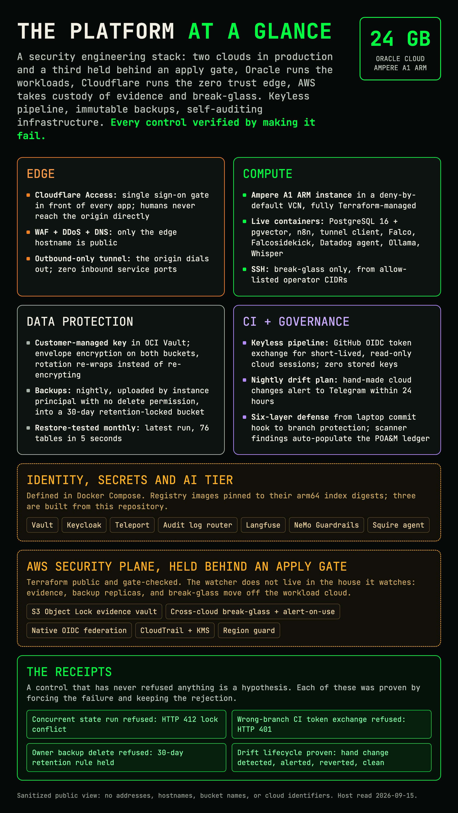

# CoreDirective Automation Engine

[](https://et-sec.github.io/portfolio/)
[](LICENSE)
[](https://github.com/ET-sec/cyber-squire1/actions/workflows/codeql.yml)
[](https://github.com/ET-sec/cyber-squire1/actions/workflows/security.yml)
[](https://github.com/ET-sec/cyber-squire1/actions/workflows/drift-check.yml)
[](https://github.com/ET-sec/cyber-squire1/actions/workflows/grc-validate.yml)

**A multi-cloud security platform built, broken, and rebuilt in public: cloud IAM with zero standing credentials, ransomware-proof backups, nightly drift detection, and a compliance library that updates itself. Runs across two clouds on a single Ampere A1 instance, with a third generation of infrastructure code in the repo.**

Built and operated by [Emmanuel Tigoue](https://et-sec.github.io/portfolio/) | AI Security Engineer | CISSP, SecurityX, CCNA, Security+ | BA Economics, Andrew Young School

---

## Why this exists (the 60-second version)

In August 2026 the cloud provider hosting this platform failed, taking the
server and its infrastructure records with it. Nothing of value was lost,
because the entire system lived in this repository as code. The rebuild, onto
an Oracle Cloud Ampere A1 instance, became the proof: every security control
here was rebuilt, then **verified by trying to defeat it**. Receipts below.

What that means if you are not an engineer: this repository shows that the
things companies pay security teams for (backups ransomware cannot delete,
pipelines that cannot leak credentials, infrastructure that reports when
someone changes it by hand, compliance paperwork that stays current by
itself) can be designed, built, tested, and documented end to end, with every
claim traceable to evidence.

## Multi-cloud, on purpose

Production today spans two clouds, each holding a different trust boundary:
**Oracle Cloud** runs compute, object storage, and the key management service;
**Cloudflare** runs the zero trust edge (Access, WAF, DNS, outbound-only
tunnel); **GitHub** acts as the pipeline's identity issuer via OIDC. No single
vendor holds both the front door and the data.

AWS is coming back into the picture as the **security and evidence plane**:
S3 Object Lock evidence vault, cross-cloud break-glass with alert-on-use,
native OIDC federation, and a region-guarded, least-privilege footprint
where nothing runs that is not a security control. The Terraform is public
in [`terraform/cd-aws-security-plane/`](terraform/cd-aws-security-plane/)
and passes the same PR gate as everything else; it deploys the moment the
account activates, and per house rules nothing gets a "running" label until
its forced-failure receipt exists ([DR-05](docs/architecture/decisions/DR-05-aws-security-plane.md)
has the design and the receipt checklist). The rule it implements: the
watcher does not live in the house it watches.

The platform's first generation also ran on AWS, and that original
infrastructure code (VPC, EC2, NAT, security groups) ships in this
repository as archived reference alongside the second-generation
DigitalOcean configuration. The design has survived two live cross-cloud migrations because every
piece of it is code. The R2 state split is queued for the same reason, so Terraform
state and the compute it describes never share a vendor failure domain.

## Find your way (pick your lane)

| You are | Go here | Time |
|---------|---------|------|
| Recruiter or hiring manager | The [overview diagram](docs/grc/diagrams/stack_overview_hero.png) and the [verified controls](#every-control-verified-by-attacking-it) table below | 2 min |
| Security engineer | [`docs/architecture/`](docs/architecture/STACK_OVERVIEW.md) for the layered design, then [`terraform/cd-oci-infrastructure/`](terraform/cd-oci-infrastructure/) for the code | 20 min |
| GRC / compliance reviewer | The [GRC library index](docs/grc/README.md): 57 documents mapped to NIST 800-53 | browse |
| Someone who wants to run this | [Replication guide](terraform/cd-oci-infrastructure/README.md#run-this-yourself-replication): clone to `terraform plan` in your own tenancy | 1 hr |

## The picture



Deeper cuts, one click each:
[network topology](docs/grc/diagrams/network_topology.png) ·
[data flows](docs/grc/diagrams/data_flow.png) ·
[trust boundaries](docs/grc/diagrams/security_boundaries.png) ·
[full architecture doc](docs/architecture/STACK_OVERVIEW.md) ·
[the seven architecture views as code](docs/architecture/views/README.md), rendered clickable on the [live site](https://et-sec.github.io/portfolio/)

---

## Every control, verified by attacking it

A control that has never been tested is a hypothesis. Each of these was
proven by making it fail, and the failure is the evidence:

| Control | The attack that was attempted | What happened |
|---------|-------------------------------|---------------|
| Terraform state locking | Two concurrent runs raced for the same state | Loser refused with HTTP 412, state intact |
| Ransomware-proof backups | The account owner tried to delete a backup | Refused: 403, blocked by retention rule |
| Keyless CI identity | A workflow from an unauthorized branch requested cloud credentials | Refused: 401, no trust rule matched |
| Drift detection | An infrastructure change was made by hand in the cloud console | Flagged on the next nightly run, alert sent, change codified |
| Encryption key rotation | Key rotated, then a pre-rotation backup was read back | Decrypted cleanly: envelope model, rotation never re-encrypts data |
| Secret gates | A fake cloud API key was staged for commit | Blocked on the laptop before it could reach the repository |

The reasoning behind each control, the options rejected, the blast radius if
it fails, and the debugging stories behind rows 1 through 5 are published in
the [decision records](docs/architecture/decisions/README.md), which cover
the state, identity, data protection, and drift controls.

## What runs where

**Live on Oracle Cloud (Ampere A1, aarch64, 4 OCPU and 24 GB):** PostgreSQL 16
with pgvector, n8n orchestration, Cloudflare Tunnel. Fronted by Cloudflare
Access (zero-trust identity checks at the edge; the origin is never exposed).

**Live in the pipeline (no server needed):** nightly infrastructure drift
detection, secret scanning at four layers, scanner findings flowing into a
self-updating POA&M ledger, SBOM generation, container signature
verification, CodeQL, OWASP ZAP DAST.

**Codified, pending the ARM rebuild:** the remaining services of the full
19-service design (HashiCorp Vault, Keycloak, Teleport, Falco runtime
detection, Datadog, Langfuse LLM observability, Ollama, NeMo Guardrails, and
Squire, the custom AI security agent). Their configuration, monitors, and
policies are all in this repository; the compose header documents exactly
what the ARM port requires. Nothing here is claimed as running unless it is.

## The pipeline is the perimeter

Six layers stand between a mistake and production, each one tested:

1. **Laptop, commit time:** gitleaks (150+ default rules plus custom
   tripwires for this repo's sanitization boundaries) blocks the commit.
   Fail-closed: no scanner, no commit.
2. **Laptop, push time:** every unpushed commit is rescanned, because history
   is an attack surface and hooks can be dodged.
3. **GitHub server-side:** push protection on known secret formats.
4. **CI on every PR:** Gitleaks, Trivy, Semgrep, CodeQL; on PRs that touch
   the relevant paths, Checkov, the OPA fixture self-test, and DAST. All 16
   workflows pinned to commit SHAs with least-privilege permissions; the only
   unpinned `uses:` are three in-repo composite actions.
5. **Branch protection:** nothing reaches main without a PR and green
   required checks. The cloud trusts only tokens minted for main.
6. **Nightly drift check:** anything that went around the pipeline entirely
   gets caught comparing code to live cloud, and alerts.

## Identity: nobody holds standing keys

- Humans reach admin surfaces through Cloudflare Access single sign-on at
  the edge.
- The CI pipeline holds zero cloud credentials: it exchanges GitHub's signed
  OIDC token for an Oracle Cloud session token that lives minutes, pinned to
  this repository and branch, mapped to a read-only principal.
- The server itself uploads backups by instance principal (the machine's own
  identity), with a policy that cannot delete what it writes.
- Operational secrets live in Doppler; nothing secret is committed, and the
  gates above enforce that mechanically.

## Governance that feeds itself

- [`metrics.yaml`](metrics.yaml) is the single source of numeric truth,
  computed from the filesystem by [`scripts/build_metrics.py`](scripts/build_metrics.py)
  on every commit. README, portfolio, and resume all cite it. If a document
  disagrees with it, the document is wrong.
- Scanner findings (Trivy, Checkov, Gitleaks) flow into the
  [POA&M auto-findings ledger](docs/grc/POAM_AUTO_FINDINGS.md) by fingerprint,
  deduplicated and auto-closing: the compliance backlog is a pipeline output,
  not a document someone remembers to edit.
- Nightly `terraform plan` means every infrastructure change is either
  code-reviewed or flagged within 24 hours.

## GRC Compliance Library

57 governance, risk, and compliance documents aligned to NIST SP 800-53
Rev. 5 Moderate baseline, FIPS 199, and the CIS Docker Benchmark, citing 140
distinct controls. Sanitized for public hosting: personal identifiers and
internal topology are replaced with generic equivalents, while product names
(Vault, Keycloak, Teleport, Falco, Datadog, Cloudflare, Trivy) are preserved
to show the real stack.

**[Browse the full library](docs/grc/README.md)**

| Category | Count | Contents |
|----------|-------|----------|
| Core Plans | 4 | System Security Plan (SSP), Plan of Action & Milestones (POA&M), Risk Assessment, Squire SSP |
| Policies | 10 | Incident Response, Access Control, Acceptable Use, Business Continuity, Disaster Recovery, Change Management, Vulnerability Management, Security Awareness, Risk Management, AI Governance |
| IR Playbooks | 5 | Compromised Container, Leaked Credential, DDoS/Service Degradation, Unauthorized Access, AI Incident Response |
| Threat Modeling | 6 | DFD, STRIDE Threat Model, Attack Tree (AI Pipeline), AI Threat Catalog, AI Supply Chain Risk, AI Red Team Plan |
| IAM Documentation | 2 | RBAC Role Map (3-tier model), Access Review Process (JIT workflow) |
| Risk Register | 1 | CIS Docker Benchmark findings with compensating controls |
| Tabletop Exercises | 2 | Operation Phantom Container, Squire Tabletop Exercise |
| Executive Summaries | 3 | Architecture, Compliance, Security Posture |
| AppSec, SDLC, Pen Test | 7 | Secure SDLC, Code Review Findings, DAST Methodology, OWASP MCP Top 10 Audit, Pen Test Self-Assessment, Red Team Results, n8n Credential Exposure Write-Up |
| AI Security Artifacts | 7 | Squire AI Risk Assessment, Squire Threat Model, Squire Data Flow Classification, Squire Model Card, Guardrails Configuration, AI Supply Chain Register, ADR-001 Embedding Provider |
| Compliance Crosswalks | 4 | SOC 2 + ISO 27001, Squire Framework Crosswalk, HIPAA Security Rule, HIPAA ePHI Handling |
| Architecture and Ops Specs | 6 | Agent Signing, Agent Telemetry, AI Audit Trail Spec, Google Cloud IAM Assessment, HITL Policy, POA&M MCP 2025 |

## Infrastructure as Code

Active IaC lives in [`terraform/cd-oci-infrastructure/`](terraform/cd-oci-infrastructure/):
Oracle Cloud compute and networking, KMS vault and customer-managed key,
retention-locked backup storage, and least-privilege identity policies, with
8 OPA/Rego policies (self-tested on fixtures for every Terraform PR, run by
conftest against the real plan after every merge and nightly) and remote state
in versioned, locked object storage. The retired DigitalOcean configuration is
preserved in [`terraform/cd-do-infrastructure/`](terraform/cd-do-infrastructure/)
as an archived reference, including the Datadog monitors and dashboards that
return with the ARM rebuild.

Want to stand this up in your own tenancy? Start at the
[replication guide](terraform/cd-oci-infrastructure/README.md#run-this-yourself-replication).

## Repository Structure

```
.
├── README.md                        You are here
├── metrics.yaml                     Canonical numbers (machine-generated)
├── SECURITY.md                      How to report a vulnerability, what is in scope
├── CONTRIBUTING.md                  Branch, hook, and review workflow
├── docs/
│   ├── architecture/                Layered architecture, decision records, the seven views as code
│   │   └── views/                   Generators and node tables behind the portfolio drawings
│   └── grc/                         57 GRC documents, NIST 800-53 aligned
│       ├── README.md                Library index (start here for GRC)
│       ├── POAM_AUTO_FINDINGS.md    Self-updating scanner findings ledger
│       └── diagrams/                Rendered visuals + HTML sources
├── terraform/
│   ├── cd-oci-infrastructure/       ACTIVE: OCI compute, KMS, locked backups, OPA policies
│   ├── cd-cloudflare-edge/          ACTIVE: edge access policies and WAF as code
│   ├── cd-aws-security-plane/       DESIGNED: evidence vault in a second cloud, apply gated
│   ├── cd-do-infrastructure/        Archived DigitalOcean generation
│   ├── cd-aws-automation/           Archived first AWS generation
│   └── simple-ec2/                  Archived AWS quick start
├── COREDIRECTIVE_ENGINE/            Docker Compose: the 19-service design and the live subset
├── builds/                          Squire, the SOC analyst agent (source, tests, migrations), and content build tools
├── detections/                      17 Sigma rules and the Falco rules the sensor loads on the host
├── .agents/                         Signed agent cards and the registry the daily inventory scan checks
├── policies/                        Rego policies for the GRC library itself (front matter, classification, POA&M ids)
├── infra/                           Conftest policies that gate the compose file (no privileged, limits, health checks)
├── keycloak/                        Sanitized realm export for the identity service
├── Agent_Squire/                    Telemetry tagging stubs for the four agent roles; the agent itself is in builds/squire
├── tests/                           Tests for the GRC tooling under scripts/grc
├── templates/                       Jinja template for the generated LinkedIn summary
├── scripts/                         build_metrics, poam_sync, sync_views, image and fact verifiers
├── .github/workflows/               16 pipelines, every third-party action SHA-pinned
├── .githooks/                       Commit + push gates (secrets, style, metrics)
├── renovate.json                    Dependency and image update policy by tier
└── .env.example                     Variable names the master compose expects (values come from a secrets manager)
```

Every tracked file at the repository root, with what it is and why it stays.
Each directory above carries its own README with the same table for its tree.

<!-- MANIFEST:root -->
Generated from docs/REPO_MANIFEST.yaml. Do not hand edit inside the markers.

| Path | Status | Purpose |
|---|---|---|
| `.env.example` | active | The variable names the master compose file expects, with no values. |
| `.gitignore` | active | What git must never track: the private planning tree, the client sites, the resume generator, and the local gitleaks tripwire config. |
| `.gitleaks.toml` | active | The public gitleaks config: the default rule set plus the sanitization tripwires that can be named in the open. |
| `.mailmap` | active | Display-only remap of five commit identities to one canonical contributor. |
| `.pr_agent.toml` | active | Model choice and review settings for the pull request review agent. |
| `.pre-commit-config.yaml` | active | The pre-commit framework config: gitleaks at commit and push time, plus the terraform fmt, validate, tflint, and checkov hooks. |
| `.semgrepignore` | active | Paths semgrep skips: the deprecated tree and the two suspended AWS terraform directories. |
| `CONTRIBUTING.md` | active | How to work in this repository: branch naming, the hook chain, and what a pull request has to carry. |
| `LICENSE` | active | The license the published tree is offered under. |
| `README.md` | active | The repository front page: what the platform is, what runs, and where the evidence lives. |
| `SECURITY.md` | active | The vulnerability disclosure contact and the response expectation. |
| `metrics.yaml` | active | The canonical numeric facts, generated from the filesystem by scripts/build_metrics.py. |
| `renovate.json` | active | Dependency update policy: schedule, limits, and the per-tier rules that keep the security boundary images on manual review. |
<!-- /MANIFEST -->

## Contact

**Portfolio:** [et-sec.github.io/portfolio](https://et-sec.github.io/portfolio/)
**LinkedIn:** [linkedin.com/in/emmanuel-tigoue](https://www.linkedin.com/in/emmanuel-tigoue)
**GitHub:** [github.com/ET-sec](https://github.com/ET-sec)

---

MIT License
