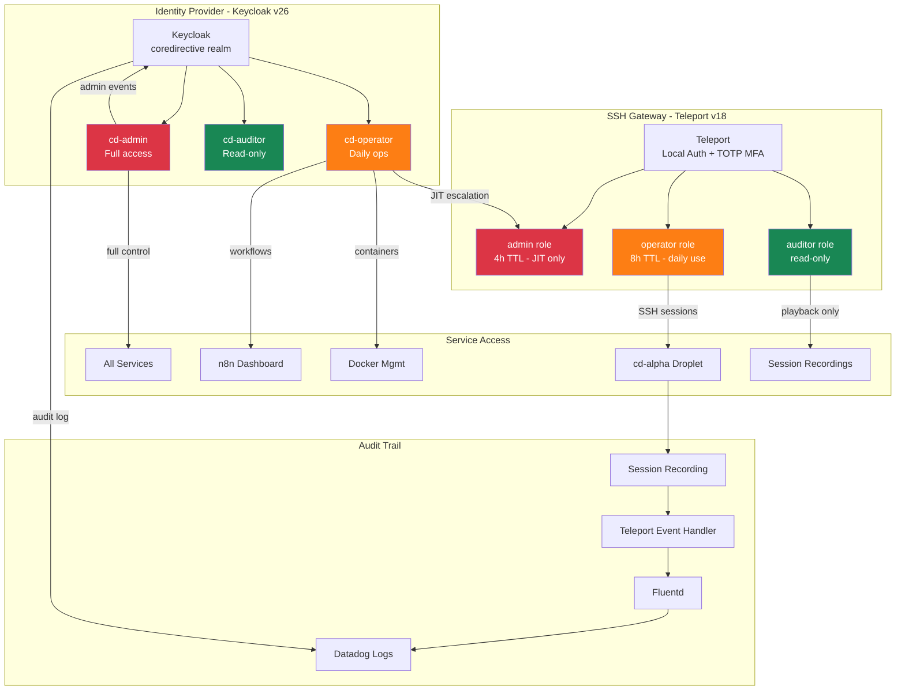
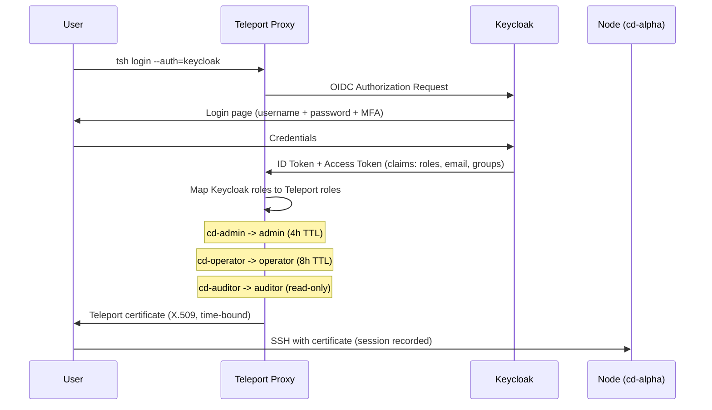

# CoreDirective IAM & RBAC Role Map

> Identity and Access Management architecture for the CoreDirective security operations platform.

## 1. Overview

CoreDirective implements a three-tier RBAC model across two identity systems:

| Layer | System | Version | Role |
|-------|--------|---------|------|
| **Identity** | Keycloak | v26.5.2 | Authentication, user management, password policy |
| **Authorization** | Teleport | v18 | SSH gateway, session recording, access requests |
| **Audit** | Datadog + Falco | Latest | Event correlation, runtime threat detection |

**Current state:** Keycloak and Teleport each use local authentication. OIDC integration between them requires Teleport Enterprise and is documented below as the upgrade path.

**Design principles:**
- Least privilege by default (auditor cannot SSH, operator cannot admin)
- Just-in-time escalation with time-bound TTLs
- Full audit trail on every session and access change
- Reproducible configuration via realm JSON import

---

## 2. Visual Role Map



---

## 3. Role Definitions

### Keycloak Realm Roles (coredirective realm)

| Role | Description | Assigned To | Source |
|------|-------------|-------------|--------|
| `cd-admin` | Full administrative access to all CoreDirective services | etigoue | `coredirective-realm.json` |
| `cd-operator` | Day-to-day operational access, can manage workflows and containers | Future ops staff | `coredirective-realm.json` |
| `cd-auditor` | Read-only access to audit logs, session recordings, and compliance data | Future auditors | `coredirective-realm.json` |

### Teleport Roles (teleport.yaml)

| Role | Max Session TTL | Node Labels | SSH Login | Audit Access | Use Case |
|------|----------------|-------------|-----------|--------------|----------|
| `admin` | 4h | `*:*` | `root`, `ubuntu` | Full | Emergency access, JIT-only |
| `operator` | 8h | `env:production` | `ubuntu` | Own sessions | Daily operations |
| `auditor` | 12h | `env:production` | None | All sessions | Compliance review |

---

## 4. Permission Matrix

| Action | cd-admin | cd-operator | cd-auditor |
|--------|:--------:|:-----------:|:----------:|
| **SSH to droplet (root)** | Yes | No | No |
| **SSH to droplet (ubuntu)** | Yes | Yes (via Teleport) | No |
| **Docker container management** | Yes | Yes | No |
| **n8n workflow edit** | Yes | Yes | No |
| **n8n workflow view** | Yes | Yes | Yes |
| **Keycloak admin console** | Yes | No | No |
| **Keycloak user management** | Yes | No | No |
| **Datadog dashboards (full)** | Yes | Yes | Yes |
| **Datadog alert management** | Yes | Yes | No |
| **Session recording playback** | Yes | Yes (own) | Yes (all) |
| **Audit log access** | Yes | No | Yes |
| **Access request approval** | Yes | No | No |
| **Teleport cluster management** | Yes | No | No |
| **Falco rule management** | Yes | No | No |
| **Vault secret access** | Yes | No | No |

---

## 5. Privilege Escalation Path

Operators can request temporary admin access through Teleport's access request system. All escalations are time-bound and fully audited.

### Request Flow

```
Operator                    Admin                     Teleport
   |                          |                          |
   |-- tsh request create --->|                          |
   |   role=admin             |                          |
   |   reason="emergency      |                          |
   |   deploy fix"            |                          |
   |                          |                          |
   |                          |<-- notification ---------|
   |                          |   (Telegram/email)       |
   |                          |                          |
   |                          |-- tctl request approve ->|
   |                          |   --id=<request-id>      |
   |                          |                          |
   |<-- access granted -------|--------------------------|
   |   (4h TTL)               |                          |
   |                          |                          |
   |-- ssh root@cd-alpha ---->|                          |
   |   (session recorded)     |                          |
   |                          |                          |
   |   ... 4 hours later ...  |                          |
   |                          |                          |
   |<-- access revoked -------|--------------------------|
   |   (automatic expiry)     |                          |
```

### Operator Commands

```bash
# Step 1: Request admin access
tsh request create \
  --roles=admin \
  --reason="Emergency: container restart required for cd-service-n8n"

# Step 2: Check request status
tsh request ls

# Step 3: Once approved, login with elevated role
tsh login --request-id=<request-id>

# Step 4: Use admin access (recorded session)
tsh ssh root@cd-alpha
```

### Admin Approval Commands

```bash
# View pending requests
tctl request ls --format=text

# Approve with reason
tctl request approve <request-id>

# Deny with reason
tctl request deny <request-id> --reason="Not justified"
```

### Safeguards

| Safeguard | Implementation |
|-----------|---------------|
| **Time-bound** | Admin role expires after 4 hours automatically |
| **Reason required** | `--reason` flag is mandatory for requests |
| **Full recording** | All SSH sessions during escalation are recorded |
| **Audit trail** | Request, approval, and session events in Datadog |
| **No self-approval** | Requestor cannot approve their own request |

---

## 6. Enterprise Upgrade Path

### Current State (Community Edition)

```
Keycloak (Identity)          Teleport (Authorization)
     |                              |
     | Local auth                   | Local auth + TOTP
     | coredirective realm          | teleport.yaml roles
     |                              |
     +--- No integration -----------+
          (separate credentials)
```

### Future State (Teleport Enterprise + OIDC)



### OIDC Connector Configuration (Reference)

The Teleport OIDC client is pre-configured in Keycloak:

| Setting | Value |
|---------|-------|
| Client ID | `teleport` |
| Protocol | OpenID Connect |
| Redirect URI | `https://teleport.tigouetheory.com/v1/webapi/oidc/callback` |
| Web Origins | `https://teleport.tigouetheory.com` |
| Public Client | No (confidential) |
| Scopes | openid, profile, email, roles |

### Teleport OIDC Connector (teleport-oidc.yaml)

```yaml
# Reference: requires Teleport Enterprise license
kind: oidc
version: v3
metadata:
  name: keycloak
spec:
  issuer_url: https://keycloak.tigouetheory.com/realms/coredirective
  client_id: teleport
  client_secret: "<from-keycloak-client-credentials>"
  redirect_url:
    - https://teleport.tigouetheory.com/v1/webapi/oidc/callback
  claims_to_roles:
    - claim: realm_access.roles
      value: cd-admin
      roles:
        - admin
    - claim: realm_access.roles
      value: cd-operator
      roles:
        - operator
    - claim: realm_access.roles
      value: cd-auditor
      roles:
        - auditor
  scope:
    - openid
    - profile
    - email
    - roles
```

### What Changes with Enterprise

| Feature | Community (Current) | Enterprise (Future) |
|---------|:------------------:|:-------------------:|
| Single Sign-On | No (separate logins) | Yes (Keycloak OIDC) |
| Role mapping | Manual | Automatic (claims_to_roles) |
| Access requests | CLI only | Web UI + CLI |
| Approval integrations | Manual | Slack, PagerDuty, Jira |
| Resource-level requests | No (role-level only) | Yes (specific nodes) |
| FedRAMP/SOC2 audit | Manual export | Built-in compliance |

---

## 7. NIST 800-53 Alignment

| Control | Name | Implementation |
|---------|------|----------------|
| **AC-2** | Account Management | Keycloak realm manages all user accounts. Admin-only user creation. `registrationAllowed: false`. Temporary bootstrap admin replaced by realm-managed accounts. |
| **AC-3** | Access Enforcement | Teleport enforces SSH access based on role. Keycloak enforces service access. Both deny by default. |
| **AC-5** | Separation of Duties | Three distinct roles (admin/operator/auditor) prevent concentration of privilege. Auditors cannot modify systems. Operators cannot approve their own escalation requests. |
| **AC-6** | Least Privilege | Operator role is the default working role. Admin access requires JIT request with 4h auto-expiry. Auditor has read-only access only. Root SSH limited to admin role. |
| **AC-6(1)** | Authorize Access to Security Functions | Only cd-admin can modify Keycloak realm settings, Teleport cluster config, Falco rules, and Vault policies. |
| **AC-6(2)** | Non-Privileged Access for Non-Security Functions | cd-operator role used for daily n8n workflow management and container operations. No security function access. |
| **AC-7** | Unsuccessful Logon Attempts | Keycloak brute force protection: 5 failures lock for 15 minutes. `failureFactor: 5`, `maxFailureWaitSeconds: 900`. |
| **AC-11** | Session Lock | Keycloak SSO idle timeout: 30 minutes (`ssoSessionIdleTimeout: 1800`). Teleport certificate TTLs enforce session limits. |
| **AC-12** | Session Termination | Teleport admin role: 4h max. Operator: 8h max. Keycloak max session: 10h (`ssoSessionMaxLifespan: 36000`). |
| **IA-2** | Identification and Authentication | Keycloak authenticates via username + password. Teleport adds TOTP MFA for SSH. Enterprise path adds OIDC for unified authentication. |
| **IA-5** | Authenticator Management | Password policy enforced: 12+ chars, upper, lower, digit, special character. `notUsername` prevents username as password. |
| **IA-5(1)** | Password-Based Authentication | Keycloak password policy: `length(12) and upperCase(1) and lowerCase(1) and digits(1) and specialChars(1) and notUsername`. |
| **AU-2** | Audit Events | Keycloak admin events enabled (`adminEventsEnabled: true`). Teleport records all SSH sessions. Falco monitors syscalls. All flow to Datadog. |
| **AU-3** | Content of Audit Records | Session recordings capture full terminal I/O. Keycloak logs include user, IP, action, timestamp. Falco logs include process, container, syscall. |
| **AU-6** | Audit Review | cd-auditor role provides read-only access to all audit data: session playback, Keycloak events, Datadog dashboards. |

---

## Appendix: Configuration Files

| File | Purpose | Location |
|------|---------|----------|
| `coredirective-realm.json` | Keycloak realm definition (roles, users, clients, policies) | `COREDIRECTIVE_ENGINE/CD_VOL_KEYCLOAK_IMPORT/` |
| `docker-compose.yaml` | Keycloak v26 container with realm import | `COREDIRECTIVE_ENGINE/` |
| `teleport.yaml` | Teleport cluster config with role definitions | `/etc/teleport.yaml` (on droplet) |
| `teleport-oidc.yaml` | OIDC connector reference (Enterprise upgrade) | Documented above |

---

*Last updated: 2026-03-11 | Phase 08-04*
