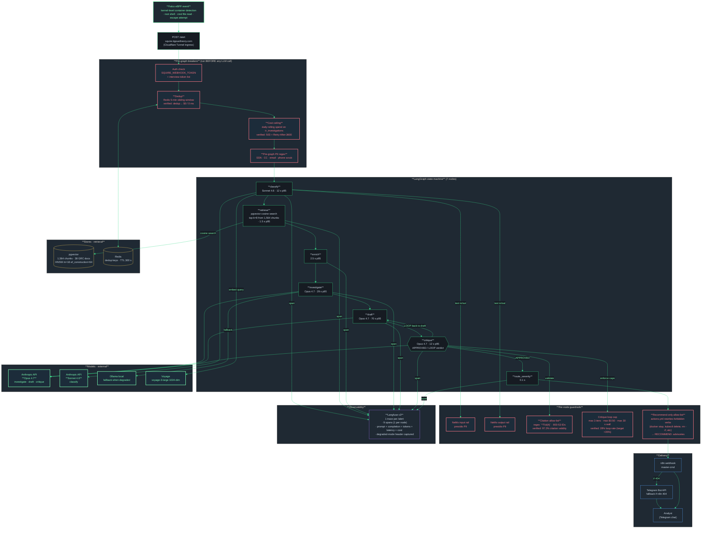
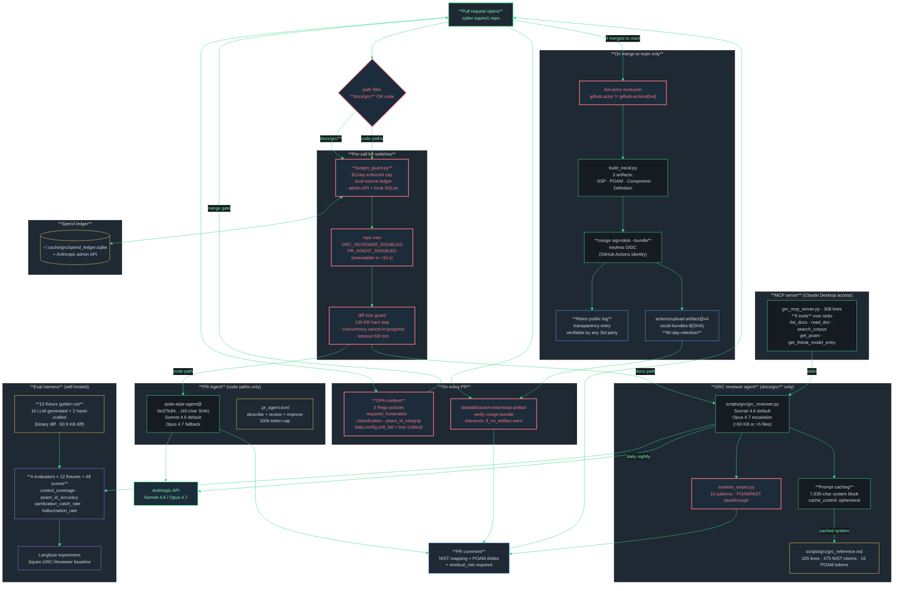

# CoreDirective Information Flows

Two critical paths through the stack. Read each diagram top to bottom. Annotations call out model, latency, cost, guardrail layer.

---

## Flow A — Squire autonomous SOC analyst (alert path)

A Falco event arrives. Squire classifies it, retrieves the relevant playbook from a 1,564-chunk RAG, drafts an IR brief, runs a critique loop, and routes to a human analyst. Every step is traced in self-hosted Langfuse and gated by five guardrail layers.



### Verified flow metrics (per `SQUIRE_MODEL_CARD.md` and Phase 17 SUMMARYs)

| Metric | Verified value | Target |
|--------|----------------|--------|
| End-to-end p50 latency | **47 s** | < 60 s |
| End-to-end p95 latency | **82 s** | < 90 s |
| Cost per invocation p95 | **$0.38** | < $0.50 |
| Citation validity rate | **97.2%** | > 95% |
| Critique loop rate | **28%** | < 35% |
| RAG retriever p95 | **< 500 ms** (317–345 ms on 5 real queries) | <500 ms |
| Top-1 playbook match | **5/5** paraphrased queries | n/a |
| Red-team cumulative cases | **20** (cycle 1: 6, cycle 2: 14) | n/a |
| Red-team true bypasses | **0** of 17 valid (3 INFRA_ERROR tracked in POAM-P17-15) | 0 |
| Red-team cumulative LLM spend | **$6.81** ($0.42 avg / valid case) | n/a |

### Where the five guardrail layers fire

1. **Pre-graph regex PII scanner** (`pre_graph_pii.py`) — scrubs SSN / CC / email / phone before the alert touches a model.
2. **NeMo input rail** — presidio PII pass on every prompt entering each LLM node.
3. **NeMo output rail** — presidio PII pass on every completion leaving each LLM node.
4. **Citation allow-list** at the critique node — every `T1234` ATT&CK technique and every `AC-2` style 800-53 ID must match the allow-list regex; otherwise the critique forces a LOOP back to draft (max 3 iters, max $0.50, max 30 s).
5. **Recommend-only `actions.yml` boundary** at the response layer — forbidden verbs (`docker stop`, `kubectl delete`, `rm -rf`, `rotate key`, `shutdown`, etc) are rewritten to `RECOMMEND:` advisories with `sanitization_events[]` attached.

---

## Flow B — Phase 19 AI-native GRC pipeline (PR path)

A pull request opens. Path filters split traffic to one of two reviewer agents. Both honor a daily cost ceiling and a kill switch. On merge to main, three OSCAL artifacts get cosign-signed via Sigstore keyless OIDC. Eval harness scores reviewer output against a 12-fixture golden set in self-hosted Langfuse.



### Verified flow metrics (per `19-06-SUMMARY.md` and Phase 19 plan files)

| Metric | Verified value |
|--------|----------------|
| Phase 19 actual spend to date | **$1.77** ($0.48 golden gen + $0.72 eval run + $0.57 re-run) |
| Per-PR cost (warm cache) | **$0.025** |
| Per-PR cost (cold cache) | **$0.05** |
| Daily enforced kill switch | **$1.00 / day** (`DAILY_LIMIT_USD`) |
| Eval-mode raised cap | $5.00 / day |
| Recurring projection | **< $5 / month** at 200 PRs |
| GRC reviewer tests | 36 passing in 0.36 s |
| MCP tools exposed | **5** |
| MCP stdio purity tests | 17 passing in 1.03 s; zero `print()` calls |
| OPA Rego policies | **3** |
| OPA soft-fail mode warnings | 22 on current corpus |
| Golden-set fixtures | **12** (10 LLM + 2 hand-crafted) |
| Langfuse evaluator scores landed | **48** (4 × 12) |
| Sanitization catch rate (baseline) | **0.917** |
| Hallucination rate (baseline) | 0.292 |
| Control coverage (baseline) | 0.750 |
| POAM ID accuracy (baseline) | 0.667 |
| Cosign artifact retention | **90 days** |
| OSCAL artifacts signed per merge | **3** (SSP, POAM, Component-Definition) |

### What this pipeline mirrors in the commercial world

| OSS piece on the droplet | Enterprise analog |
|--------------------------|-------------------|
| Custom GRC reviewer (Sonnet 4.6 + Opus 4.7 escalation) | ServiceNow GRC + Drata workflow checklists |
| Qodo PR-Agent | CodeRabbit |
| Cosign + Rekor on OSCAL | Chainguard supply-chain attestation |
| OPA + conftest on frontmatter | ServiceNow workflow gates / policy-as-code |
| FastMCP server (5 tools) | RegScale REST API · Drata GraphQL |
| Langfuse eval harness | Internal QA · vendor SLA dashboards |
| budget_guard.py + spend_ledger.py | Enterprise FinOps cost-cap controls |

---

## How to render to PNG

```bash
# Option 1: one-shot via Mermaid CLI (mmdc) on the droplet or local Mac
brew install mermaid-cli   # if not yet installed
mmdc -i docs/architecture/STACK_OVERVIEW.md -o /tmp/stack_overview.png -t dark -b transparent
mmdc -i docs/architecture/INFORMATION_FLOWS.md -o /tmp/information_flows.png -t dark -b transparent

# Option 2: render in VS Code with the Mermaid Preview extension and screenshot
# Option 3: paste into mermaid.live for an interactive view
```

Render at 2160px wide minimum if you want the labels readable per `feedback_diagram_text_size`.
