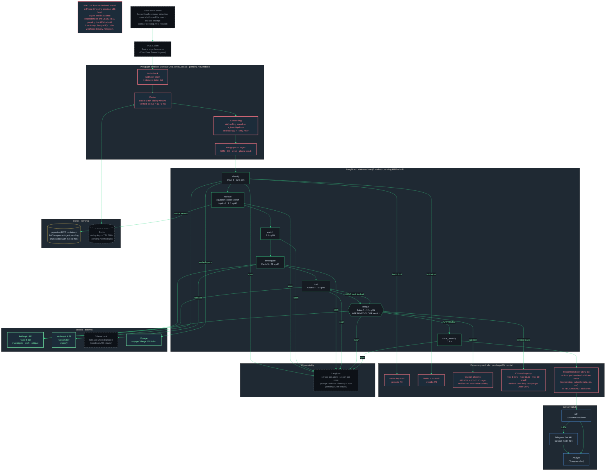
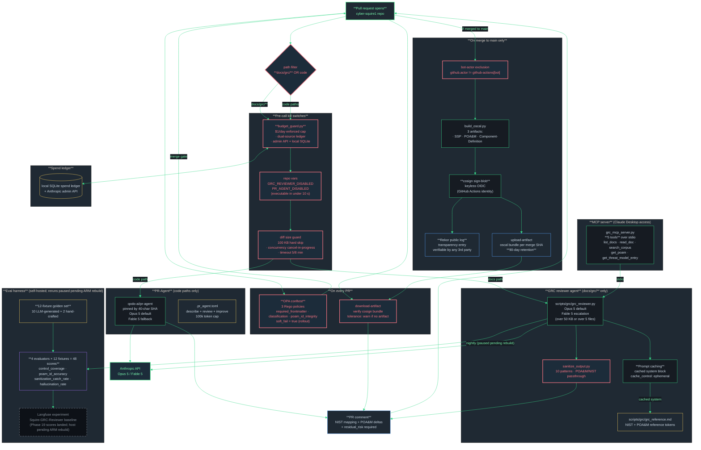

# CoreDirective Information Flows

Two critical paths through the stack, current as of 2026-08-31. Runtime context first, because it changes how to read both flows: the platform now runs on a single Oracle Cloud Infrastructure (OCI) Ampere A1 Always Free ARM instance with 3 live containers (PostgreSQL 16 with pgvector, n8n, the Cloudflare tunnel sidecar). The previous x86 host died in August 2026. Squire and its self-hosted dependencies (NeMo Guardrails, Langfuse, Redis, Ollama, the Falco sensor) are designed and codified in the master compose file but pending the ARM rebuild, and the diagrams mark them with dashed grey boxes.

Acronyms, once: SOC (security operations center), RAG (retrieval augmented generation), PII (personally identifiable information), IR (incident response), eBPF (extended Berkeley Packet Filter), LLM (large language model), GRC (governance, risk, and compliance), OIDC (OpenID Connect), MCP (Model Context Protocol), OSCAL (Open Security Controls Assessment Language), SSP (System Security Plan), POA&M (Plan of Action and Milestones), OPA (Open Policy Agent), CI (continuous integration).

---

## Flow A: Squire autonomous SOC analyst (alert path)

**Status: designed and previously verified, pending ARM rebuild.** This flow ran end to end on the previous x86 host and every metric below was measured there during Phase 17. The code, guardrail configs, and eval evidence survived in the repo; the runtime did not. Live today from this diagram: the PostgreSQL container (its RAG corpus needs re-ingest, the chunks died with the old host), the n8n webhook delivery path, and Telegram. Everything drawn dashed comes back with the ARM rebuild.

The flow: a Falco event arrives, Squire classifies it, retrieves the relevant playbook from the RAG store, drafts an IR brief, runs a critique loop, and routes a recommend-only advisory to a human analyst. Every step is traced in self-hosted Langfuse and gated by five guardrail layers.



### Verified flow metrics (Phase 17, measured on the previous x86 host)

| Metric | Verified value | Target |
|--------|----------------|--------|
| End-to-end p50 latency | 47 s | under 60 s |
| End-to-end p95 latency | 82 s | under 90 s |
| Cost per invocation p95 | $0.38 | under $0.50 |
| Citation validity rate | 97.2% | over 95% |
| Critique loop rate | 28% | under 35% |
| RAG retriever p95 | under 500 ms (317 to 345 ms on 5 real queries) | under 500 ms |
| Top-1 playbook match | 5/5 paraphrased queries | n/a |
| Red-team cumulative cases | 20 (cycle 1: 6, cycle 2: 14) | n/a |
| Red-team true bypasses | 0 of 17 valid (3 INFRA_ERROR tracked in the POA&M) | 0 |
| Red-team cumulative LLM spend | $6.81 ($0.42 avg per valid case) | n/a |

These numbers stand as evidence of what the design achieves; they get re-verified on ARM once the rebuild lands, and the RAG counts get recounted after re-ingest.

### Where the five guardrail layers fire

1. **Pre-graph regex PII scanner** scrubs SSN, credit card, email, and phone patterns before the alert touches a model.
2. **NeMo input rail** runs a presidio PII pass on every prompt entering each LLM node.
3. **NeMo output rail** runs the same pass on every completion leaving each LLM node.
4. **Citation allow-list** at the critique node: every ATT&CK technique ID and every NIST 800-53 control ID must match the allow-list regex, otherwise the critique forces a LOOP back to draft (max 3 iterations, max $0.50, max 30 s).
5. **Recommend-only actions.yml boundary** at the response layer: forbidden verbs (docker stop, kubectl delete, rm, rotate key, shutdown, and the rest of the list) are rewritten to RECOMMEND advisories with sanitization events attached.

---

## Flow B: AI-native GRC pipeline (PR path)

**Status: live in CI, with one paused branch.** This flow runs in GitHub Actions, so it survived the host loss almost untouched. The reviewer agents, kill switches, OPA gates, and the cosign signing path on merge all operate today. The one casualty: the eval harness lands its scores in self-hosted Langfuse, which is pending the ARM rebuild, so eval reruns are paused. The Phase 19 baseline scores were landed before the loss and remain the recorded baseline.

The flow: a pull request opens, path filters split traffic to one of two reviewer agents, both honor a daily cost ceiling and a kill switch. On merge to main, three OSCAL artifacts get cosign-signed via Sigstore keyless OIDC. The eval harness scores reviewer output against a 12-fixture golden set.



### Verified flow metrics (Phase 19 records)

| Metric | Verified value |
|--------|----------------|
| Phase 19 actual spend | $1.77 ($0.48 golden gen + $0.72 eval run + $0.57 re-run) |
| Per-PR cost (warm cache) | $0.025 |
| Per-PR cost (cold cache) | $0.05 |
| Daily enforced kill switch | $1.00 / day |
| Eval-mode raised cap | $5.00 / day |
| Recurring projection | under $5 / month at 200 PRs |
| MCP tools exposed | 5 |
| OPA Rego policies in the GRC gate | 3 |
| Golden-set fixtures | 12 (10 LLM + 2 hand-crafted) |
| Langfuse evaluator scores landed | 48 (4 x 12) |
| Sanitization catch rate (baseline) | 0.917 |
| Hallucination rate (baseline) | 0.292 |
| Control coverage (baseline) | 0.750 |
| POA&M ID accuracy (baseline) | 0.667 |
| Cosign artifact retention | 90 days |
| OSCAL artifacts signed per merge | 3 (SSP, POA&M, Component-Definition) |

Since Phase 20.1 this flow gained a sibling: scanner findings (Trivy, Checkov, Gitleaks) now feed `scripts/poam_sync.py`, which maintains a script-owned, fingerprint-deduplicated POA&M intake ledger alongside the human-curated register. See STACK_OVERVIEW.md, detection plane.

### What this pipeline mirrors in the commercial world

| Self-hosted piece | Enterprise analog |
|-------------------|-------------------|
| Custom GRC reviewer (Opus 5 with Fable 5 escalation) | ServiceNow GRC + Drata workflow checklists |
| Qodo PR-Agent | CodeRabbit |
| Cosign + Rekor on OSCAL | Chainguard supply-chain attestation |
| OPA + conftest on frontmatter | ServiceNow workflow gates / policy-as-code |
| FastMCP server (5 tools) | RegScale REST API · Drata GraphQL |
| Langfuse eval harness | Internal QA · vendor SLA dashboards |
| budget_guard.py + spend ledger | Enterprise FinOps cost-cap controls |

---

## How to render to PNG

The `.mmd` files in this directory are the render sources; the markdown embeds mirror them.

```bash
cd ~/cyber-squire-ops
npx -y @mermaid-js/mermaid-cli -i docs/architecture/STACK_OVERVIEW_1.mmd \
  -o docs/architecture/STACK_OVERVIEW.png -p docs/architecture/puppeteer-config.json --scale 3
npx -y @mermaid-js/mermaid-cli -i docs/architecture/INFORMATION_FLOWS_1.mmd \
  -o docs/architecture/FLOW_A_squire_alert_path.png -p docs/architecture/puppeteer-config.json --scale 3
npx -y @mermaid-js/mermaid-cli -i docs/architecture/INFORMATION_FLOWS_2.mmd \
  -o docs/architecture/FLOW_B_phase19_grc_pipeline.png -p docs/architecture/puppeteer-config.json --scale 3
```
