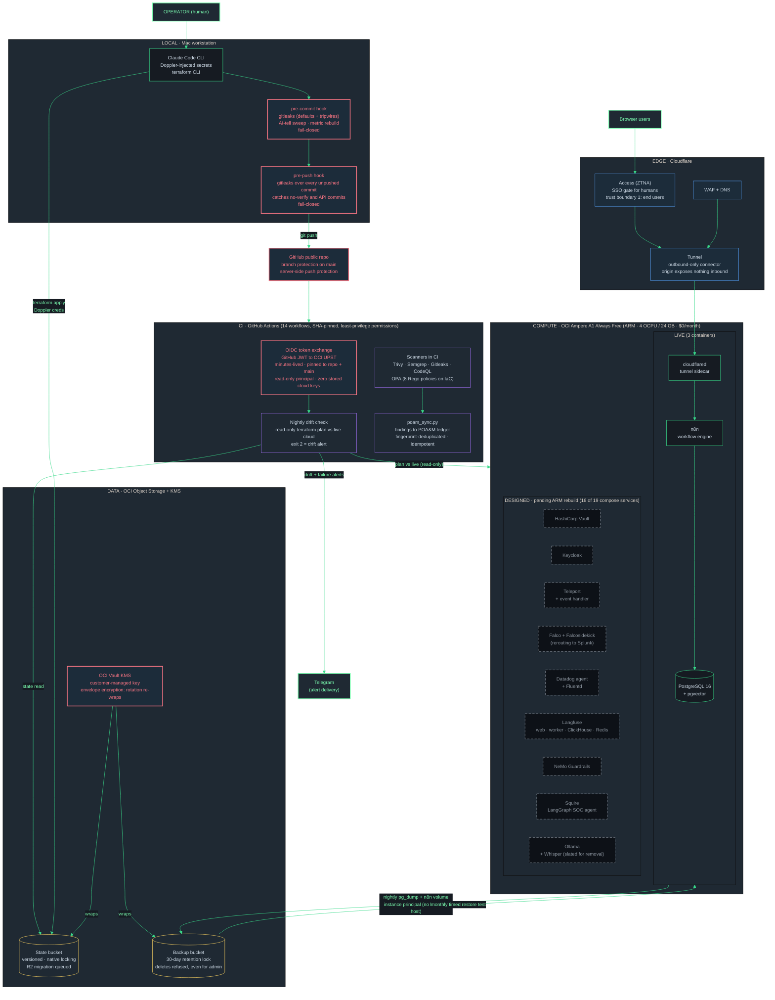

# CoreDirective Stack Overview

Current as of 2026-08-31, after the Phase 20.1 cloud hardening pass. The platform runs on a single Oracle Cloud Infrastructure (OCI) Ampere A1 Always Free instance (ARM, 4 OCPU / 24 GB) at $0/month. The previous DigitalOcean host died with its account in August 2026 and took the old Terraform state bucket with it; that loss shaped most of the controls below. This document is organized as four security planes layered over a two-tier runtime, and for each control it names the enemy it defeats and how the control was verified.

Acronyms, once: OIDC (OpenID Connect), JWT (JSON Web Token), UPST (user principal session token), KMS (key management service), CMK (customer-managed key), ZTNA (zero trust network access), WAF (web application firewall), SSO (single sign-on), POA&M (Plan of Action and Milestones), IaC (infrastructure as code), CI (continuous integration), PII (personally identifiable information), RAG (retrieval augmented generation), SOC (security operations center), RTO (recovery time objective).

The reasoning behind each control (options weighed, blast radius, verification method) lives in the [decision records](decisions/README.md).

**Multi-cloud posture.** The running platform deliberately splits trust across vendors: OCI holds compute, storage, and keys; Cloudflare holds the edge (Access, WAF, DNS, tunnel); GitHub issues the pipeline's identity. This is the third cloud generation of the same design: generation one ran on AWS (its IaC is archived in `terraform/cd-aws-automation/` and `terraform/simple-ec2/`), generation two on DigitalOcean (`terraform/cd-do-infrastructure/`, archived), and each migration was survivable because the entire system is code. The queued R2 state migration extends the split further, so Terraform state and the compute it describes never share a vendor failure domain.

## Runtime: live versus designed

The distinction matters and the public story keeps it honest.

**LIVE (verified against `COREDIRECTIVE_ENGINE/docker-compose.oci-core.yaml` this session):** exactly 3 containers run on the OCI instance.

| Container | Role |
|-----------|------|
| PostgreSQL 16 + pgvector | Workflow state and the future RAG store |
| n8n | Workflow engine, reachable only through the Cloudflare Access gate |
| cloudflared | Tunnel sidecar, outbound-only connection to the edge |

Also live outside the instance: the Cloudflare edge (Access ZTNA, WAF, DNS, tunnel), the Terraform remote state bucket, the KMS key, the backup bucket, the nightly drift check, the scanner-to-POA&M pipeline, and both local git hooks.

**DESIGNED, PENDING ARM REBUILD:** the remaining 16 services of the 19-service master compose file (`COREDIRECTIVE_ENGINE/docker-compose.yaml`) are codified but not running. That list: HashiCorp Vault, Keycloak, Teleport plus its event handler, Falco, Falcosidekick, the Datadog agent, Fluentd, Langfuse (web, worker, ClickHouse, Redis), NeMo Guardrails, Squire, Ollama, and Whisper (slated for removal in the rebuild). They were authored and operated on x86; the blockers are amd64 digest pins that resolve wrong on ARM, local images that need arm64 rebuilds, and identity material (Teleport certs, Keycloak realm, Vault data) that died with the old host and must be regenerated. The compose file is the design record. Nothing in this document claims those services are running.

## Identity plane: two trust boundaries

Two different actors authenticate, through two different mechanisms. Conflating them is the common mistake; keeping them separate is the design.

| Boundary | Who | Mechanism | Enemy defeated | How it was verified |
|----------|-----|-----------|----------------|---------------------|
| Edge | Humans in browsers | Cloudflare Access (ZTNA) federates end users to an SSO identity provider at the edge; WAF in front; the origin is reachable only through the outbound-only tunnel and exposes nothing inbound | Direct-to-origin scanning and credential stuffing; there is no listening surface to attack | Anonymous requests to the edge hostname get bounced to the Access gate in front of a live origin |
| Pipeline | The GitHub Actions runner (a robot) | OIDC token exchange: the workflow presents GitHub's signed JWT to an OCI Identity Domain, which checks the `sub` claim against a trust rule pinned to this repo and the main branch, then issues a UPST that lives minutes and maps to a read-only principal. GitHub's secret store holds zero cloud keys | Stolen long-lived CI credentials, the classic supply chain pivot; there is no key to steal, and even a minted token can only read | An accepted exchange on the pinned branch, and a deliberate wrong-branch attempt refused with HTTP 401 (both on public CI runs) |

Secrets management around both boundaries: Doppler is the single operational secrets manager, 1Password is rotation-only, and HashiCorp Vault is reserved for dynamic per-agent secrets once the ARM rebuild lands. The host itself stores no cloud credentials; its backup uploads authenticate by instance principal (the cloud recognizes the machine, not a key file).

## Data plane: encryption, immutable backups, proven restore

| Control | Enemy defeated | How it was verified |
|---------|----------------|---------------------|
| Customer-managed key in OCI Vault (software-protected) wraps both the state and backup buckets. Envelope encryption: the key encryption key never leaves KMS and only wraps per-object data keys, so rotation is a re-wrap, never a re-encryption project | Provider-managed-key opacity, and the operational cost that makes teams skip rotation | Key rotated; an object written before rotation still decrypts afterward |
| Backup bucket retention rule (30 days): objects can be written and read but not modified or deleted until the window passes | Ransomware's first move, deleting the backups | Delete attempted as tenancy admin, refused with a 403 retention violation; delete attempted from the instance, refused because the policy grants no delete permission at all |
| Nightly pg_dump plus the n8n volume upload to the retention-locked bucket by instance principal; backup-failure alerting fires to Telegram | Silent backup rot, and harvested host credentials (the host has none to harvest) | Nightly cron installed and alert path wired; upload principal holds create/read/inspect only |
| Monthly timed restore test to a scratch target, RTO logged | The untested-backup hypothesis | First run restored 76 tables in 5 seconds |
| Terraform state in a versioned bucket with native locking (atomic create-if-absent); the backend address lives in a gitignored file, and migration to Cloudflare R2 is queued so state and compute stop sharing a vendor | State loss (this exact failure killed the old environment), state clobbering by concurrent runs, and secrets leaking through a public backend block | Lock contention proven live: a second plan lost with HTTP 412 while an apply held the lock; the first remote plan also caught real console drift |

## Detection plane: drift, findings, alerting

| Control | Enemy defeated | How it was verified |
|---------|----------------|---------------------|
| Nightly drift check in CI: a read-only terraform plan with detailed exit codes runs against live OCI using the pipeline identity above. Exit 2 sends a Telegram alert listing the drifted resource addresses; the full plan is delivered privately and never printed to the public log | Quiet hand-made console changes, the class of change no code review ever sees | Full lifecycle proven on public runs: clean, then a deliberate hand change detected with a Telegram alert, then revert, then clean again |
| Scanner findings pipeline: Trivy, Checkov, and Gitleaks output is parsed by `scripts/poam_sync.py` into a script-owned POA&M ledger, keyed by a fingerprint of source, rule, and location so reruns update instead of duplicate. The curated register stays human-owned; rows graduate only on triage | POA&M rot, the compliance document someone forgets to edit | Idempotency proven: rerunning on the same input is a no-op, a new finding appears as exactly one new row |
| Backup-failure alerting on the host | A detection plane that watches the cloud but not its own safety net | Wired during Phase 20.1, alert path to Telegram |

Falco (kernel-level detection) and the Datadog agent belong to this plane by design and are in the pending-ARM-rebuild tier; the rebuild reroutes Falcosidekick output to Splunk. Until then the detection plane is drift, scanners, and backup health, which is stated plainly rather than padded.

## Pipeline plane: six layers between a keyboard and main

Each layer exists because the previous one can be bypassed. Depth is the point.

| # | Layer | Catches | Bypass it defends against |
|---|-------|---------|---------------------------|
| 1 | pre-commit hook: gitleaks (default rules plus custom sanitization tripwires) on staged changes, an AI-tell sweep on markdown, and a canonical metric rebuild; fails closed if gitleaks is missing | Secrets and sanitization misses before they enter history | Nothing yet; this is the first gate |
| 2 | pre-push hook: gitleaks over every commit not yet on a remote | Commits that dodged layer 1 via the no-verify flag or API-created commits | Hook bypass at commit time |
| 3 | GitHub server-side push protection | Secrets in pushes from any client, including ones without the hooks installed | Local-gate bypass entirely |
| 4 | CI scans on the pull request: Trivy, Semgrep, Gitleaks, CodeQL, OPA policy checks (8 Rego policies on the IaC), all in 14 workflows that are SHA-pinned with least-privilege permissions blocks | Vulnerable dependencies, insecure IaC, injected workflow tampering | Anything that is not a secret and so passed layers 1 to 3 |
| 5 | Branch protection on main | Direct pushes that skip review | Merging without the layer 4 checks |
| 6 | Nightly drift check | Changes made outside the pipeline entirely, in the cloud console | Every layer above; this one watches reality instead of the repo |

A secret that reaches a pushed commit stays fetchable by SHA even after a force-push, which is why layers 1 through 3 are fail-closed rather than advisory.

## Trust boundaries, numbered

1. **End users to the stack**: only through the Cloudflare edge. Access (ZTNA) authenticates the human, the tunnel carries the traffic, the origin listens on nothing inbound.
2. **Operator workstation to the cloud**: Terraform and SSH with Doppler-injected credentials; SSH ingress is restricted to codified allowlisted addresses that live in gitignored variables, never in the public repo.
3. **CI to the cloud**: OIDC token exchange only, minutes-lived, read-only, pinned to repo and branch. No stored keys on either side.
4. **Host to storage**: instance principal with create/read/inspect only. The host cannot delete its own backups even if fully compromised.
5. **Repo to public**: the layered pipeline above, plus sanitization convention (illustrative addresses like 10.100.1.10 only, no real hostnames, buckets, or identifiers in public docs).

## Counts verified this session

| What | Count | Source checked |
|------|-------|----------------|
| Containers live on OCI | 3 | `docker-compose.oci-core.yaml` |
| Services designed in the master compose | 19 | `docker-compose.yaml` service list |
| GitHub Actions workflows (SHA-pinned, permissions blocks) | 14 | `.github/workflows/` |
| OPA Rego policies on the IaC | 8 | `terraform/cd-oci-infrastructure/policy/` |
| Restore test result | 76 tables, 5 seconds | Phase 20.1 status log |
