# CoreDirective Stack Overview

A layered view of what runs where, from local Mac up through the droplet, plus every external service the platform depends on. Read top to bottom.

```mermaid
%%{init: {'theme':'base', 'themeVariables': {
  'primaryColor':'#0d1117',
  'primaryTextColor':'#7CFFB2',
  'primaryBorderColor':'#39d98a',
  'lineColor':'#39d98a',
  'secondaryColor':'#161b22',
  'tertiaryColor':'#1f2933',
  'fontFamily':'JetBrains Mono, Menlo, monospace',
  'fontSize':'13px'
}}}%%
flowchart TB

  classDef user fill:#1f2933,stroke:#7CFFB2,color:#7CFFB2,stroke-width:2px
  classDef local fill:#161b22,stroke:#39d98a,color:#cdd9e5
  classDef edge fill:#1c2c3a,stroke:#58a6ff,color:#cdd9e5
  classDef app fill:#1f2933,stroke:#39d98a,color:#cdd9e5
  classDef plat fill:#1f2933,stroke:#a371f7,color:#cdd9e5
  classDef data fill:#1f2933,stroke:#f2cc60,color:#cdd9e5
  classDef obs fill:#1f2933,stroke:#f97583,color:#cdd9e5
  classDef ext fill:#0d1117,stroke:#8b949e,color:#cdd9e5,stroke-dasharray:4 3
  classDef model fill:#1c2c3a,stroke:#7CFFB2,color:#7CFFB2,stroke-width:2px

  %% =========================================================
  USER["**EMMANUEL** (operator)"]:::user
  TGUSER["Telegram chat<br/>@CDirective_bot · @Coredirective_bot"]:::user
  PRAUTH["GitHub PR authors<br/>(self · agents)"]:::user
  EVTSRC["Security signals<br/>Falco eBPF · Datadog · webhooks"]:::user

  %% =========================================================
  subgraph LOCAL["**LOCAL** — Mac · ET-MacBook-Air"]
    direction TB
    CCODE["**Claude Code CLI**<br/>Opus 4.7 · 1M context<br/>~150 memory files · 40+ skills"]:::local
    HOOKS["Stop hooks · CARL rules<br/>AI-pattern check · permission allowlists"]:::local
    GSD["**GSD planning system**<br/>ROADMAP · STATE · phases/<br/>17 squire · 18 opus-sync · 19 grc"]:::local
    BUILDS["builds/ trees<br/>squire · ir-assistant · resume-rebuild<br/>grc_librarian · grc_reviewer"]:::local
    DOPP["Doppler CLI<br/>44 secrets · prd config"]:::local
    OPN["OpenClaw node agent"]:::local
    MTUN["cloudflared mac-ssh-tunnel<br/>(LaunchAgent)"]:::local
  end

  %% =========================================================
  subgraph EDGE["**EDGE** — Cloudflare"]
    direction TB
    DNS["DNS · tigouetheory.com<br/>squire / langfuse / n8n / ssh / mac-ssh"]:::edge
    CFTUN["Cloudflare Tunnel<br/>4bcf8238-...<br/>3 named routes"]:::edge
    ZTA["Zero Trust Access<br/>SSO · session policy"]:::edge
  end

  %% =========================================================
  subgraph DROPLET["**DROPLET** — DigitalOcean cd-alpha · 8 GB · Ubuntu 24.04 · 161.35.0.184"]
    direction TB

    subgraph APP["L4 Application services"]
      direction LR
      N8N["**n8n SOAR**<br/>14 active workflows<br/>master orchestrator · 16 actions"]:::app
      SQUIRE["**Squire FastAPI**<br/>7-node LangGraph<br/>recommend-only mode"]:::app
      OPGW["OpenClaw gateway<br/>v2026.3.8 · 18789-90"]:::app
      LF["**Langfuse v3**<br/>web · worker · ClickHouse · Redis"]:::app
    end

    subgraph PLAT["L3 Platform services"]
      direction LR
      VAULT["HashiCorp Vault"]:::plat
      KCLOAK["Keycloak v26<br/>RBAC + SSO"]:::plat
      TELE["Teleport v18<br/>JIT + session record"]:::plat
      NEMO["**NeMo Guardrails 0.21.0**<br/>presidio PII rails<br/>Colang BLOCKED_BY_RAIL"]:::plat
      OLLAMA["Ollama<br/>local LLM fallback"]:::plat
      WHISP["Whisper<br/>transcription"]:::plat
    end

    subgraph DATA["L2 Data layer"]
      direction LR
      PG[("PostgreSQL 16<br/>+ pgvector 0.8.2<br/>1,564 ir_chunks · n8n state")]:::data
      VOLS["CD_VOL_*<br/>persistent docker volumes"]:::data
      BAK["CD_BACKUPS<br/>nightly cron"]:::data
    end

    subgraph SECOBS["L1 Detection · Observability"]
      direction LR
      FALCO["Falco<br/>eBPF kernel events"]:::obs
      FSIDE["Falcosidekick<br/>alert router"]:::obs
      DDAG["Datadog Agent"]:::obs
      FLUENT["Fluentd"]:::obs
      ETH["Teleport event handler<br/>audit shipper"]:::obs
    end

    CFTUNINGRESS["Cloudflare Tunnel sidecar<br/>tunnel-cyber-squire"]:::edge
  end

  %% =========================================================
  subgraph EXT["**EXTERNAL** — third-party APIs and SaaS"]
    direction TB

    subgraph MODELS["Models · embeddings"]
      direction LR
      ANTH["**Anthropic API**<br/>Opus 4.7 · Sonnet 4.6 · Haiku 4.5"]:::model
      VOY["**Voyage AI**<br/>voyage-3-large · 1024-dim"]:::model
    end

    subgraph DEVOPS["Code · supply chain"]
      direction LR
      GH["GitHub<br/>cyber-squire1 · portfolio · ET-sec"]:::ext
      SIG["Sigstore + Rekor<br/>keyless OIDC · public log"]:::ext
      OP["1Password<br/>rotation source-of-truth"]:::ext
    end

    subgraph SAAS["Observability · comms · search"]
      direction LR
      DD["Datadog SaaS<br/>us5.datadoghq.com"]:::ext
      SENT["Sentry<br/>tigoue-theory org"]:::ext
      DOSP["DO Spaces<br/>backups · Langfuse blob"]:::ext
      NTN["Notion"]:::ext
      TAV["Tavily search"]:::ext
      GML["Gmail x4 inboxes"]:::ext
      TG["Telegram"]:::ext
    end
  end

  %% =========================================================
  %% Relationships
  USER --> CCODE
  CCODE --> HOOKS
  CCODE --> GSD
  CCODE --> BUILDS
  CCODE --> DOPP
  DOPP -->|read 44 secrets| OP
  OPN -->|ws| OPGW
  MTUN -->|outbound| CFTUN

  TGUSER --> TG
  PRAUTH --> GH
  EVTSRC --> FALCO

  USER -->|ssh cd-alpha direct| DROPLET
  USER -->|ssh.tigouetheory.com| ZTA
  ZTA --> CFTUN
  DNS --> CFTUN
  CFTUN --> CFTUNINGRESS
  CFTUNINGRESS --> N8N
  CFTUNINGRESS --> LF
  CFTUNINGRESS --> SQUIRE

  SQUIRE --> NEMO
  SQUIRE --> PG
  SQUIRE --> ANTH
  SQUIRE --> VOY
  SQUIRE --> OLLAMA
  SQUIRE --> LF
  N8N --> PG
  N8N --> ANTH
  N8N --> OLLAMA
  N8N --> NTN
  N8N --> TAV
  N8N --> GML
  N8N --> TG
  N8N --> GH
  OPGW --> ANTH

  TELE -->|audit events| ETH
  ETH --> DD
  FALCO --> FSIDE
  FSIDE --> DD
  FSIDE --> N8N
  DDAG --> DD
  FLUENT --> DD

  PG --> BAK
  BAK --> DOSP
  LF --> DOSP

  GH --> SIG
  GH --> ANTH

  KCLOAK -->|SSO| APP
  VAULT -->|future| APP
```

## Layer key

| Layer | What lives here | Why it matters |
|-------|-----------------|----------------|
| **L0 user / signal** | Emmanuel, Telegram bots, GitHub PR authors, Falco/Datadog alerts | Every action and every alert enters here |
| **L1 detection / observability** | Falco eBPF, Falcosidekick, Datadog Agent, Fluentd, Teleport event handler, Sentry, Langfuse | Every event is captured and routed |
| **L2 data** | PostgreSQL 16 + pgvector (1,564 RAG chunks), CD_VOL_* docker volumes, CD_BACKUPS, DO Spaces blob | Persistent state, durable across container restarts |
| **L3 platform** | Vault, Keycloak v26 (RBAC + SSO), Teleport v18 (JIT + session record), NeMo Guardrails 0.21.0, Ollama, Whisper | Security primitives shared by every app |
| **L4 application** | n8n SOAR (14 workflows), Squire FastAPI (7-node LangGraph), Langfuse v3 (web + worker + ClickHouse + Redis), OpenClaw gateway | The systems that do the work |
| **L5 agentic logic** | LangGraph node graph in Squire, n8n master orchestrator (16 actions), MCP server (5 tools), GRC reviewer agent (Phase 19) | Where decisions get made |
| **L6 models** | Anthropic Opus 4.7 / Sonnet 4.6 / Haiku 4.5, Voyage `voyage-3-large` 1024-dim, Ollama local | Reasoning + retrieval |
| **L7 guardrails** | Pre-graph PII regex, NeMo input rail, NeMo output rail, citation allow-list (critique node), recommend-only `actions.yml` boundary | Five layers between an alert and an autonomous action |
| **L8 supply chain** | GitHub Actions (Trivy, Semgrep, Gitleaks, OPA, SBOM), Sigstore cosign keyless OIDC, Rekor public log, 3 OSCAL artifacts signed per merge | Cryptographic provenance on every build |
| **L9 compliance** | 51 sanitized GRC docs, 11-framework crosswalk (NIST 800-53, CSF 2.0, ATT&CK, ATLAS, OWASP LLM, CSA Agentic, AI RMF, 800-61r3, +others), 29 POAM rows, 4 Mermaid diagrams, OPA Rego policies (3 in Phase 19, 8 on IaC) | Every control is documented and tracked |

## Counts at a glance

| What | Count | Source of truth |
|------|-------|-----------------|
| Containers on the droplet | 14 | `CLAUDE.md` 14-container table |
| n8n active workflows | 14 | n8n REST `/workflows?active=true` |
| n8n master orchestrator actions | 16 | `CLAUDE.md` MASTER_ORCHESTRATOR_V1 list |
| GRC documents (sanitized) | 51 | `docs/grc/README.md` |
| RAG chunks in pgvector | 1,564 | `17-07-SUMMARY.md` |
| GRC source files indexed | 38 | `17-07-SUMMARY.md` |
| Frameworks crosswalked | 11 | `docs/grc/README.md` |
| POAM rows tracked | 29 | `POAM_PLAN_OF_ACTION.md` |
| Skills available locally | 40+ | `~/.claude/` skill manifest |
| Memory files | ~150 topic files | `~/.claude/projects/.../memory/MEMORY.md` |
| Doppler-managed secrets | 44 | Doppler `prd` config |
| GitHub Action workflows | ~12 (security, terraform-pr, grc-reviewer, pr-agent, grc-validate, etc) | `.github/workflows/` |
| Phase plans across 17 / 18 / 19 | 26+ | `.planning/phases/` |
| Phase 17 red-team cases | 20 (17 valid, 3 INFRA_ERROR) | `REDTEAM_RESULTS.md` |
| Phase 19 OPA Rego policies | 3 | `policies/grc/` |
| Phase 19 MCP tools exposed | 5 | `scripts/grc/grc_mcp_server.py` |
| Phase 19 golden-set fixtures | 12 | `scripts/grc/golden_prs/` |
| Phase 19 Langfuse evaluators | 4 | `19-06-SUMMARY.md` |
| OSCAL artifacts signed per merge | 3 (SSP, POAM, Component-Definition) | `scripts/grc/build_oscal.py` |

## Trust boundaries

1. **Local Mac to Anthropic** — only Claude Code traffic. Doppler-injected key. No agent code runs unsupervised on the Mac.
2. **Local Mac to droplet** — direct SSH (`ssh cd-alpha`) is the trusted path. The Cloudflare Access route (`ssh.tigouetheory.com`) is gated by Zero Trust SSO.
3. **Public internet to droplet** — only via Cloudflare Tunnel. Three named ingress points (`squire`, `langfuse`, `n8n`). Origin droplet has no exposed ports.
4. **Droplet apps to data** — every app reads PostgreSQL through internal Docker network. No app talks to PG over the public network.
5. **Droplet to Anthropic / Voyage** — egress only. API keys live in Doppler, injected at container start.
6. **GitHub to Sigstore** — only on push to main. Bot-actor exclusion guard. Cosign bundles published as workflow artifacts (90-day retention), not committed back.
