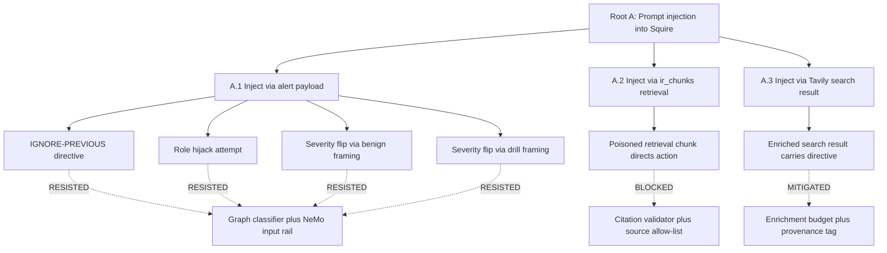
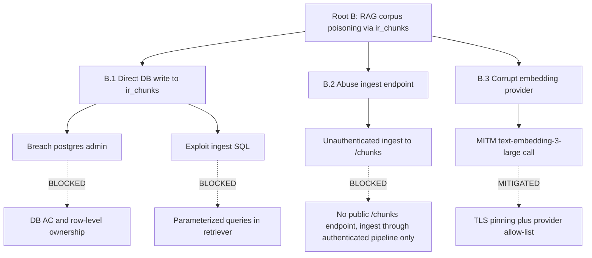
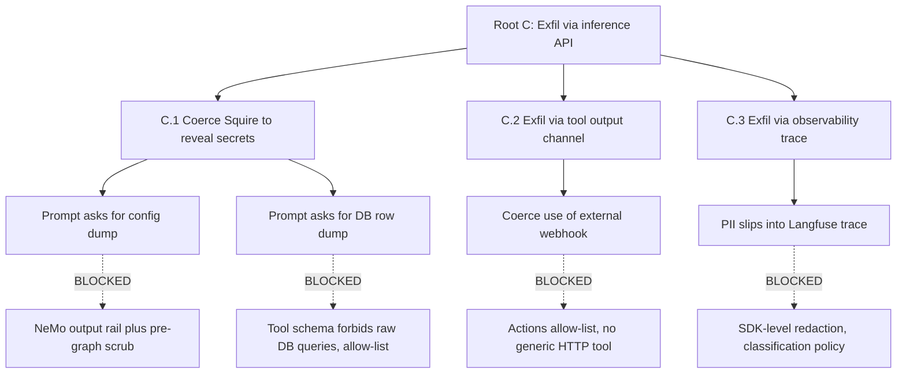

# Attack Tree - Compromise AI Inference Pipeline

**Organization:** Organization Security Operations Platform
**Assessment Date:** 2026-03-12
**Assessor:** System Owner
**Methodology:** Attack Tree Analysis (Schneier, 1999) with MITRE ATLAS and OWASP LLM Top 10 mapping
**NIST 800-53 Controls:** RA-3 (Risk Assessment), RA-5 (Vulnerability Monitoring), SA-11 (Developer Testing), SA-15 (Development Process)
**OWASP LLM Top 10 (2025):** LLM01 (Prompt Injection), LLM02 (Sensitive Information Disclosure), LLM03 (Supply Chain), LLM04 (Data and Model Poisoning), LLM05 (Improper Output Handling), LLM06 (Excessive Agency), LLM07 (System Prompt Leakage), LLM10 (Unbounded Consumption)
**MITRE ATLAS:** AML.T0010 (ML Supply Chain Compromise), AML.T0018 (Backdoor ML Model), AML.T0020 (Poison Training Data), AML.T0024 (Exfiltration via ML Inference API), AML.T0029 (Denial of ML Service), AML.T0040 (ML-Enabled Lateral Movement), AML.T0043 (Craft Adversarial Data), AML.T0051 (LLM Prompt Injection), AML.T0054 (LLM Jailbreak)
**Classification:** Internal Use Only
**Version:** 1.1 (Phase 17 scope extension 2026-04-24)

---

## Document Control

| Field | Value |
|-------|-------|
| Document ID | AT-AI-001 |
| Version | 1.0 |
| Status | Approved |
| Last Revised | 2026-03-12 |
| Next Review | 2026-09-12 |
| Author | Information Security Officer |
| Approver | System Owner |

### Revision History

| Version | Date | Author | Description |
|---------|------|--------|-------------|
| 1.1 | 2026-04-24 | Information Security Officer | Phase 17 scope extension added. 3 new attack roots for Squire (prompt injection, RAG poisoning, exfil via inference API). 4 leaves RESISTED in red-team cycle 1, 2 scheduled for cycle 2. |
| 1.0 | 2026-03-12 | Information Security Officer | Initial attack tree for AI inference pipeline |

---

## 1. Purpose

This document presents an attack tree decomposition for the root goal: **Compromise AI Inference Pipeline**. The AI inference pipeline encompasses all three AI systems within the authorization boundary (AI-001, AI-002, AI-003), their input channels, processing logic, output consumers, and the downstream automation workflows that act upon AI-generated outputs.

Attack trees provide a hierarchical, goal-oriented view of how an adversary could achieve a specific objective. Each branch represents an alternative attack path, and each leaf node represents an atomic attack step annotated with probability, skill level, existing controls, and detection capability.

This analysis supports the STRIDE threat model (`THREAT_MODEL_STRIDE.md`) by providing depth on AI-specific attack paths, and cross-references the AI Threat Catalog (`AI_THREAT_CATALOG.md`) for comprehensive threat-to-control mapping.

---

## 2. Scope

### 2.1 Root Goal Definition

**Root Goal:** Achieve one or more of the following outcomes by compromising the AI inference pipeline:

1. **Unauthorized action execution** - cause the AI agent to trigger svc-automation workflows that perform unintended operations
2. **Sensitive data exfiltration** - extract credentials, PII, system prompts, or operational context from AI systems
3. **Model integrity degradation** - alter AI model behavior to produce manipulated, biased, or backdoored outputs
4. **Denial of AI service** - render AI inference unavailable, degrading platform operational capability

### 2.2 AI Systems in Scope

| ID | System | Service | External Dependencies | Trust Zone |
|----|--------|---------|----------------------|------------|
| AI-001 | AI Agent Gateway | svc-ai-gateway (OpenClaw → Claude Fable 5) | Anthropic API | DMZ |
| AI-002 | Local LLM Inference | svc-llm (Ollama → Qwen 3 4B) | None (air-gapped on net-ai) | Internal |
| AI-003 | Voice Transcription | svc-transcription (Whisper) | None (local CPU inference) | Internal |

---

## 3. Attack Tree

### 3.1 Root Node

```
[ROOT] Compromise AI Inference Pipeline
├── [PATH 1] Prompt Injection via External Messaging
│   ├── [1.1] Direct Prompt Injection via Telegram
│   │   ├── [1.1.1] Craft adversarial prompt to override system instructions
│   │   │           AML.T0051 (LLM Prompt Injection)
│   │   │           Prob: HIGH | Skill: LOW | Detect: MEDIUM
│   │   │
│   │   ├── [1.1.2] Exploit multi-turn context to gradually shift behavior
│   │   │           AML.T0051
│   │   │           Prob: MEDIUM | Skill: MEDIUM | Detect: LOW
│   │   │
│   │   └── [1.1.3] Trigger unintended svc-automation workflow execution
│   │               AML.T0051 (LLM Prompt Injection); OWASP 2025 LLM06 (Excessive Agency)
│   │               Prob: LOW | Skill: MEDIUM | Detect: HIGH
│   │
│   ├── [1.2] Indirect Prompt Injection via Data Sources
│   │   ├── [1.2.1] Inject malicious content into data consumed by AI
│   │   │           (e.g., poisoned web content retrieved by search skills)
│   │   │           AML.T0043 (Adversarial Data Injection)
│   │   │           Prob: LOW | Skill: HIGH | Detect: LOW
│   │   │
│   │   └── [1.2.2] Embed injection payloads in Telegram message metadata
│   │               AML.T0051
│   │               Prob: VERY LOW | Skill: HIGH | Detect: MEDIUM
│   │
│   └── [1.3] System Prompt Extraction
│       ├── [1.3.1] Query AI to reveal its system instructions
│       │           AML.T0054 (LLM Jailbreak)
│       │           Prob: MEDIUM | Skill: LOW | Detect: MEDIUM
│       │
│       └── [1.3.2] Use extracted prompt to craft targeted injection
│                   AML.T0051
│                   Prob: LOW | Skill: MEDIUM | Detect: LOW
│
├── [PATH 2] Model Integrity Compromise (Supply Chain)
│   ├── [2.1] Poison svc-llm (Ollama) Model Weights
│   │   ├── [2.1.1] Compromise Ollama model registry
│   │   │           AML.T0018 (Backdoor ML Model)
│   │   │           Prob: VERY LOW | Skill: HIGH | Detect: LOW
│   │   │
│   │   ├── [2.1.2] Publish trojaned model variant with similar name
│   │   │           AML.T0018
│   │   │           Prob: LOW | Skill: MEDIUM | Detect: MEDIUM
│   │   │
│   │   └── [2.1.3] Exploit model download process to MITM weights
│   │               AML.T0018
│   │               Prob: VERY LOW | Skill: HIGH | Detect: MEDIUM
│   │
│   ├── [2.2] Compromise svc-ai-gateway Dependencies
│   │   ├── [2.2.1] Inject malicious code into OpenClaw container image
│   │   │           Prob: VERY LOW | Skill: HIGH | Detect: HIGH
│   │   │
│   │   └── [2.2.2] Compromise upstream dependency (npm/pip supply chain)
│   │               Prob: LOW | Skill: HIGH | Detect: MEDIUM
│   │
│   └── [2.3] Tamper with svc-transcription (Whisper) Model
│       └── [2.3.1] Replace Whisper model weights with adversarial variant
│                   AML.T0018
│                   Prob: VERY LOW | Skill: HIGH | Detect: LOW
│
├── [PATH 3] Credential Theft via Environment Variable Exposure
│   ├── [3.1] Exploit svc-automation Code Nodes
│   │   ├── [3.1.1] Craft workflow with Code node that reads process.env
│   │   │           Prob: MEDIUM | Skill: LOW | Detect: MEDIUM
│   │   │
│   │   ├── [3.1.2] Exfiltrate env vars via webhook response body
│   │   │           Prob: LOW | Skill: LOW | Detect: HIGH
│   │   │
│   │   └── [3.1.3] Write env vars to svc-db for later retrieval
│   │               Prob: LOW | Skill: MEDIUM | Detect: LOW
│   │
│   ├── [3.2] Extract Secrets from Container Runtime
│   │   ├── [3.2.1] Exploit container vulnerability to read /proc/1/environ
│   │   │           Prob: LOW | Skill: HIGH | Detect: HIGH
│   │   │
│   │   └── [3.2.2] Access Docker inspect output from compromised container
│   │               (requires Docker socket - NOT mounted)
│   │               Prob: BLOCKED | Skill: N/A | Detect: N/A
│   │
│   └── [3.3] Harvest Credentials from Log Streams
│       ├── [3.3.1] Trigger verbose logging that dumps env vars to stdout
│       │           Prob: LOW | Skill: MEDIUM | Detect: MEDIUM
│       │
│       └── [3.3.2] Access Datadog log archives containing leaked secrets
│                   Prob: VERY LOW | Skill: MEDIUM | Detect: LOW
│
└── [PATH 4] Lateral Movement from Compromised AI Container
    ├── [4.1] Pivot from svc-ai-gateway (DMZ) to Internal Zone
    │   ├── [4.1.1] Use net-core connectivity to reach svc-db
    │   │           AML.T0040 (ML-Enabled Lateral Movement)
    │   │           Prob: MEDIUM | Skill: MEDIUM | Detect: HIGH
    │   │
    │   ├── [4.1.2] Authenticate to svc-db using env var credentials
    │   │           Prob: MEDIUM (if 4.1.1 succeeds) | Skill: LOW | Detect: MEDIUM
    │   │
    │   └── [4.1.3] Query svc-db for stored credentials or workflow secrets
    │               Prob: MEDIUM (if 4.1.2 succeeds) | Skill: LOW | Detect: MEDIUM
    │
    ├── [4.2] Pivot from svc-llm (Internal) to Sensitive Zone
    │   ├── [4.2.1] Exploit svc-llm container to gain shell access
    │   │           Prob: LOW | Skill: HIGH | Detect: HIGH
    │   │
    │   ├── [4.2.2] Scan net-core for reachable sensitive services
    │   │           AML.T0040
    │   │           Prob: LOW (if 4.2.1 succeeds) | Skill: MEDIUM | Detect: HIGH
    │   │
    │   └── [4.2.3] Access svc-secrets (Vault) using harvested tokens
    │               Prob: VERY LOW | Skill: HIGH | Detect: HIGH
    │
    └── [4.3] Escape to Host from AI Container
        ├── [4.3.1] Exploit kernel vulnerability from unprivileged container
        │           Prob: VERY LOW | Skill: HIGH | Detect: HIGH
        │
        └── [4.3.2] Exploit shared volume mount for host file access
                    Prob: VERY LOW | Skill: HIGH | Detect: MEDIUM
```

---

## 4. Attack Path Analysis

### 4.1 Path 1 - Prompt Injection via External Messaging

**Attack Chain:** Telegram API → svc-tunnel → svc-ai-gateway → svc-automation → downstream actions

**OWASP LLM References:** LLM01 (Prompt Injection), LLM02 (Insecure Output Handling), LLM08 (Excessive Agency)

| Leaf Node | Probability | Skill Level | Existing Controls | Detection Capability |
|-----------|-------------|-------------|-------------------|---------------------|
| 1.1.1 Direct injection | High | Low (publicly available techniques) | System prompt hardening; output sanitization | Medium - behavioral anomaly in responses logged but not auto-flagged |
| 1.1.2 Multi-turn context shift | Medium | Medium | Conversation context limits; rate limiting | Low - gradual drift is harder to detect than single-prompt injection |
| 1.1.3 Trigger workflow execution | Low | Medium | Human approval gates for destructive actions; action allowlist | High - svc-automation execution logs; Falco alert on unexpected process spawns |
| 1.2.1 Indirect injection via data | Low | High (requires knowledge of data sources) | Data source validation in search skills | Low - injected content may be indistinguishable from legitimate data |
| 1.2.2 Metadata injection | Very Low | High | Telegram API validates message structure | Medium - unusual metadata patterns detectable in log analysis |
| 1.3.1 System prompt extraction | Medium | Low | Prompt instructs model not to disclose; access restricted by chat ID | Medium - extraction attempts visible in prompt logs upon review |
| 1.3.2 Targeted injection post-extraction | Low | Medium | Same as 1.1.1 plus knowledge of prompt structure | Low - targeted attacks blend with normal interactions |

**Path 1 Overall Assessment:**
- **Most likely sub-path:** 1.1.1 (direct injection) - highest probability, lowest skill requirement
- **Highest impact sub-path:** 1.1.3 (workflow execution) - potential for unauthorized infrastructure changes
- **Key control gap:** No automated prompt firewall to classify and block injection attempts before they reach the model
- **Compensating control:** Human approval gates prevent destructive actions even if injection succeeds

### 4.2 Path 2 - Model Integrity Compromise

**Attack Chain:** Upstream registry/repository → model download → svc-llm/svc-transcription → altered outputs → svc-automation

**OWASP LLM References:** LLM03 (Supply Chain Vulnerabilities)
**MITRE ATLAS:** AML.T0018 (Backdoor ML Model)

| Leaf Node | Probability | Skill Level | Existing Controls | Detection Capability |
|-----------|-------------|-------------|-------------------|---------------------|
| 2.1.1 Registry compromise | Very Low | High (nation-state level) | No automatic model updates; manual pull required | Low - backdoor detection in ML models is an open research problem |
| 2.1.2 Typosquatting model variant | Low | Medium | Operator verifies model name/source manually | Medium - detectable if naming conventions are checked before pull |
| 2.1.3 MITM model download | Very Low | High | HTTPS transport for Ollama pulls | Medium - TLS certificate validation prevents most MITM |
| 2.2.1 Container image injection | Very Low | High | Trivy scanning; Cosign signing; SBOM tracking | High - CI pipeline catches known vulnerabilities; signatures verify provenance |
| 2.2.2 Dependency supply chain | Low | High | Semgrep SAST; Trivy dependency scanning | Medium - zero-day supply chain attacks may evade scanning |
| 2.3.1 Whisper model replacement | Very Low | High | Model loaded from local volume; manual deployment | Low - no automated behavioral testing of Whisper outputs |

**Path 2 Overall Assessment:**
- **Most likely sub-path:** 2.1.2 (typosquatting) and 2.2.2 (dependency supply chain) - both Low probability but achievable by motivated adversaries
- **Highest impact sub-path:** 2.1.1 (registry compromise) - a backdoored model could subtly alter all AI-002 outputs, affecting downstream decisions
- **Key control gap:** No automated model behavioral regression testing; model integrity verification is manual
- **Compensating control:** svc-llm outputs are consumed by svc-automation with validation steps; no direct external user exposure

### 4.3 Path 3 - Credential Theft via Environment Variable Exposure

**Attack Chain:** svc-automation Code node / container exploit → process.env / /proc/1/environ → credential exfiltration → privilege escalation

**OWASP LLM References:** LLM06 (Sensitive Information Disclosure)

| Leaf Node | Probability | Skill Level | Existing Controls | Detection Capability |
|-----------|-------------|-------------|-------------------|---------------------|
| 3.1.1 Code node reads process.env | Medium | Low (basic JavaScript) | Workflow access restricted to authenticated operators | Medium - Code node execution logged but env var access not specifically flagged |
| 3.1.2 Exfiltrate via webhook response | Low | Low | Webhook responses logged; Falco monitors outbound connections | High - unusual outbound data from svc-automation triggers Falco alert |
| 3.1.3 Write to database for retrieval | Low | Medium | Database writes logged in workflow execution history | Low - blends with normal workflow database operations |
| 3.2.1 Read /proc/1/environ | Low | High (requires container exploit first) | no-new-privileges; PID namespace isolation | High - Falco detects access to /proc sensitive files |
| 3.2.2 Docker inspect (socket) | **BLOCKED** | N/A | Docker socket NOT mounted in any container | N/A - attack path is architecturally eliminated |
| 3.3.1 Trigger verbose logging | Low | Medium | Production log level set to info/warn; log rotation limits | Medium - log level changes detectable via Falco file write monitoring |
| 3.3.2 Access Datadog log archives | Very Low | Medium | Datadog RBAC; API key stored in secrets manager | Low - API key compromise would provide broad log access |

**Path 3 Overall Assessment:**
- **Most likely sub-path:** 3.1.1 (Code node env var access) - Medium probability, Low skill requirement
- **Highest impact sub-path:** 3.1.1 → 3.1.3 chain - credentials written to database could persist indefinitely and be retrieved later
- **Key control gap:** svc-automation Code nodes have unrestricted access to all container environment variables
- **Compensating control:** Workflow access restricted to authenticated operators; however, a compromised operator account or injection into workflow logic bypasses this control
- **Architecturally blocked path:** 3.2.2 - Docker socket is not exposed to any container, eliminating this entire branch

### 4.4 Path 4 - Lateral Movement from Compromised AI Container

**Attack Chain:** Compromised AI container → network scanning → cross-zone service access → sensitive data/privilege escalation

**MITRE ATLAS:** AML.T0040 (ML-Enabled Lateral Movement)

| Leaf Node | Probability | Skill Level | Existing Controls | Detection Capability |
|-----------|-------------|-------------|-------------------|---------------------|
| 4.1.1 Reach svc-db from DMZ | Medium | Medium | Docker network segmentation (net-core) | High - Falco detects unexpected network connections |
| 4.1.2 Authenticate to svc-db | Medium (conditional) | Low | Database requires credential authentication | Medium - connection from unexpected source logged by PostgreSQL |
| 4.1.3 Query for secrets | Medium (conditional) | Low | Limited schema permissions (Partial) | Medium - unusual query patterns detectable in slow query logs |
| 4.2.1 Shell access on svc-llm | Low | High | no-new-privileges; no internet access on net-ai | High - Falco detects shell spawns in application containers |
| 4.2.2 Scan for sensitive services | Low (conditional) | Medium | Network segmentation; no network scanning tools in containers | High - network scanning activity triggers Falco alerts |
| 4.2.3 Access svc-secrets | Very Low | High | Token-based auth; sealed by default; requires unseal keys | High - Vault audit log captures all access attempts |
| 4.3.1 Kernel exploit for host escape | Very Low | High | no-new-privileges; kernel hardening; PID limits | High - Falco eBPF detects container escape indicators |
| 4.3.2 Shared volume exploitation | Very Low | High | Volumes are service-specific; no cross-container volume sharing for AI services | Medium - file access outside expected paths triggers alert |

**Path 4 Overall Assessment:**
- **Most likely sub-path:** 4.1.1 → 4.1.2 → 4.1.3 chain - if svc-ai-gateway is compromised, net-core connectivity provides a path to svc-db, and environment variables contain the credentials needed to authenticate
- **Highest impact sub-path:** 4.2.3 (Vault access) - compromise of svc-secrets would grant access to all managed secrets
- **Key control gap:** net-core provides overly broad connectivity; micro-segmentation would limit AI container reach
- **Compensating control:** Falco eBPF monitoring provides high-confidence detection of lateral movement indicators; svc-secrets requires token authentication and is sealed by default

---

## 5. Controls Effectiveness Assessment

### 5.1 Control Coverage by Attack Path

| Control | Path 1 (Injection) | Path 2 (Supply Chain) | Path 3 (Credential Theft) | Path 4 (Lateral Movement) |
|---------|:------------------:|:---------------------:|:------------------------:|:------------------------:|
| System prompt hardening | Prevents | - | - | - |
| Human approval gates | Mitigates | - | - | - |
| Trivy CVE scanning | - | Detects | - | - |
| Cosign image signing | - | Detects (signature mismatch) | - | - |
| SBOM tracking | - | Detects | - | - |
| Docker network segmentation | - | - | - | Mitigates |
| no-new-privileges | - | - | Mitigates | Prevents (partial) |
| Falco eBPF detection | Detects | - | Detects | Detects |
| svc-automation auth | - | - | Prevents | - |
| Secrets manager (external) | - | - | Mitigates | - |
| Rate limiting | Mitigates | - | - | - |
| Chat ID allowlist | Prevents | - | - | - |
| Log scrubbing (Fluentd) | - | - | **GAP** | - |
| mTLS between services | - | - | - | **GAP** |
| Prompt firewall | **GAP** | - | - | - |
| Model integrity automation | - | **GAP** | - | - |

### 5.2 Detection Confidence by Path

| Attack Path | Prevention Confidence | Detection Confidence | Response Readiness |
|-------------|:--------------------:|:-------------------:|:-----------------:|
| Path 1 (Prompt Injection) | Medium | Medium | High (IR playbooks, human gates) |
| Path 2 (Supply Chain) | Medium | Low-Medium | Medium (rollback procedures exist) |
| Path 3 (Credential Theft) | Low-Medium | Medium | High (credential rotation runbook) |
| Path 4 (Lateral Movement) | Medium | High | High (container isolation playbook) |

---

## 6. Recommended Mitigations (Prioritized)

| Priority | Attack Path | Mitigation | MITRE ATLAS Defense | Target Date |
|----------|-------------|-----------|---------------------|-------------|
<!-- TODO(et): P1 through P5 target dates 2026-06-12 / 2026-09-12 are past or approaching. Refresh with closure status or revised targets. -->
| 1 | Path 3 | Restrict environment variable visibility in svc-automation Code nodes; migrate to svc-secrets dynamic credentials | Not an ATLAS-mitigation; tracked via NIST 800-53 SC-28, SC-12 and CIS Docker Bench 5.10 | 2026-06-12 |
| 2 | Path 1 | Deploy prompt firewall (input/output classifier) at svc-ai-gateway | AML.M0004 (Restrict Queries) | 2026-06-12 |
| 3 | Path 4 | Implement micro-segmentation within net-core; restrict AI container network egress to documented endpoints only | AML.M0002 (Passive ML Output Obfuscation) | 2026-09-12 |
| 4 | Path 2 | Automate model integrity verification with behavioral regression testing against curated baselines | AML.M0014 (Verify ML Artifacts) | 2026-09-12 |
| 5 | Path 1 | Implement structured decision logging with full AI reasoning chain attribution | AML.M0015 | 2026-06-12 |

---

## 6.5 Phase 17 Scope Extension: Squire-Specific Attack Roots

> **Key Point:** Phase 17 deploys a new autonomous SOC analyst (Squire) with tool-calling, RAG retrieval, and a dedicated webhook. Three new attack roots target Squire specifically. Each root maps to remediation controls now deployed.

### 6.5.1 Root A: Prompt injection into Squire



| Leaf | Status | Evidence |
|------|--------|----------|
| A.1.a IGNORE-PREVIOUS | RESISTED | REDTEAM_RESULTS.md Finding 1 |
| A.1.b Role hijack | RESISTED | REDTEAM_RESULTS.md Finding 2 |
| A.1.c Benign framing | RESISTED | REDTEAM_RESULTS.md Finding 5 |
| A.1.d Drill framing | RESISTED | REDTEAM_RESULTS.md Finding 6 |
| A.2.a Poisoned chunk | Not yet executed | Scheduled in AI_RED_TEAM_PLAN cycle 2 |
| A.3.a Search directive | Not yet executed | Scheduled in AI_RED_TEAM_PLAN cycle 2 |

### 6.5.2 Root B: RAG corpus poisoning via ir_chunks



| Leaf | Control | Doc |
|------|---------|-----|
| B.1.a | Role-scoped Postgres user, no shell for svc-squire | SQUIRE_SSP SC-4, AC-3 |
| B.1.b | Parameterized queries, no string concat in retriever | CODE_REVIEW_FINDINGS |
| B.2.a | No public ingest path, only batch loader with auth | SQUIRE_SSP AC-3 |
| B.3.a | Provider allow-list in ADR_001_EMBEDDING_PROVIDER | ADR_001_EMBEDDING_PROVIDER |

### 6.5.3 Root C: Exfil via inference API



| Leaf | Control | Doc |
|------|---------|-----|
| C.1.a | NeMo output rail strips secrets; pre-graph scrub catches PII upstream | GUARDRAILS_CONFIGURATION |
| C.1.b | Tool schema forbids raw DB queries; only typed investigator tools | SQUIRE_SSP AC-6 |
| C.2.a | Actions allow-list; no generic HTTP tool exposed | SQUIRE_SSP AC-6 |
| C.3.a | SDK-level redaction plus data class policy | SQUIRE_DATA_FLOW_CLASSIFICATION |

### 6.5.4 Reconciled counts

| Metric | Pre-Phase 17 | Phase 17 delta | Total |
|--------|--------------|----------------|-------|
| Attack paths or roots | 4 | +3 | 7 |
| Leaves tested | 0 | 4 RESISTED, 2 scheduled | 4 RESISTED plus 2 scheduled |

---

## 7. Related Documents

| Document | Relationship |
|----------|-------------|
| [THREAT_MODEL_STRIDE.md](THREAT_MODEL_STRIDE.md) | STRIDE analysis referencing AI threats T-01, T-02, I-01, E-02, E-04 |
| [AI_THREAT_CATALOG.md](AI_THREAT_CATALOG.md) | Comprehensive AI threat-to-control mapping |
| [POLICY_AI_GOVERNANCE.md](POLICY_AI_GOVERNANCE.md) | AI risk register (AI-R01 through AI-R10), AI risk tolerance statements, lifecycle management, governance structure |
| [PLAYBOOK_COMPROMISED_CONTAINER.md](PLAYBOOK_COMPROMISED_CONTAINER.md) | Response procedures for Path 4 scenarios |
| [PLAYBOOK_LEAKED_CREDENTIAL.md](PLAYBOOK_LEAKED_CREDENTIAL.md) | Response procedures for Path 3 scenarios |
| [SSP_SYSTEM_SECURITY_PLAN.md](SSP_SYSTEM_SECURITY_PLAN.md) | Control implementations supporting all paths |

---

*This attack tree is a living document. It SHALL be reviewed semi-annually or when new AI systems are added, existing AI system configurations change, or after an AI-related security incident. The next scheduled review is 2026-09-12.*
