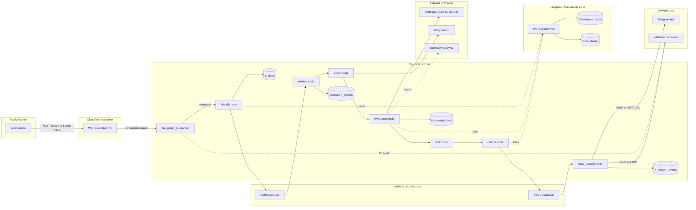

# Data Flow Diagram - Organization Security Operations Platform

**Organization:** Organization Security Operations Platform
**Assessment Date:** 2026-03-12 (v1.0), 2026-04-24 (v1.1 Phase 17 scope extension)
**Assessor:** System Owner
**Methodology:** Data Flow Diagrams (DFD) Levels 0 through 2, per NIST SP 800-154 (Data-Centric Threat Modeling)
**NIST 800-53 Controls:** RA-3 (Risk Assessment), SA-8 (Security and Privacy Engineering Principles), PL-8 (Security and Privacy Architectures)
**Classification:** Internal Use Only
**Version:** 1.1

> **Status note (2026-09-01):** this document describes the DigitalOcean-era baseline as assessed. That environment was retired 2026-08. The platform now runs on an Oracle Cloud (OCI) ARM instance with a partial stack (3 containers live); the remaining services are pending ARM rebuild. A re-baseline of this document is queued and tracked in the POA&M.

---

## Document Control

| Field | Value |
|-------|-------|
| Document ID | DFD-OPS-001 |
| Version | 1.1 |
| Status | Approved |
| Last Revised | 2026-04-24 |
| Next Review | 2026-09-12 |
| Author | Information Security Officer |
| Approver | System Owner |

### Revision History

| Version | Date | Author | Description |
|---------|------|--------|-------------|
| 1.0 | 2026-03-12 | Information Security Officer | Initial DFD covering all 20 services, 3 networks, 7 trust boundaries |
| 1.1 | 2026-04-24 | Information Security Officer | Phase 17 scope extension. Added Squire alert pipeline section 11 with +10 data flows, +3 trust boundaries, +6 data stores, +3 external entities. Reconciled totals: 40 flows, 15 stores, 14 entities, 10 boundaries. |

---

## 1. Purpose

This document provides the canonical Data Flow Diagram (DFD) for the Organization Security Operations Platform at Levels 0, 1, and 2. It identifies all processes, data stores, external entities, trust boundaries, and data flows within the authorization boundary.

This DFD is the foundational input to the STRIDE threat model (`THREAT_MODEL_STRIDE.md`). Every trust boundary crossing in this document maps to one or more STRIDE threats, and every data flow maps to a potential attack surface analyzed in the Attack Tree (`ATTACK_TREE_AI_PIPELINE.md`) and AI Threat Catalog (`AI_THREAT_CATALOG.md`).

The DFD serves as:

1. **The threat modeling substrate** - STRIDE analysis is performed against these diagrams, not against code or architecture docs
2. **A data classification tool** - each flow is annotated with data type, sensitivity, and encryption status
3. **An audit artifact** - demonstrates systematic identification of data flows per NIST SP 800-154 and RA-3
4. **A change control reference** - any new service, integration, or data flow must be reflected here before deployment

---

## 2. DFD Legend

| Symbol | Name | Description |
|--------|------|-------------|
| `[P]` | Process | A service, application, or compute function that transforms data |
| `[DS]` | Data Store | A persistent or semi-persistent repository of data |
| `[EE]` | External Entity | An actor or system outside the authorization boundary |
| `[DF]` | Data Flow | A directional movement of data between elements |
| `[TB]` | Trust Boundary | A transition between zones of different trust levels |

### Trust Boundary Definitions

| Boundary | From | To | Description |
|----------|------|----|-------------|
| **TB-1** | Internet | Edge security provider (Cloudflare) | Untrusted traffic enters edge network |
| **TB-2** | Edge security provider | svc-tunnel → DMZ | Authenticated HTTPS traffic enters platform |
| **TB-3** | DMZ | Internal zone | Workflow queries, AI inference requests cross zone |
| **TB-4** | DMZ | Sensitive zone | Authentication requests, secret lookups cross zone |
| **TB-5** | svc-ai-gateway | Anthropic API (external) | Prompts containing operational context leave boundary |
| **TB-6** | Monitoring zone | Monitoring platform SaaS (Datadog) | Metrics, logs, traces, alerts leave boundary |
| **TB-7** | Telegram API | svc-tunnel → svc-ai-gateway | User messages from external messaging platform |

### Network Segments

| Network | Purpose | Internet Access | Services |
|---------|---------|-----------------|----------|
| **net-core** | Primary service mesh | Via svc-tunnel only | svc-automation, svc-ai-gateway, svc-db, svc-secrets, svc-identity, svc-gateway |
| **net-ai** | AI inference isolation | `internal: true` (no internet) | svc-llm (Ollama), svc-transcription (Whisper) |
| **net-monitoring** | Observability pipeline | Egress to monitoring platform SaaS | svc-detection (Falco), svc-detection-router (Falcosidekick), svc-monitor (Datadog), svc-log-router (Fluentd), svc-event-shipper |

---

## 3. Level 0 - Context Diagram

The platform is represented as a single process. All external entities and their data flows are shown.

```
                                         Legend
                                         ------
                                         [EE] = External Entity
                                         [P]  = Process
                                         [DF] = Data Flow
                                         [TB] = Trust Boundary


    [EE] User                  [DF-01] Telegram messages
    (Telegram)  ─────────────────────────────────────────┐
                                                         │
    [EE] Anthropic             [DF-02] AI prompts /      │
    API          ◄──────────────────── responses ────────┤
                                                         │
    [EE] Edge Security         [DF-03] HTTPS traffic /   │
    Provider     ◄──────────────────── tunnel ──────────►│
    (Cloudflare)                                         │
                                                   ┌─────┴──────┐
    [EE] Monitoring            [DF-04] Metrics /   │             │
    Platform     ◄──────────────────── logs /  ────┤  [P] Org    │
    (Datadog SaaS)                     alerts      │  Security   │
                                                   │  Operations │
    [EE] GitHub                [DF-05] CI/CD       │  Platform   │
    (CI/CD)      ◄──────────────────── artifacts ──┤             │
                                                   │             │
    [EE] Cloud Provider        [DF-06] IaC state / │             │
    API          ◄──────────────────── provisioning┤             │
    (Compute/DNS/FW)                               └─────────────┘
                                                         │
    [EE] Secrets Manager       [DF-07] Secret sync /     │
    (Secrets Manager)    ◄───────────────────── rotation ────────┘

    [EE] Credential Vault      [DF-08] Secret source
      ◄──────────── of truth (rotation) ─── [EE] Secrets Manager
```

### Context Diagram - External Entity Summary

| Entity | Direction | Data Exchanged | Trust Level |
|--------|-----------|----------------|-------------|
| User (Telegram) | Inbound | Chat messages, commands, voice notes | Untrusted (authenticated by chat ID allowlist) |
| Anthropic API | Bidirectional | AI prompts (outbound), inference responses (inbound) | Semi-trusted (vendor agreement) |
| Edge security provider (Cloudflare) | Bidirectional | HTTPS requests (inbound), tunnel keepalive (outbound) | Trusted (infrastructure partner) |
| Monitoring platform (Datadog SaaS) | Outbound | Metrics, logs, traces, Falco alerts | Trusted (monitoring partner) |
| GitHub (CI/CD) | Bidirectional | Code push (inbound), scan results, deployment triggers | Trusted (version control) |
| Cloud provider API | Outbound | Terraform state, resource provisioning, DNS updates | Trusted (infrastructure) |
| Secrets manager | Inbound | Secret values injected as environment variables | Trusted (secrets authority) |
| Credential vault | Source of truth | Secret rotation reference; write-only from platform | Trusted (offline reference) |

---

## 4. Level 1 - System Decomposition

The platform is decomposed into five trust zones with 20 services, 3 Docker networks, and 10 trust boundaries (7 legacy plus 3 Phase 17, see section 11).

```
Legend: [TB-N] = Trust Boundary | [P-NN] = Process | [DS-NN] = Data Store | ──► = Data Flow

═══════════════════════════════════════════════════════════════════════════════════
                               INTERNET (Untrusted)
═══════════════════════════════════════════════════════════════════════════════════
    [EE] User         [EE] Anthropic    [EE] Monitoring    [EE] GitHub
    (Telegram)        API               Platform (SaaS)    (CI/CD)
        │                 ▲                   ▲                 │
        │ [DF-01]         │ [DF-02]           │ [DF-04]         │ [DF-05]
  ══════╪═════════════════╪═══════════════════╪═════════════════╪═════════ [TB-1]
        │                 │                   │                 │
        ▼                 │                   │                 ▼
┌─ PUBLIC ZONE ───────────┼───────────────────┼─────────────────────────────────┐
│  [P-01] Edge Security   │                   │          [P-14] CI/CD Pipeline  │
│  Provider (Cloudflare   │                   │          (GitHub Actions +      │
│  WAF + DDoS + Tunnel)   │                   │           Terraform)            │
└────────┬────────────────┼───────────────────┼──────────────────────────┬──────┘
         │ [DF-09]        │                   │                          │
   ══════╪════════════════╪═══════════════════╪══════════════════════════╪═ [TB-2]
         │                │                   │                          │
         ▼                │                   │                          ▼
┌─ DMZ (net-core ingress) ┼───────────────────┼────────────────────────────────┐
│                         │                   │                                │
│  [P-02] svc-tunnel ─────┤                   │                                │
│  (Cloudflare Tunnel)    │                   │                                │
│         │               │                   │                                │
│         ├──[DF-10]──►[P-03] svc-automation (n8n SOAR)◄──[DF-11]──┘          │
│         │               │         │    │                                     │
│         └──[DF-12]──►[P-04] svc-ai-gateway (OpenClaw)                       │
│                         │         │                                          │
└─────────────────────────┼─────────┼──────────────────────────────────────────┘
                          │         │
   ═══════════════════════╪═════════╪══════════════════════════════════════ [TB-3]
                          │         │
┌─ INTERNAL ZONE ─────────┼─────────┼─────────────────────────────────────────┐
│                         │         │                                         │
│  net-core:              │         │          net-ai (internal: true):        │
│  ┌──────────────────┐   │    ┌────┴────┐     ┌──────────────────────┐       │
│  │[DS-01] svc-db    │◄──┘    │ [DF-15] │     │[P-06] svc-llm       │       │
│  │(PostgreSQL 16)   │        │         ▼     │(Ollama - Qwen 3 8B) │       │
│  │                  │        │    [DF-16]     │  No internet egress  │       │
│  │[DS-02] db-data-  │        │         │     └──────────────────────┘       │
│  │  volume          │        │         │     ┌──────────────────────┐       │
│  └──────────────────┘        │         │     │[P-07] svc-           │       │
│                              │         ▼     │  transcription       │       │
│                              │               │(Whisper)             │       │
│                              │               │  No internet egress  │       │
│                              │               └──────────────────────┘       │
└──────────────────────────────┼──────────────────────────────────────────────┘
                               │
   ════════════════════════════╪═══════════════════════════════════════════ [TB-4]
                               │
┌─ SENSITIVE ZONE (net-core, restricted) ─────────────────────────────────────┐
│                              │                                              │
│  [P-08] svc-secrets ◄───────┤ [DF-17]                                      │
│  (HashiCorp Vault)          │                                               │
│                              │                                              │
│  [P-09] svc-identity ◄──────┤ [DF-18]                                      │
│  (Keycloak v26)             │                                               │
│                              │                                              │
│  [P-10] svc-gateway ◄───────┘ [DF-19]                                      │
│  (Teleport v18)                                                             │
└─────────────────────────────────────────────────────────────────────────────┘

   ═══════════════════════════════════════════════════════════════════════ [TB-6]

┌─ MONITORING ZONE (net-monitoring) ──────────────────────────────────────────┐
│                                                                             │
│  [P-11] svc-detection ──► [P-12] svc-detection-router ──► [EE] Monitoring  │
│  (Falco eBPF)             (Falcosidekick)                  Platform (SaaS) │
│                                                                ▲           │
│  [P-13] svc-monitor ──────────────────────────────────────────┘            │
│  (Datadog Agent)               ▲                                           │
│                                │                                           │
│  [P-15] svc-log-router ───────┘ [DF-23]                                   │
│  (Fluentd)                     ▲                                           │
│                                │                                           │
│  [P-16] svc-event-shipper ─────┘ [DF-24]                                  │
│  (Teleport Event Handler)                                                  │
└─────────────────────────────────────────────────────────────────────────────┘
```

---

## 5. Level 2 - AI Pipeline Detail

This diagram zooms into the AI subsystem, showing the three AI systems (AI-001, AI-002, AI-003), their data flows, and trust boundary crossings.

```
Legend: [TB-N] = Trust Boundary | [AI-0N] = AI System | ──► = Data Flow

═══════════════════════════════════════════════════════════════════════ [TB-7]
  [EE] User (Telegram)
      │
      │ [DF-01] Chat messages, voice notes, commands
      ▼
═══════════════════════════════════════════════════════════════════════ [TB-1]
  [P-01] Edge Security Provider (Cloudflare WAF + rate limiting)
      │
      │ [DF-09] Authenticated HTTPS (Telegram webhook payload)
      ▼
═══════════════════════════════════════════════════════════════════════ [TB-2]
  [P-02] svc-tunnel (Cloudflare Tunnel connector)
      │
      │ [DF-12] HTTP POST to svc-ai-gateway
      ▼
┌─ DMZ ─────────────────────────────────────────────────────────────────────┐
│                                                                           │
│  [P-04] svc-ai-gateway (OpenClaw - Claude Fable 5) [AI-001]               │
│  ├── System prompt + conversation context                                 │
│  ├── Skills: Tavily search, browser, GitHub, Notion, python-interpreter   │
│  │                                                                        │
│  ├──[DF-02]──► [EE] Anthropic API ◄────── [TB-5]                         │
│  │             (prompts out, responses in)                                │
│  │                                                                        │
│  ├──[DF-13]──► [EE] Tavily API (web search results)                      │
│  ├──[DF-14]──► [EE] GitHub API (repo data)                               │
│  ├──[DF-28]──► [EE] Notion API (workspace data)                          │
│  │                                                                        │
│  ├──[DF-25]──► [P-03] svc-automation ──── workflow triggers               │
│  │                      │       │                                         │
│  │                      │       └──[DF-15]──► [DS-01] svc-db              │
│  │                      │                     (workflow state, creds)      │
│  │                      │                                                 │
│  │                 ─────┼──────────────────────────────── [TB-3]          │
│  │                      │                                                 │
│  │                      ├──[DF-16]──► [P-06] svc-llm [AI-002]            │
│  │                      │             (Ollama - Qwen 3 8B)               │
│  │                      │             net-ai: no internet egress          │
│  │                      │             Local classification,               │
│  │                      │             summarization, triage               │
│  │                      │                                                 │
│  │                      └──[DF-26]──► [P-07] svc-transcription [AI-003]  │
│  │                                    (Whisper)                           │
│  │                                    net-ai: no internet egress          │
│  │                                    Voice-to-text processing            │
│  │                                                                        │
│  └──[DF-27]──► [P-11] svc-detection (Falco eBPF)                         │
│                (behavioral monitoring of AI containers)                    │
└───────────────────────────────────────────────────────────────────────────┘

AI Pipeline Data Flow Summary:
  User ──[TB-7]──► Cloudflare ──[TB-2]──► svc-tunnel ──► svc-ai-gateway
  svc-ai-gateway ──[TB-5]──► Anthropic API (external inference)
  svc-ai-gateway ──► svc-automation ──[TB-3]──► svc-llm (local inference)
  svc-ai-gateway ──► svc-automation ──[TB-3]──► svc-transcription (voice)
  svc-ai-gateway ──► svc-automation ──► svc-db (state persistence)
  svc-ai-gateway ──► Tavily/GitHub/Notion APIs (skill execution)
```

---

## 6. Data Flow Inventory

| Flow ID | Source | Destination | Data Type | Protocol | Encryption | Trust Boundary Crossed | Sensitivity |
|---------|--------|-------------|-----------|----------|------------|----------------------|-------------|
| DF-01 | User (Telegram) | Edge security provider → svc-tunnel → svc-ai-gateway | Chat messages, commands, voice notes | HTTPS (Telegram Bot API) | TLS 1.2+ in transit | TB-7, TB-1, TB-2 | Medium |
| DF-02 | svc-ai-gateway | Anthropic API | AI prompts (may contain operational context) | HTTPS | TLS 1.3 in transit | TB-5 | High |
| DF-03 | Anthropic API | svc-ai-gateway | AI inference responses | HTTPS | TLS 1.3 in transit | TB-5 | Medium |
| DF-04 | svc-monitor / svc-log-router | Monitoring platform SaaS (Datadog) | Metrics, logs, traces, Falco alerts | HTTPS | TLS 1.2+ in transit | TB-6 | High |
| DF-05 | GitHub Actions | CI/CD pipeline (Terraform) | Code changes, scan results, deployment triggers | HTTPS (GitHub API) | TLS 1.2+ in transit | TB-1 | Medium |
| DF-06 | Terraform (CI/CD) | Cloud provider API | IaC state, resource provisioning, DNS updates | HTTPS (API) | TLS 1.2+ in transit; state encrypted at rest | TB-1 | High |
| DF-07 | Secrets manager | Platform containers | Secret values (API keys, DB creds, tokens) | HTTPS (CLI) | TLS in transit; env var in memory | TB-1 | Critical |
| DF-08 | Credential vault | Secrets manager | Secret rotation source of truth | HTTPS | TLS in transit; vault encrypted at rest | External | Critical |
| DF-09 | Edge security provider (Cloudflare) | svc-tunnel | Filtered HTTPS traffic (post-WAF) | Cloudflare Tunnel (QUIC/HTTP2) | TLS in transit (tunnel-encrypted) | TB-2 | Medium |
| DF-10 | svc-tunnel | svc-automation | Webhook payloads (GitHub, Telegram, Gumroad) | HTTP (localhost) | Unencrypted (localhost loopback) | None (same host) | Medium |
| DF-11 | CI/CD pipeline | svc-automation | Deployment notifications, workflow triggers | HTTPS (webhook) | TLS via tunnel | TB-2 | Low |
| DF-12 | svc-tunnel | svc-ai-gateway | Telegram webhook payloads, user messages | HTTP (localhost) | Unencrypted (localhost loopback) | None (same host) | Medium |
| DF-13 | svc-ai-gateway | Tavily API | Web search queries | HTTPS | TLS 1.2+ in transit | TB-5 | Low |
| DF-14 | svc-ai-gateway | GitHub API | Repository queries, issue data | HTTPS | TLS 1.2+ in transit | TB-5 | Low |
| DF-15 | svc-automation | svc-db (PostgreSQL) | Workflow state, execution history, credential refs | TCP (PostgreSQL wire protocol) | Unencrypted (Docker internal network) | TB-3 | High |
| DF-16 | svc-automation | svc-llm (Ollama) | Inference prompts (classification, summarization) | HTTP (Ollama API, internal LLM port) | Unencrypted (net-ai, no egress) | TB-3 | Medium |
| DF-17 | svc-automation / svc-ai-gateway | svc-secrets (Vault) | Secret requests, token auth, dynamic credentials | HTTPS (Vault API, internal secrets port) | TLS in transit; sealed storage at rest | TB-4 | Critical |
| DF-18 | svc-automation / svc-gateway | svc-identity (Keycloak) | OIDC auth requests, token validation, RBAC queries | HTTPS (Keycloak API, internal identity port) | TLS in transit | TB-4 | High |
| DF-19 | User (SSH) | svc-gateway (Teleport) | SSH sessions, terminal I/O, session recordings | SSH (port 3080) | SSH encrypted channel | TB-2, TB-4 | High |
| DF-20 | svc-detection (Falco) | svc-detection-router (Falcosidekick) | Security alerts (syscall anomalies, container events) | HTTP (internal) | Unencrypted (net-monitoring) | None | High |
| DF-21 | svc-detection-router (Falcosidekick) | svc-monitor (Datadog) | Formatted security alerts | HTTPS (Datadog API) | TLS in transit | TB-6 | High |
| DF-22 | All containers | svc-log-router (Fluentd) | Container stdout/stderr logs | Fluentd forward protocol | Unencrypted (net-monitoring) | None | Medium |
| DF-23 | svc-log-router (Fluentd) | Monitoring platform SaaS (Datadog) | Aggregated, tagged log streams | HTTPS (Datadog API) | TLS in transit | TB-6 | High |
| DF-24 | svc-event-shipper | svc-log-router (Fluentd) | Teleport audit events (session recordings, access logs) | Fluentd forward protocol | Unencrypted (net-monitoring) | None | High |
| DF-25 | svc-ai-gateway | svc-automation | Workflow trigger payloads (AI-initiated actions) | HTTP (webhook, internal) | Unencrypted (net-core) | None (same zone) | High |
| DF-26 | svc-automation | svc-transcription (Whisper) | Audio data for voice-to-text processing | HTTP (Whisper API, internal transcription port) | Unencrypted (net-ai, no egress) | TB-3 | Medium |
| DF-27 | svc-ai-gateway | svc-detection (Falco) | Behavioral telemetry (implicit - Falco reads syscalls via eBPF) | Kernel eBPF (passive) | N/A (kernel-level observation) | None | High |
| DF-28 | svc-ai-gateway | Notion API | Workspace queries, page reads/writes | HTTPS | TLS 1.2+ in transit | TB-5 | Low |
| DF-29 | svc-automation | User (Telegram) | Bot responses, notifications, status updates | HTTPS (Telegram Bot API) | TLS 1.2+ in transit | TB-7 | Medium |
| DF-30 | svc-identity (Keycloak) | svc-db (PostgreSQL) | RBAC state, user records, session data | TCP (PostgreSQL wire protocol) | Unencrypted (Docker internal network) | None (same zone) | High |

---

## 7. Data Stores

| Store ID | Name | Type | Data Classification | Encryption at Rest | Backup |
|----------|------|------|--------------------|--------------------|--------|
| DS-01 | svc-db (PostgreSQL 16) | Relational database | High - workflow state, credential references, user data, RBAC state | Partial - volume-level encryption depends on host disk config; no TDE | Automated scripts to /opt/platform/CD_BACKUPS/ |
| DS-02 | db-data-volume | Docker volume (persistent) | High - PostgreSQL data files | Inherits host disk encryption | Included in DS-01 backup scope |
| DS-03 | svc-automation persistent data | Docker volume (/opt/platform/CD_VOL_N8N/) | Medium - workflow definitions, execution history, imported credentials | No additional encryption beyond host | Not independently backed up |
| DS-04 | svc-llm model storage | Docker volume (/opt/platform/CD_VOL_OLLAMA/) | Low - public model weights (Qwen 3 8B) | None (public data) | Not backed up (re-pullable) |
| DS-05 | svc-transcription model cache | Docker volume (/opt/platform/CD_VOL_WHISPER/) | Low - public Whisper model weights | None (public data) | Not backed up (re-pullable) |
| DS-06 | svc-secrets storage | Docker volume (/opt/platform/CD_VOL_VAULT/) | Critical - sealed secret data, encryption keys, dynamic credentials | AES-256-GCM (Vault auto-unseal or Shamir) | Not independently backed up (stateless config; secrets sourced from the secrets manager) |
| DS-07 | Terraform state | Remote encrypted storage | High - full infrastructure state, resource IDs, configuration | AES-256 at rest (remote backend) | Version history in remote backend |
| DS-08 | Container image cache | Docker image store (host) | Low - pulled images with known digests | None | Not backed up (re-pullable from registry) |
| DS-09 | Teleport audit data | svc-gateway internal storage + shipped to monitoring platform | High - session recordings, access logs, terminal replay data | Encrypted in transit to monitoring platform; local storage unencrypted | Shipped to monitoring platform (retained per Datadog plan) |

---

## 8. External Entities

| Entity ID | Name | Trust Level | Authentication | Data Exchanged |
|-----------|------|-------------|----------------|----------------|
| EE-01 | User (Telegram) | Untrusted (allowlisted) | Telegram Bot API token + chat ID allowlist | Chat messages, commands, voice notes (inbound); bot responses (outbound) |
| EE-02 | Anthropic API | Semi-trusted (vendor) | API key (Bearer token) | AI prompts (outbound); inference responses (inbound) |
| EE-03 | Edge security provider (Cloudflare) | Trusted (infrastructure) | Tunnel token (unique per tunnel ID) | HTTPS traffic (bidirectional); DNS management; WAF filtering |
| EE-04 | Monitoring platform (Datadog SaaS) | Trusted (monitoring) | Datadog API key + App keys (per integration) | Metrics, logs, traces, alerts (outbound); dashboard queries (inbound) |
| EE-05 | GitHub (CI/CD) | Trusted (version control) | Personal Access Token (PAT) | Code push/pull, CI/CD triggers, scan results, deployment artifacts |
| EE-06 | Cloud provider API | Trusted (infrastructure) | API token (stored in secrets manager) | Resource provisioning, DNS updates, firewall rules, IaC state |
| EE-07 | Secrets manager | Trusted (secrets authority) | Service token + CLI authentication | Secret values (inbound to platform as env vars) |
| EE-08 | Credential vault | Trusted (offline reference) | App-based authentication (local) | Source of truth for secret rotation (write-only from platform perspective) |
| EE-09 | Tavily API | Semi-trusted (search) | API key (Bearer token) | Web search queries (outbound); search results (inbound) |
| EE-10 | Notion API | Semi-trusted (SaaS) | Integration token | Workspace queries, page data (bidirectional) |
| EE-11 | Telegram API (outbound) | Trusted (messaging) | Bot token | Bot responses, notifications, status messages (outbound) |

---

## 9. Sensitive Data Mapping

### 9.1 Data Classification (per FIPS 199 - Moderate Baseline)

| Classification | Definition | Examples in Platform |
|----------------|-----------|---------------------|
| **Critical** | Compromise causes severe operational impact; immediate incident response required | API keys, database credentials, Vault unseal keys, tunnel tokens, bot tokens |
| **High** | Compromise causes significant operational or privacy impact | Workflow state, database records, session recordings, audit logs, AI prompts to external API, RBAC configuration |
| **Medium** | Compromise causes moderate operational impact | User chat messages, AI responses, container logs, workflow definitions, Telegram payloads |
| **Low** | Compromise causes minimal impact; data is public or easily replaceable | Public model weights, container images, search results, CI/CD scan outputs |

### 9.2 Sensitive Data Flow Map

| Data Type | Origin | Flows Through | Destination | Classification | Key Risk |
|-----------|--------|--------------|-------------|----------------|----------|
| API keys / tokens | Secrets manager | Container env vars | Service runtime memory | Critical | Env var exposure via logs (I-02), Code node access (I-04) |
| Database credentials | Secrets manager | svc-automation env vars | svc-db authentication | Critical | Shared credential across services (T-04, Path 3) |
| AI prompts (external) | svc-ai-gateway | HTTPS | Anthropic API | High | PII leakage (I-01, ATC-05), operational context disclosure |
| AI prompts (internal) | svc-automation | HTTP (net-ai) | svc-llm | Medium | Air-gapped network mitigates exfiltration risk |
| Workflow state | svc-automation | PostgreSQL wire protocol | svc-db | High | Record manipulation (T-04), credential references in state |
| Session recordings | svc-gateway (Teleport) | svc-event-shipper → svc-log-router | Monitoring platform (Datadog) | High | Full terminal replay; contains all operator commands |
| Security alerts | svc-detection (Falco) | svc-detection-router → Datadog API | Monitoring platform | High | Alert suppression (R-04); detection gap visibility |
| Container logs | All services | stdout/stderr → svc-log-router | Monitoring platform | Medium | May contain leaked secrets (I-02); no runtime scrubbing |
| Tunnel token | Secrets manager | svc-tunnel env var | Cloudflare edge | Critical | Token compromise enables tunnel hijacking (S-05) |
| User voice data | Telegram | svc-tunnel → svc-automation → svc-transcription | Processed text in svc-automation | Medium | Voice PII; processed locally (no external transmission) |

### 9.3 Encryption Coverage Summary

| Segment | Encrypted | Method | Gap |
|---------|-----------|--------|-----|
| Internet → Cloudflare | Yes | TLS 1.2+ | None |
| Cloudflare → svc-tunnel | Yes | Tunnel encryption (QUIC/HTTP2) | None |
| svc-tunnel → internal services | **No** | Localhost HTTP | Accepted risk - same-host loopback |
| net-core inter-service | **No** | Docker internal network | Gap - no mTLS between services |
| net-ai inter-service | **No** | Docker internal network (isolated) | Mitigated - network has no internet egress |
| net-monitoring inter-service | **No** | Fluentd forward protocol | Gap - log data unencrypted in transit |
| Services → svc-secrets (Vault) | Yes | TLS (Vault API) | None |
| Services → svc-identity (Keycloak) | Yes | TLS (Keycloak API) | None |
| Platform → Anthropic API | Yes | TLS 1.3 | None |
| Platform → Datadog SaaS | Yes | TLS 1.2+ (Datadog API) | None |
| svc-db data at rest | **Partial** | Host disk encryption (if enabled) | Gap - no PostgreSQL TDE |
| svc-secrets data at rest | Yes | AES-256-GCM (Vault sealed storage) | None |

---

## 10. Cross-References

### 10.1 DFD-to-STRIDE Mapping

Each trust boundary crossing in this DFD maps to STRIDE threats in `THREAT_MODEL_STRIDE.md`:

| Trust Boundary | STRIDE Threats |
|----------------|---------------|
| TB-1 (Internet → Edge) | S-05 (Spoofed Tunnel Origin), D-01 (Volumetric DDoS) |
| TB-2 (Edge → DMZ) | S-01 (Spoofed Webhooks), R-02 (SSH Attribution), D-05 (Tunnel Disruption) |
| TB-3 (DMZ → Internal) | S-03 (Service Spoofing), T-04 (DB Manipulation), I-04 (Code Node Exposure), D-04 (Connection Exhaustion) |
| TB-4 (DMZ → Sensitive) | E-03 (Keycloak Misconfiguration), E-04 (Lateral Movement to Sensitive Zone) |
| TB-5 (AI → Anthropic) | T-01 (Prompt Injection), I-01 (PII Leakage), I-03 (Prompt Extraction), D-02 (AI Exhaustion) |
| TB-6 (Monitoring → SaaS) | S-04 (Forged Audit Logs), I-02 (Env Var Exposure via Logs), I-05 (Datadog Compromise) |
| TB-7 (Telegram → Platform) | S-02 (Telegram Impersonation), T-01 (Prompt Injection), E-02 (Excessive AI Agency) |

### 10.2 DFD-to-Attack Tree Mapping

| Data Flow | Attack Tree Path (ATTACK_TREE_AI_PIPELINE.md) |
|-----------|----------------------------------------------|
| DF-01, DF-12 (User → svc-ai-gateway) | Path 1: Prompt Injection via External Messaging |
| DF-02 (svc-ai-gateway → Anthropic) | Path 3: Credential Theft (PII leakage vector) |
| DF-16 (svc-automation → svc-llm) | Path 2: Model Integrity Compromise |
| DF-15 (svc-automation → svc-db) | Path 3: Credential Theft via Environment Variables |
| DF-25 (svc-ai-gateway → svc-automation) | Path 1, Node 1.1.3: Workflow Execution Trigger |
| DF-17 (services → svc-secrets) | Path 4, Node 4.2.3: Vault Token Harvest |

### 10.3 DFD-to-AI Threat Catalog Mapping

| Data Flow | AI Threat (AI_THREAT_CATALOG.md) |
|-----------|--------------------------------|
| DF-01 (Telegram → AI) | ATC-01 (Direct Prompt Injection), ATC-02 (Indirect Prompt Injection) |
| DF-02 (AI → Anthropic) | ATC-05 (Sensitive Information Disclosure) |
| DF-13, DF-14, DF-28 (Skill execution) | ATC-02 (Indirect Injection via Data), ATC-06 (Insecure Skill Execution) |
| DF-25 (AI → svc-automation) | ATC-03 (Insecure Output Handling), ATC-07 (Excessive Agency) |
| DF-16 (svc-automation → svc-llm) | ATC-04 (Supply Chain), ATC-10 (Lateral Movement) |

## 11. Phase 17 Scope Extension: Squire Autonomous SOC Analyst

**Key Point:** Phase 17 added a new AI-driven SOC analyst subsystem. This extends the Level 2 DFD with 10 new data flows, 3 new trust boundaries, 6 new data stores, and 3 new external entities. The canonical classification of every Squire data class lives in `SQUIRE_DATA_FLOW_CLASSIFICATION.md`.

### 11.1 Phase 17 alert pipeline (Mermaid Level 2)



### 11.2 New data flows (+10)

| ID | Source | Destination | Data | Encryption | Trust crossing |
|----|--------|-------------|------|------------|----------------|
| DF-31 | Alert source | Cloudflare WAF | Raw alert payload JSON | TLS 1.3 | TB-8 (public to CF zone) |
| DF-32 | Cloudflare WAF | Pre-graph scanner | Filtered alert payload | TLS 1.3 internal | TB-9 (CF to Squire) |
| DF-33 | Pre-graph scanner | classify node | Validated payload | in-process | intra-zone |
| DF-34 | classify node | NeMo input rail | Classification plus raw text | in-process | TB-10 (Squire to NeMo) |
| DF-35 | retrieve node | pgvector ir_chunks | Query embedding | in-process | intra-zone |
| DF-36 | enrich node | Tavily API | Search query | TLS 1.3 | TB-9 (Squire to external) |
| DF-37 | investigate node | Anthropic API | Prompt plus tool calls | TLS 1.3 | TB-9 (Squire to external) |
| DF-38 | critique node | NeMo output rail | Draft report | in-process | TB-10 (Squire to NeMo) |
| DF-39 | route_severity | Telegram bot | HIGH or CRITICAL report | TLS 1.3 | TB-8 (Squire to public) |
| DF-40 | Squire nodes | Langfuse web | Trace span data | TLS 1.3 internal | TB-11 (Squire to Langfuse) |

### 11.3 New trust boundaries (+3)

<!-- TODO(et): Row count mismatch. Section heading says "+3" and section 11.6 reconciled total is 10, but this table lists 4 boundaries (TB-8 through TB-11). Either drop TB-11 (Squire->Langfuse is observability, may be considered intra-zone) or change to "+4" with reconciled total 11. -->

| ID | Boundary | Crosses | Controls |
|----|----------|---------|----------|
| TB-8 | Public Internet to Cloudflare | Inbound alert ingress, outbound delivery | Cloudflare WAF, rate limit, HMAC token |
| TB-9 | Squire to external LLM and search | Prompts to Anthropic, queries to Tavily, agent dispatch to OpenClaw | TLS 1.3, per-provider auth, cost ceiling |
| TB-10 | Squire to NeMo Guardrails | Input rail, output rail | Colang rail definitions, presidio PII detection |
| TB-11 | Squire to Langfuse observability | Trace span data | Internal TLS, dedicated observability network |

### 11.4 New data stores (+6)

| ID | Store | Location | Data class | Retention |
|----|-------|----------|------------|-----------|
| DS-10 | ir_alerts | PostgreSQL | Alert payloads (sanitized) | 180 days |
| DS-11 | ir_chunks | pgvector | Embedding vectors plus source text chunks | 365 days |
| DS-12 | ir_investigations | PostgreSQL | Investigation records with verdict and evidence | 365 days |
| DS-13 | ir_rotation_events | PostgreSQL | HITL token rotation audit log | 3 years |
| DS-14 | Langfuse ClickHouse | Dedicated container | Trace spans | 90 days |
| DS-15 | Langfuse Redis | Dedicated container | Dedup cache, short TTL | 24 hours |

### 11.5 New external entities (+3)

| ID | Entity | Purpose | Auth |
|----|--------|---------|------|
| E-12 | Anthropic API | Primary Fable 5 and Opus 5 inference | API key, 60-day rotation |
| E-13 | Tavily API | Enrichment search | API key |
<!-- TODO(et): Clarify production state of OpenClaw OAuth bearer. "pending" status needs an explicit owner and ETA. -->
| E-14 | OpenClaw gateway | Agent dispatch path | OAuth bearer, pending |

### 11.6 Reconciled counts

| Metric | Pre-Phase 17 | Phase 17 delta | Total |
|--------|--------------|----------------|-------|
| Data flows | 30 | +10 | 40 |
| Data stores | 9 | +6 | 15 |
| External entities | 11 | +3 | 14 |
| Trust boundaries | 7 | +3 | 10 |

### 11.7 Cross-references

See `SQUIRE_DATA_FLOW_CLASSIFICATION.md` for per-class encryption, retention, sanitization, and access rules. See `SQUIRE_SSP.md` for control implementation. See `GUARDRAILS_CONFIGURATION.md` for rail configuration. See `AI_AUDIT_TRAIL_SPEC.md` for per-invocation logging. `SQUIRE_THREAT_MODEL.md` supersedes this section as the integrated Squire-scope threat view.

---

### 10.4 Related Documents

| Document | Relationship |
|----------|-------------|
| [THREAT_MODEL_STRIDE.md](THREAT_MODEL_STRIDE.md) | STRIDE analysis performed against this DFD; 29 threats mapped to trust boundaries |
| [ATTACK_TREE_AI_PIPELINE.md](ATTACK_TREE_AI_PIPELINE.md) | 4 attack paths decomposed along data flows identified in this DFD |
| [AI_THREAT_CATALOG.md](AI_THREAT_CATALOG.md) | 10 AI threats mapped to data flows crossing TB-5 and TB-7 |
| [SSP_SYSTEM_SECURITY_PLAN.md](SSP_SYSTEM_SECURITY_PLAN.md) | NIST 800-53 controls mapped to processes and data stores in this DFD |
| [RISK_ASSESSMENT.md](RISK_ASSESSMENT.md) | 17 risk scenarios quantified against the architecture depicted here |
| [POLICY_AI_GOVERNANCE.md](POLICY_AI_GOVERNANCE.md) | AI governance controls for AI-001, AI-002, AI-003 processes |
| [POAM_PLAN_OF_ACTION.md](POAM_PLAN_OF_ACTION.md) | Remediation tracking for gaps identified in encryption coverage (Section 9.3) |
| [CIS_RISK_REGISTER.md](CIS_RISK_REGISTER.md) | Container hardening findings for processes P-02 through P-16 |
| [IAM_RBAC_ROLE_MAP.md](IAM_RBAC_ROLE_MAP.md) | Role assignments for svc-identity (P-09) and svc-gateway (P-10) |
| [PLAYBOOK_COMPROMISED_CONTAINER.md](PLAYBOOK_COMPROMISED_CONTAINER.md) | Response procedures for compromised processes in any trust zone |
| [PLAYBOOK_LEAKED_CREDENTIAL.md](PLAYBOOK_LEAKED_CREDENTIAL.md) | Response procedures for credential exposure in data flows DF-07, DF-15, DF-22 |

---

*This Data Flow Diagram is a living document. It SHALL be updated when new services are added, network topology changes, new external integrations are introduced, or trust boundaries are modified. Any change to this DFD triggers a review of the dependent STRIDE model, Attack Tree, and AI Threat Catalog. The next scheduled review is 2026-09-12.*
