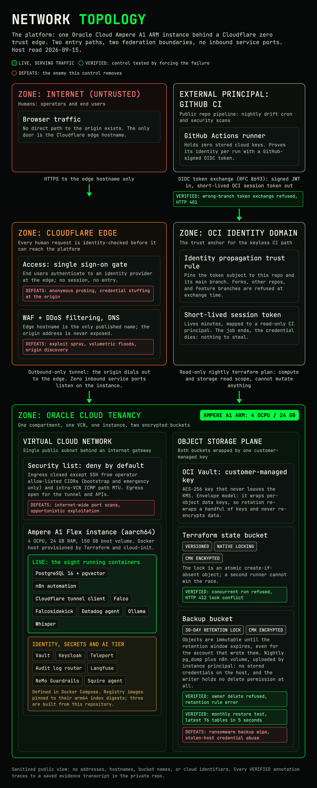
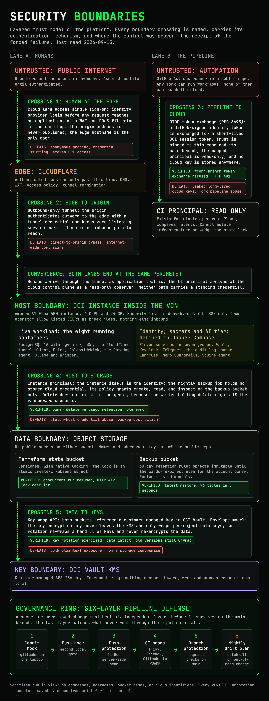
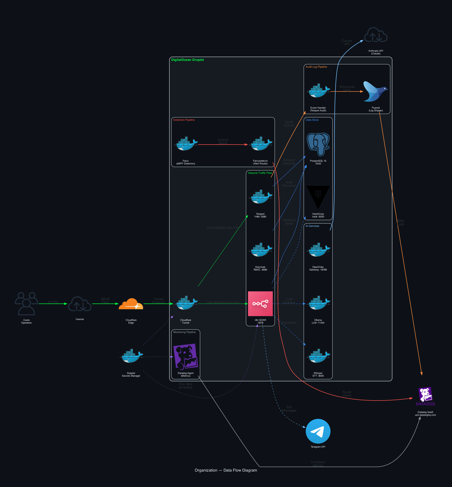

# Executive Summary: Architecture

**System Name:** Organization Security Operations Platform (OSOP)
**Document Identifier:** EXEC-ARCH-001
**Classification:** Internal Use Only
**Version:** 1.0
**Date:** 2026-03-11
**Prepared By:** System Owner

---

## Platform Overview

The Organization Security Operations Platform is a containerized security operations environment deployed on a single cloud VPS. It provides centralized SOAR, identity management, runtime threat detection, secrets management, and AI-assisted analysis through 14 containerized services.

| Specification | Value |
|---------------|-------|
| **Compute** | 4 vCPU, 8 GB RAM, 160 GB SSD |
| **Operating System** | Ubuntu 24.04 LTS |
| **Container Runtime** | Docker with Compose (13 managed services + 1 standalone) |
| **Public Ingress** | Zero-trust tunnel only (Cloudflare) |
| **Firewall** | Cloud firewall with deny-all default |
| **Exposed Ports** | 0 (all traffic routed through tunnel) |

---

## Network Architecture and Trust Zones

The platform implements four trust zones with network-layer isolation:

| Zone | Services | Access |
|------|----------|--------|
| **Public** | Cloudflare Tunnel (sole entry point) | Internet-facing, TLS-terminated |
| **DMZ** | n8n SOAR (svc-automation), OpenClaw Gateway | Accessible via tunnel routes only |
| **Internal** | PostgreSQL, Ollama, Whisper, Fluentd, Falcosidekick, Datadog, Event Handler | No external access, Docker bridge only |
| **Sensitive** | Vault (secrets), Keycloak (identity), Teleport (PAM) | Restricted internal access, audit-logged |

All inter-service communication occurs over Docker bridge networks. No container ports are bound to the host's public interface.

---

## Service Inventory

### Core Services

| Container | Function | Port (Internal) |
|-----------|----------|-----------------|
| svc-db | PostgreSQL 16 - workflow state and operational data | 5432 |
| svc-automation | n8n SOAR - orchestration, webhooks, Telegram bot | internal |

### Access & Identity

| Container | Function | Port (Internal) |
|-----------|----------|-----------------|
| svc-gateway | Teleport v18 - PAM, session recording, JIT access | 3080 |
| svc-identity | Keycloak v26 - RBAC, SSO, 3-tier role model | internal |
| svc-event-handler | Teleport audit event shipper | - |

### Security & Monitoring

| Container | Function | Port (Internal) |
|-----------|----------|-----------------|
| svc-detection | Falco - eBPF kernel-level runtime detection | - |
| svc-detection-router | Falcosidekick - alert routing to Datadog | - |
| svc-observability | Datadog Agent - metrics, logs, APM | - |
| svc-log-shipper | Fluentd - structured log pipeline to Datadog | - |

### AI & Analysis

| Container | Function | Port (Internal) |
|-----------|----------|-----------------|
| svc-llm | Ollama - local LLM inference | internal |
| svc-transcription | Whisper - voice transcription | internal |
| openclaw-gateway | OpenClaw - Claude Opus 4.6 AI gateway | internal |

### Infrastructure

| Container | Function | Port (Internal) |
|-----------|----------|-----------------|
| tunnel | Cloudflare Tunnel - zero-trust ingress | Host network |
| svc-secrets | HashiCorp Vault - secrets management | internal |

---

## Data Flow

**Inbound:** Internet traffic terminates at Cloudflare's edge, passes through the zero-trust tunnel, and routes to internal services (n8n on `example-ops.com`, SSH via `ssh.example-ops.com`).

**Internal:** n8n orchestrates workflows by connecting to PostgreSQL, Telegram Bot API, GitHub API, Ollama, and external SaaS integrations. Teleport records all SSH and console sessions. Falco monitors syscalls via eBPF and ships alerts through Falcosidekick to Datadog.

**Outbound:** Audit logs flow from Teleport Event Handler through Fluentd to Datadog. Datadog Agent ships metrics, logs, and traces to the Datadog SaaS platform.

---

## Infrastructure as Code

| Component | Detail |
|-----------|--------|
| **IaC Tool** | Terraform |
| **Files** | 16 `.tf` files |
| **State** | Remote, encrypted |
| **Policy Enforcement** | 8 OPA (Rego) policies evaluated on every PR |
| **Managed Resources** | VPS, firewall rules, DNS records, tunnel configuration, monitoring |

### Secrets Management

| Principle | Implementation |
|-----------|---------------|
| No hardcoded secrets | External secrets manager injects env vars at runtime |
| Encrypted at rest | `.env` file `chmod 600`, Vault for future secret rotation |
| Least privilege | Per-service env var scoping, no shared secret namespace |
| Rotation tracking | Credential vault as source of truth for rotation schedules |

---

## Key Design Decisions

1. **Single-VPS consolidation** - reduces attack surface to one hardened host with centralized monitoring
2. **Zero-trust over VPN** - Cloudflare Tunnel eliminates the need for open inbound ports or VPN infrastructure
3. **eBPF over agent-based detection** - Falco operates at the kernel level without modifying containers
4. **Compose over Kubernetes** - right-sized orchestration for a single-node deployment, lower operational complexity
5. **Immutable audit chain** - Teleport session recordings and Falco alerts ship to external SaaS (Datadog), preventing local tampering

---

## Related Documents

| Document | Description |
|----------|-------------|
| [SSP_SYSTEM_SECURITY_PLAN.md](SSP_SYSTEM_SECURITY_PLAN.md) | Full system description and control mapping |
| [RISK_ASSESSMENT.md](RISK_ASSESSMENT.md) | Threat scenarios and trust zone analysis |
| [IAM_RBAC_ROLE_MAP.md](IAM_RBAC_ROLE_MAP.md) | 3-tier RBAC role definitions |
| [IAM_ACCESS_REVIEW.md](IAM_ACCESS_REVIEW.md) | Access review process with JIT workflow |
| [EXECUTIVE_SUMMARY_SECURITY_POSTURE.md](EXECUTIVE_SUMMARY_SECURITY_POSTURE.md) | Security posture one-pager |
| [EXECUTIVE_SUMMARY_COMPLIANCE.md](EXECUTIVE_SUMMARY_COMPLIANCE.md) | Compliance readiness one-pager |
