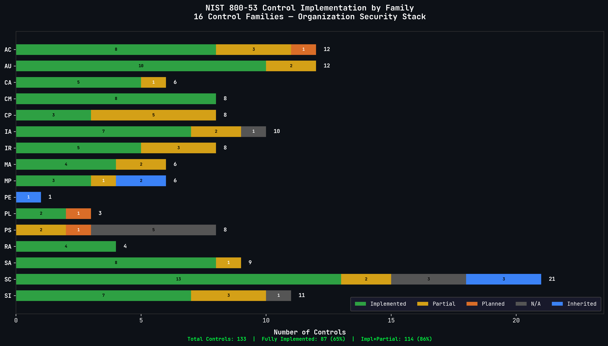

# Executive Summary: Compliance Readiness

**System Name:** Organization Security Operations Platform (OSOP)
**Document Identifier:** EXEC-CMP-001
**Classification:** Internal Use Only
**Version:** 1.0
**Date:** 2026-03-11
**Prepared By:** System Owner

---

## Compliance Framework

| Element | Detail |
|---------|--------|
| **Primary Framework** | NIST SP 800-53 Rev. 5 - Moderate Baseline |
| **Risk Methodology** | NIST SP 800-30 Rev. 1 |
| **Risk Management** | NIST SP 800-39 |
| **Security Categorization** | FIPS 199 - Moderate |
| **Container Hardening** | CIS Docker Benchmark |
| **Threat Mapping** | MITRE ATT&CK (Enterprise) |

---

## GRC Documentation Library

The compliance program is supported by **37 GRC documents** totaling approximately **18,000 lines** of structured governance, risk, and compliance content.

### Document Inventory

| Category | Count | Documents |
|----------|-------|-----------|
| **Core Plans** | 3 | System Security Plan (SSP), Plan of Action & Milestones (POA&M), Risk Assessment |
| **Policies** | 10 | Incident Response, Access Control, Acceptable Use, Business Continuity, Disaster Recovery, Change Management, Vulnerability Management, Security Awareness, Risk Management, AI Governance |
| **IAM** | 2 | RBAC Role Map (3-tier model), Access Review Process (JIT workflow) |
| **Risk Register** | 1 | CIS Docker Benchmark findings with compensating controls |
| **IR Playbooks** | 5 | Compromised Container, Leaked Credential, DDoS/Service Degradation, Unauthorized Access, AI Incident Response |
| **Threat Modeling** | 6 | Data Flow Diagram, STRIDE Threat Model, Attack Tree, AI Threat Catalog, AI Supply Chain Risk, AI Red Team Plan |
| **Executive Summaries** | 3 | Architecture, Compliance, Security Posture |
| **Exercises** | 1 | Operation Phantom Container (5-phase tabletop exercise) |

All documents are sanitized for public repository hosting. Personal identifiers, real IPs, internal domains, and service names are replaced with generic equivalents. Product names (Vault, Keycloak, Teleport, Falco, Datadog, Cloudflare, Trivy, etc.) are preserved to demonstrate the actual technology stack.

---

## Control Coverage

| Metric | Value |
|--------|-------|
| **NIST 800-53 Control Families** | 16 of 20 |
| **Total Controls Mapped** | 133 |
| **Fully Implemented** | 87 (65%) |
| **Partially Implemented** | 27 (21%) |
| **Implemented + Partial** | 114 (86%) |

### Control Family Coverage

| Family | ID | Status |
|--------|----|--------|
| Access Control | AC | Mapped |
| Awareness & Training | AT | Mapped |
| Audit & Accountability | AU | Mapped |
| Security Assessment | CA | Mapped |
| Configuration Management | CM | Mapped |
| Contingency Planning | CP | Mapped |
| Identification & Authentication | IA | Mapped |
| Incident Response | IR | Mapped |
| Maintenance | MA | Mapped |
| Media Protection | MP | Mapped |
| Physical & Environmental | PE | Mapped |
| Planning | PL | Mapped |
| Personnel Security | PS | Mapped |
| Risk Assessment | RA | Mapped |
| System & Communications Protection | SC | Mapped |
| System & Information Integrity | SI | Mapped |

---

## Automated Evidence Collection

Manual compliance work is reduced through continuous, automated evidence generation:

| Source | Evidence Type | Frequency |
|--------|--------------|-----------|
| **Falco (eBPF)** | Runtime syscall alerts, container behavior anomalies | Real-time |
| **Datadog Agent** | Infrastructure metrics, logs, APM traces | Continuous |
| **Datadog Monitors** | 7 Terraform-managed alert conditions | Continuous |
| **Teleport** | SSH session recordings, access audit logs | Per-session |
| **Fluentd** | Structured log shipping to Datadog | Real-time |
| **CI/CD Pipeline** | Trivy, Semgrep, Gitleaks, Checkov scan results | Per-commit |
| **OPA Policies** | 8 Rego policy evaluations on every pull request | Per-PR |
| **Cosign + Syft** | Container signatures and SBOM generation | Per-deploy |

### Visual Evidence

Architecture diagrams, risk heat maps, and SOC dashboard screenshots provide visual compliance evidence:

- Network topology and security boundary diagrams ([diagrams/](diagrams/))
- Risk heat map and summary dashboard ([diagrams/risk_heat_map.png](diagrams/risk_heat_map.png), [diagrams/risk_summary_dashboard.png](diagrams/risk_summary_dashboard.png))
- Datadog SOC dashboard with 5 operational views ([diagrams/datadog_soc_dashboard_full.png](diagrams/datadog_soc_dashboard_full.png))
- GitHub Actions security pipeline visualization ([diagrams/github_actions_pipeline.png](diagrams/github_actions_pipeline.png))

---

## Review Schedule

| Activity | Frequency | Next Review |
|----------|-----------|-------------|
| Full SSP review | Semi-annual | 2026-09-11 |
| POA&M status review | Quarterly (90-day cycle) | 2026-06-09 |
| Risk register review | Quarterly | 2026-06-11 |
| CIS Docker Bench rescan | Monthly | 2026-04-11 |
| Policy review (all 10) | Annual | 2027-03-11 |
| Tabletop exercise | Semi-annual | TBD |

---

## Tabletop Exercise Program

**Exercise Name:** Operation Phantom Container
**Scenario:** Compromised container with lateral movement attempt across trust zones
**Structure:** 5 phases - Initial Detection, Containment, Investigation, Eradication, Recovery
**Participants:** System Owner (all roles simulated)
**Outcome:** Validated IR playbook procedures, identified communication gaps, confirmed Falco detection coverage

---

## Compliance Readiness Assessment

| Area | Readiness |
|------|-----------|
| **Documentation completeness** | Strong - 37 documents covering all major GRC domains |
| **Control implementation** | Strong - 86% implemented or partially implemented |
| **Automated evidence** | Strong - continuous collection from 8+ sources |
| **Risk management** | Strong - 17 scenarios assessed, all tracked to disposition |
| **Finding remediation** | Adequate - 0 Critical/High, 7 Medium tracked with compensating controls |
| **Exercise program** | Developing - 1 tabletop completed, cadence being established |
| **Multi-region resilience** | Gap - single-region deployment, DR plan documented but untested |

---

## Related Documents

| Document | Description |
|----------|-------------|
| [SSP_SYSTEM_SECURITY_PLAN.md](SSP_SYSTEM_SECURITY_PLAN.md) | Full NIST 800-53 control mapping |
| [POAM_PLAN_OF_ACTION.md](POAM_PLAN_OF_ACTION.md) | 27 tracked findings with remediation timelines |
| [RISK_ASSESSMENT.md](RISK_ASSESSMENT.md) | 17 threat scenarios with 5x5 risk matrix |
| [CIS_RISK_REGISTER.md](CIS_RISK_REGISTER.md) | CIS Docker Bench compensating controls |
| [TABLETOP_EXERCISE.md](TABLETOP_EXERCISE.md) | Operation Phantom Container - 5-phase TTX |
| [EXECUTIVE_SUMMARY_SECURITY_POSTURE.md](EXECUTIVE_SUMMARY_SECURITY_POSTURE.md) | Security posture one-pager |
| [EXECUTIVE_SUMMARY_ARCHITECTURE.md](EXECUTIVE_SUMMARY_ARCHITECTURE.md) | Architecture one-pager |
