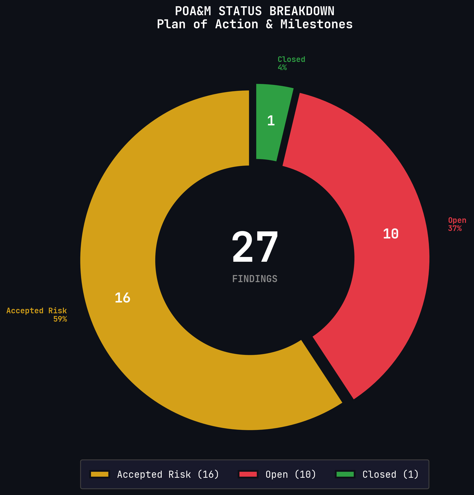
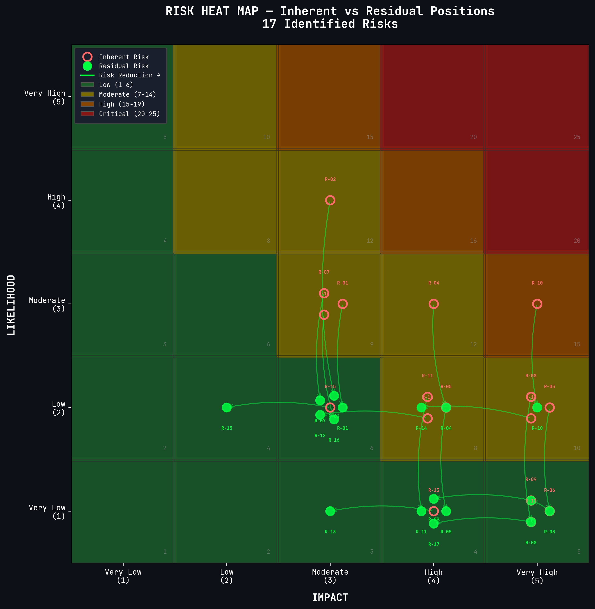
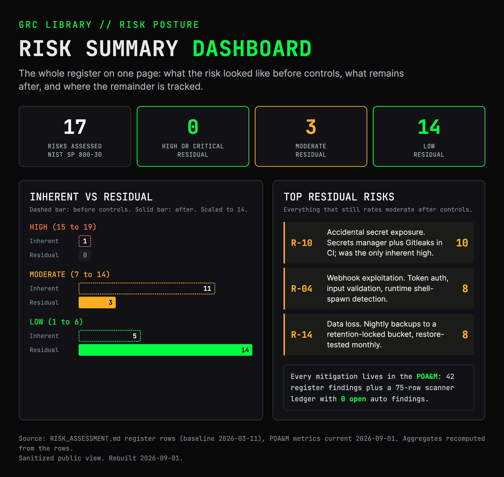

# Executive Summary: Security Posture

**System Name:** Organization Security Operations Platform (OSOP)
**Document Identifier:** EXEC-SEC-001
**Classification:** Internal Use Only
**Version:** 1.0
**Date:** 2026-03-11
**Prepared By:** System Owner

---

## Security Categorization

| Security Objective | Impact Level |
|-------------------|--------------|
| **Confidentiality** | Moderate |
| **Integrity** | Moderate |
| **Availability** | Moderate |
| **Overall (FIPS 199)** | **MODERATE** |

The platform processes API keys, operational credentials, workflow automation logic, and security telemetry. Unauthorized disclosure, modification, or prolonged unavailability would have a serious adverse effect on operations.

---

## NIST 800-53 Control Implementation

| Metric | Value |
|--------|-------|
| **Framework** | NIST SP 800-53 Rev. 5, Moderate Baseline |
| **Control Families** | 16 |
| **Total Controls Mapped** | 133 |
| **Fully Implemented** | 87 (65%) |
| **Partially Implemented** | 27 (21%) |
| **Implemented + Partial** | 114 (86%) |
| **Planned / Not Implemented** | 19 (14%) |

---

## Findings and Risk Posture

### POA&M Summary

| Severity | Count |
|----------|-------|
| Critical | 0 |
| High | 0 |
| Medium | 7 |
| Low | 30 |
| **Total** | **37** |

### Finding Sources

| Source | Findings |
|--------|----------|
| CIS Docker Bench for Security | 29 |
| Checkov Static Analysis (CI/CD) | 3 |
| Risk Assessment (Mitigate treatments) | 5 |
| Falco Runtime Detection (baseline) | 0 |

### Disposition

| Status | Count |
|--------|-------|
| Accepted Risk (with compensating controls) | 16 |
| Open (remediation tracked) | 10 |
| Closed | 1 |
| **Total** | **27 POA&M entries** |

---

## Risk Assessment Overview

- **17 threat scenarios** assessed using NIST SP 800-30 Rev. 1 methodology with a 5x5 risk matrix
- **35% average risk reduction** achieved through implemented controls
- All scenarios mapped to MITRE ATT&CK techniques
- Zero scenarios rated Critical or High after control application

---

## Defense-in-Depth Architecture

The platform runs **14 containers** protected by layered security controls:

| Layer | Implementation |
|-------|---------------|
| **Network Perimeter** | Cloud firewall (deny-all default), zero-trust tunnel (sole public ingress) |
| **Runtime Detection** | Falco eBPF kernel-level monitoring with alert routing via Falcosidekick |
| **Session Recording** | Teleport PAM with immutable audit logs and session replay |
| **Identity & Access** | Keycloak RBAC with 3-tier role model, JIT access workflow |
| **Secrets Management** | External secrets manager with runtime env var injection, no hardcoded secrets |
| **Observability** | Datadog agent with 7 Terraform-managed monitors, SOC dashboard (5 views) |
| **Container Hardening** | Resource limits, PID limits, no-new-privileges, read-only rootfs, cap_drop ALL |

### CI/CD Security Pipeline

| Control | Tool |
|---------|------|
| Container vulnerability scanning | Trivy |
| Static application security testing | Semgrep |
| Secret detection | Gitleaks |
| Infrastructure-as-code scanning | Checkov |
| Policy enforcement | 8 OPA (Rego) policies |
| Container signing & SBOM | Cosign + Syft |

---

## Key Strengths

1. **Zero Critical/High findings** across all assessment sources
2. **86% control implementation rate** against NIST 800-53 Moderate baseline
3. **Full defense-in-depth stack** from network perimeter through runtime detection
4. **Automated evidence collection** via Falco, Datadog, and CI/CD scanners reduces manual audit burden
5. **Immutable audit chain** from Teleport session recording through Fluentd log shipping to Datadog
6. **Zero exposed ports** to the public internet — all ingress through Cloudflare zero-trust tunnel
7. **Comprehensive GRC library** (20 documents, ~8,500 lines) with defined review cadences

## Areas for Improvement

1. **Multi-region redundancy** — single-VPS deployment creates availability concentration risk
2. **User namespace remapping** — not yet enabled on Docker daemon (POAM-001, Medium)
3. **Automated backup testing** — PostgreSQL backups exist but restore testing is manual
4. **OAuth credential lifecycle** — several Google OAuth integrations pending reconnection
5. **Remaining 14% of controls** — 19 controls planned but not yet implemented
6. **Tabletop exercise cadence** — first exercise completed, semi-annual schedule needs second iteration

---

## Related Documents

| Document | Description |
|----------|-------------|
| [SSP_SYSTEM_SECURITY_PLAN.md](SSP_SYSTEM_SECURITY_PLAN.md) | Full NIST 800-53 control mapping (16 families, 133 controls) |
| [POAM_PLAN_OF_ACTION.md](POAM_PLAN_OF_ACTION.md) | All 27 POA&M entries with remediation plans |
| [RISK_ASSESSMENT.md](RISK_ASSESSMENT.md) | 17 threat scenarios with MITRE ATT&CK mapping |
| [CIS_RISK_REGISTER.md](CIS_RISK_REGISTER.md) | CIS Docker Bench findings with compensating controls |
| [EXECUTIVE_SUMMARY_ARCHITECTURE.md](EXECUTIVE_SUMMARY_ARCHITECTURE.md) | Architecture overview one-pager |
| [EXECUTIVE_SUMMARY_COMPLIANCE.md](EXECUTIVE_SUMMARY_COMPLIANCE.md) | Compliance readiness one-pager |
