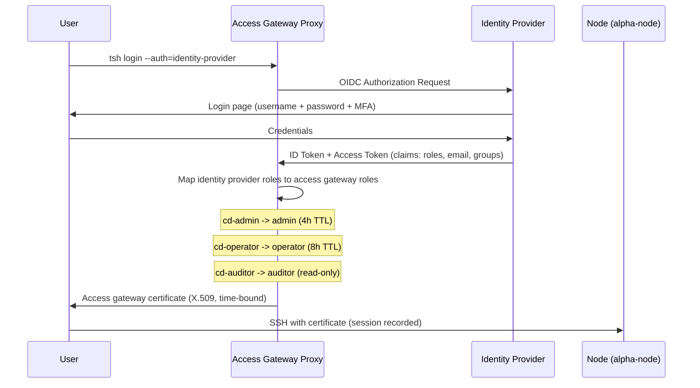

# Organization IAM & RBAC Role Map

> Identity and Access Management architecture for the Organization security operations platform.

## 1. Overview

Organization implements a three-tier RBAC model across two identity systems:

| Layer | System | Version | Role |
|-------|--------|---------|------|
| **Identity** | Identity Provider | v26.5.2 | Authentication, user management, password policy |
| **Authorization** | Access Gateway | v18 | SSH gateway, session recording, access requests |
| **Audit** | Datadog + Falco | Latest | Event correlation, runtime threat detection |

**Current state:** The identity provider and access gateway each use local authentication. OIDC integration between them requires an enterprise access gateway license and is documented below as the upgrade path.

**Design principles:**
- Least privilege by default (auditor cannot SSH, operator cannot admin)
- Just-in-time escalation with time-bound TTLs
- Full audit trail on every session and access change
- Reproducible configuration via realm JSON import

---

## 2. Visual Role Map

```mermaid
graph TD
  subgraph Identity Provider (v26)
    KC[Identity Provider<br/>organization realm]
    KC --> R1[cd-admin<br/>Full access]
    KC --> R2[cd-operator<br/>Daily ops]
    KC --> R3[cd-auditor<br/>Read-only]
  end

  subgraph SSH Gateway - Access Gateway (v18)
    TP[Access Gateway<br/>Local Auth + TOTP MFA]
    TP --> TR1[admin role<br/>4h TTL - JIT only]
    TP --> TR2[operator role<br/>8h TTL - daily use]
    TP --> TR3[auditor role<br/>read-only]
  end

  subgraph Service Access
    R1 -->|full control| SVC[All Services]
    R2 -->|workflows| N8N[Automation Dashboard]
    R2 -->|containers| DOCK[Docker Mgmt]
    R2 -->|JIT escalation| TR1
    TR2 -->|SSH sessions| DROP[alpha-node VPS]
    TR3 -->|playback only| REC[Session Recordings]
  end

  subgraph Audit Trail
    DROP --> SR[Session Recording]
    SR --> EH[Audit Event Handler]
    EH --> FL[Log Pipeline Agent]
    FL --> DD[Monitoring Logs]
    R1 -->|admin events| KC
    KC -->|audit log| DD
  end

  style R1 fill:#dc3545,color:#fff
  style R2 fill:#fd7e14,color:#fff
  style R3 fill:#198754,color:#fff
  style TR1 fill:#dc3545,color:#fff
  style TR2 fill:#fd7e14,color:#fff
  style TR3 fill:#198754,color:#fff
```

---

## 3. Role Definitions

### Identity Provider Realm Roles (organization realm)

| Role | Description | Assigned To | Source |
|------|-------------|-------------|--------|
| `cd-admin` | Full administrative access to all Organization services | sysadmin | `organization-realm.json` |
| `cd-operator` | Day-to-day operational access, can manage workflows and containers | Future ops staff | `organization-realm.json` |
| `cd-auditor` | Read-only access to audit logs, session recordings, and compliance data | Future auditors | `organization-realm.json` |

<!-- TODO(et): confirm SANITIZATION_KEY.md maps the realm export to the sanitized `organization-realm.json` filename used here so external readers can trace the file. -->

### Access Gateway Roles (gateway-config.yaml)

| Role | Max Session TTL | Node Labels | SSH Login | Audit Access | Use Case |
|------|----------------|-------------|-----------|--------------|----------|
| `admin` | 4h | `*:*` | `root`, `ubuntu` | Full | Emergency access, JIT-only |
| `operator` | 8h | `env:production` | `ubuntu` | Own sessions | Daily operations |
| `auditor` | 12h | `env:production` | None | All sessions | Compliance review |

---

## 4. Permission Matrix

| Action | cd-admin | cd-operator | cd-auditor |
|--------|:--------:|:-----------:|:----------:|
| **SSH to VPS (root)** | Yes | No | No |
| **SSH to VPS (ubuntu)** | Yes | Yes (via access gateway) | No |
| **Docker container management** | Yes | Yes | No |
| **Automation workflow edit** | Yes | Yes | No |
| **Automation workflow view** | Yes | Yes | Yes |
| **Identity provider admin console** | Yes | No | No |
| **Identity provider user management** | Yes | No | No |
| **Monitoring dashboards (full)** | Yes | Yes | Yes |
| **Monitoring alert management** | Yes | Yes | No |
| **Session recording playback** | Yes | Yes (own) | Yes (all) |
| **Audit log access** | Yes | No | Yes |
| **Access request approval** | Yes | No | No |
| **Access gateway cluster management** | Yes | No | No |
| **Detection rule management** | Yes | No | No |
| **Secrets engine access** | Yes | No | No |

---

## 5. Privilege Escalation Path

Operators can request temporary admin access through the access gateway's request system. All escalations are time-bound and fully audited.

### Request Flow

```
Operator          Admin           Access Gateway
  |             |             |
  |-- tsh request create --->|             |
  |  role=admin       |             |
  |  reason="emergency   |             |
  |  deploy fix"      |             |
  |             |             |
  |             |<-- notification ---------|
  |             |  (Telegram/email)    |
  |             |             |
  |             |-- tctl request approve ->|
  |             |  --id=<request-id>   |
  |             |             |
  |<-- access granted -------|--------------------------|
  |  (4h TTL)        |             |
  |             |             |
  |-- ssh root@alpha-node -->|             |
  |  (session recorded)   |             |
  |             |             |
  |  ... 4 hours later ... |             |
  |             |             |
  |<-- access revoked -------|--------------------------|
  |  (automatic expiry)   |             |
```

### Operator Commands

```bash
# Step 1: Request admin access
tsh request create \
 --roles=admin \
 --reason="Emergency: container restart required for svc-automation"

# Step 2: Check request status
tsh request ls

# Step 3: Once approved, login with elevated role
tsh login --request-id=<request-id>

# Step 4: Use admin access (recorded session)
tsh ssh root@alpha-node
```

### Admin Approval Commands

```bash
# View pending requests
tctl request ls --format=text

# Approve with reason
tctl request approve <request-id>

# Deny with reason
tctl request deny <request-id> --reason="Not justified"
```

### Safeguards

| Safeguard | Implementation |
|-----------|---------------|
| **Time-bound** | Admin role expires after 4 hours automatically |
| **Reason required** | `--reason` flag is mandatory for requests |
| **Full recording** | All SSH sessions during escalation are recorded |
| **Audit trail** | Request, approval, and session events in Datadog |
| **No self-approval** | Requestor cannot approve their own request |

---

## 6. Enterprise Upgrade Path

### Current State (Community Edition)

```
Identity Provider      Access Gateway (Authorization)
   |               |
   | Local auth          | Local auth + TOTP
   | organization realm      | gateway-config.yaml roles
   |               |
   +--- No integration -----------+
     (separate credentials)
```

### Future State (Access Gateway Enterprise + OIDC)



### OIDC Connector Configuration (Reference)

The access gateway OIDC client is pre-configured in the identity provider:

| Setting | Value |
|---------|-------|
| Client ID | `svc-gateway` |
| Protocol | OpenID Connect |
| Redirect URI | `https://gateway.example-ops.com/v1/webapi/oidc/callback` |
| Web Origins | `https://gateway.example-ops.com` |
| Public Client | No (confidential) |
| Scopes | openid, profile, email, roles |

### Access Gateway OIDC Connector (gateway-oidc.yaml)

```yaml
# Reference: requires access gateway enterprise license
kind: oidc
version: v3
metadata:
 name: identity-provider
spec:
 issuer_url: https://identity.example-ops.com/realms/organization
 client_id: svc-gateway
 client_secret: "<from-identity-provider-client-credentials>"
 redirect_url:
  - https://gateway.example-ops.com/v1/webapi/oidc/callback
 claims_to_roles:
  - claim: realm_access.roles
   value: cd-admin
   roles:
    - admin
  - claim: realm_access.roles
   value: cd-operator
   roles:
    - operator
  - claim: realm_access.roles
   value: cd-auditor
   roles:
    - auditor
 scope:
  - openid
  - profile
  - email
  - roles
```

### What Changes with Enterprise

| Feature | Community (Current) | Enterprise (Future) |
|---------|:------------------:|:-------------------:|
| Single Sign-On | No (separate logins) | Yes (identity provider OIDC) |
| Role mapping | Manual | Automatic (claims_to_roles) |
| Access requests | CLI only | Web UI + CLI |
| Approval integrations | Manual | Slack, PagerDuty, Jira |
| Resource-level requests | No (role-level only) | Yes (specific nodes) |
| FedRAMP/SOC2 audit | Manual export | Built-in compliance |

---

## 7. NIST 800-53 Alignment

| Control | Name | Implementation |
|---------|------|----------------|
| **AC-2** | Account Management | Identity provider realm manages all user accounts. Admin-only user creation. `registrationAllowed: false`. Temporary bootstrap admin replaced by realm-managed accounts. |
| **AC-3** | Access Enforcement | Access gateway enforces SSH access based on role. Identity provider enforces service access. Both deny by default. |
| **AC-5** | Separation of Duties | Three distinct roles (admin/operator/auditor) prevent concentration of privilege. Auditors cannot modify systems. Operators cannot approve their own escalation requests. |
| **AC-6** | Least Privilege | Operator role is the default working role. Admin access requires JIT request with 4h auto-expiry. Auditor has read-only access only. Root SSH limited to admin role. |
| **AC-6(1)** | Authorize Access to Security Functions | Only cd-admin can modify identity provider realm settings, access gateway cluster config, detection rules, and secrets engine policies. |
| **AC-6(2)** | Non-Privileged Access for Non-Security Functions | cd-operator role used for daily automation workflow management and container operations. No security function access. |
| **AC-7** | Unsuccessful Logon Attempts | Identity provider brute force protection: 5 failures lock for 15 minutes. `failureFactor: 5`, `maxFailureWaitSeconds: 900`. <!-- TODO(et): verify failureFactor and maxFailureWaitSeconds against the deployed realm import; update if drifted --> |
| **AC-11** | Session Lock | Identity provider SSO idle timeout: 30 minutes (`ssoSessionIdleTimeout: 1800`). Access gateway certificate TTLs enforce session limits. |
| **AC-12** | Session Termination | Access gateway admin role: 4h max. Operator: 8h max. Identity provider max session: 10h (`ssoSessionMaxLifespan: 36000`). |
| **IA-2** | Identification and Authentication | Identity provider authenticates via username + password. Access gateway adds TOTP MFA for SSH. Enterprise path adds OIDC for unified authentication. |
| **IA-5** | Authenticator Management | Password policy enforced: 12+ chars, upper, lower, digit, special character. `notUsername` prevents username as password. |
| **IA-5(1)** | Password-Based Authentication | Identity provider password policy: `length(12) and upperCase(1) and lowerCase(1) and digits(1) and specialChars(1) and notUsername`. |
| **AU-2** | Audit Events | Identity provider admin events enabled (`adminEventsEnabled: true`). Access gateway records all SSH sessions. Runtime detection engine monitors syscalls. All flow to Datadog. |
| **AU-3** | Content of Audit Records | Session recordings capture full terminal I/O. Identity provider logs include user, IP, action, timestamp. Runtime detection logs include process, container, syscall. |
| **AU-6** | Audit Review | cd-auditor role provides read-only access to all audit data: session playback, identity provider events, monitoring dashboards. |

---

## Appendix: Configuration Files

| File | Purpose | Location |
|------|---------|----------|
| `organization-realm.json` | Identity provider realm definition (roles, users, clients, policies) | `platform/identity-import/` |
| `docker-compose.yaml` | Identity provider (v26) container with realm import | `platform/` |
| `gateway-config.yaml` | Access gateway cluster config with role definitions | `/etc/gateway-config.yaml` (on VPS) |
| `gateway-oidc.yaml` | OIDC connector reference (Enterprise upgrade) | Documented above |

---

*Last updated: 2026-06-24 | Phase 20 (extends Phase 17 scope added 2026-04-24, Phase 08-04 baseline)*

---

## Phase 17 Scope Extension: Squire roles (2026-04-24)

> **Key Point:** Phase 17 added three Squire-specific roles layered on top of the 3-tier RBAC model: SOC Analyst (HITL Reviewer), Squire Operator, Interview Presenter. These roles do not replace the core admin/operator/auditor tiers; they augment with scoped access to the Squire subsystem.

### Squire role definitions

| Role | Duties | Permissions | Token source | Rotation cadence |
|------|--------|-------------|--------------|------------------|
| SOC Analyst (HITL Reviewer) | Review HIGH and CRITICAL severity Squire investigations before external action. Approve or deny routed actions per HITL_POLICY section 3. | Read `ir_alerts`, `ir_investigations`. Write `ir_rotation_events` (via approval API). No direct DB access. | Production HMAC token (60-day rotation, no expiry between rotations) | 60 days |
| Squire Operator | Operate the Squire subsystem. Start or stop svc-squire, svc-nemo, svc-langfuse-*. Rotate tokens. Deploy guardrail changes through change control. | SSH to host (JIT via access gateway), no Prod DB write, read Langfuse traces. | Access gateway admin role (JIT), 4h TTL | per session |
| Interview Presenter | Ephemeral demo path for showcasing Squire end-to-end without production data. | Access a demo token that grants read-only `/alert` POST with sanitized seed alerts. No DB read. | Per-interview ephemeral HMAC token | per interview, revoked within 24h |

### RBAC matrix (roles x Squire resources)

| Role | ir_alerts | ir_investigations | ir_rotation_events | Langfuse traces | NeMo config | actions.yml |
|------|-----------|-------------------|--------------------|-----------------|-------------|-------------|
| cd-admin | RW | RW | RW | RW | RW | RW |
| cd-operator | R | R | R | R | R (no W) | R |
| cd-auditor | R | R | R | R | R | R |
| SOC Analyst (HITL Reviewer) | R | R | W (approvals only) | R | - | - |
| Squire Operator | R | R | R | R | RW (via change control) | RW (via change control) |
| Interview Presenter | - (POST /alert only) | - | - | - | - | - |

**Legend:** R = read, W = write, RW = read and write, `-` = no access.

### Cross-reference

See `HITL_POLICY.md` section 6 for per-interview token rotation procedure. See `SQUIRE_SSP.md` AC-3, AC-6 for control implementations. See `IAM_ACCESS_REVIEW.md` for the 60-day audit cadence.

---

## Cross-References

| Document | Relationship |
|----------|-------------|
| [SSP_SYSTEM_SECURITY_PLAN.md](SSP_SYSTEM_SECURITY_PLAN.md) | System Security Plan with NIST 800-53 control mapping |
| [POAM_PLAN_OF_ACTION.md](POAM_PLAN_OF_ACTION.md) | Tracks findings and remediation milestones |
| [SQUIRE_SSP.md](SQUIRE_SSP.md) | Squire subsystem SSP with AC-3 and AC-6 control implementations |
| [HITL_POLICY.md](HITL_POLICY.md) | Human-in-the-loop policy with token rotation section |
| [IAM_ACCESS_REVIEW.md](IAM_ACCESS_REVIEW.md) | Access review process with Phase 17 cadences |
| [README.md](README.md) | GRC library index and reading guide |
