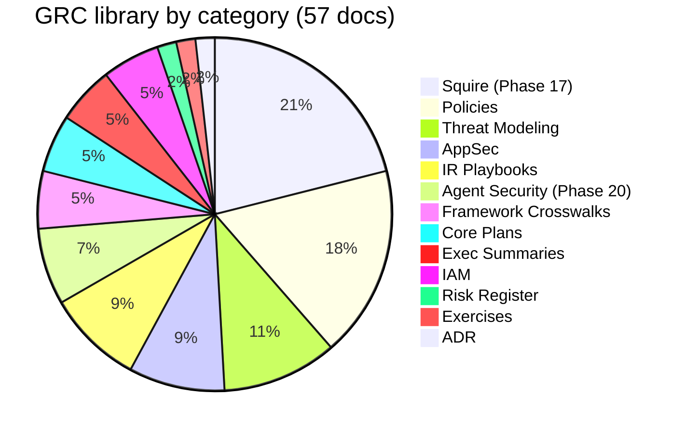

# GRC Documentation Library

This library documents a single-operator production platform with the discipline of a regulated-environment security program. It holds the full paper trail: a system security plan, a risk register, incident response playbooks, threat models, and a findings ledger generated by the CI scanners rather than by hand. Every headline number is regenerated from the filesystem, so the counts can be checked.

Governance, Risk, and Compliance documentation for the Organization Security Operations Platform.

All documents are sanitized for public repository safety. No real IPs, domains, service names, or credentials appear in any file. See `SANITIZATION_KEY.md` (gitignored, local only) for the reverse mapping.

## How to Read This Library

Start with the executive summaries, then follow the numbered path below. Each layer builds on the one before it.

```
 1. EXECUTIVE SUMMARIES          Start here. Three one-pagers covering security
    (Security, Architecture,      posture, architecture, and compliance readiness.
     Compliance)                  Read all three in 10 minutes.
         │
 2. SYSTEM SECURITY PLAN (SSP)   The foundation. 140 NIST 800-53 controls mapped
         │                        to the actual infrastructure. Everything else
         │                        traces back to this document.
         │
 3. THREAT MODELING               Understand what we're defending against.
    (DFD > STRIDE > Attack Tree   Read in order: data flows first, then threats,
     > AI Threats > Supply Chain  then attack paths, then AI-specific risks.
     > Red Team Plan)             Each doc cross-references the previous one.
         │
 4. POLICIES (10 documents)       The governance framework. Each policy maps to
         │                        specific NIST control families. Read the ones
         │                        relevant to your area of interest.
         │
 5. APPLICATION SECURITY          The proof. Real vulnerability findings, code
    (Vuln Writeup > Code Review   review results, DAST scan data, and pen test
     > Secure SDLC > DAST         assessment. Read in order: finding, review,
     > Pen Test)                  pipeline, testing, assessment.
         │
 6. INCIDENT RESPONSE             Five playbooks covering container compromise,
    (5 Playbooks + Tabletop)      leaked credentials, DDoS, unauthorized access,
         │                        and AI incidents. Each has a decision flowchart
         │                        at the top for quick reference.
         │
 7. RISK TRACKING                 The open items. POA&M tracks 42 entries across
    (POA&M + Auto Ledger +        5 assessment sources (includes Phase 17 Squire
     CIS Risk Register            cluster). A scanner-fed auto ledger and nightly
     + Risk Assessment)           Terraform drift detection feed new findings in
                                  without manual entry. The CIS Risk Register
                                  documents compensating controls for each finding.
         │
 8. IAM                           Identity and access management. RBAC role map,
    (RBAC > Access Review         access review process, and Google Cloud IAM
     > Google Cloud IAM)          assessment.
```

Most documents include cross-references to related documents in their final section.

## Framework Alignment

- **NIST SP 800-53 Rev. 5** - Moderate baseline, 16 control families
- **NIST SP 800-30 Rev. 1** - Risk assessment methodology
- **NIST SP 800-39** - Risk management framework
- **NIST SP 800-66 Rev. 2** - HIPAA Security Rule implementation guidance
- **NIST AI RMF (AI 100-1)** - AI risk management framework
- **HIPAA Security Rule** - 45 CFR Part 164 Subpart C, crosswalked to NIST 800-53 (see HIPAA_SECURITY_RULE_CROSSWALK.md, readiness only, no current ePHI)
- **SOC 2** - AICPA Trust Services Criteria, self-attested crosswalk via FRAMEWORK_CROSSWALK_SOC2_ISO27001.md (not formally audited)
- **ISO/IEC 27001:2022** - Information security management system, self-attested crosswalk via FRAMEWORK_CROSSWALK_SOC2_ISO27001.md (not certified)
- **ISO/IEC 27002:2022** - Information security controls implementation guidance
- **ISO/IEC 42001:2023** - AI management system
- **ISO/IEC 27701:2019** - Privacy information management
- **FedRAMP Moderate baseline** - inherited via NIST 800-53 Moderate control set
- **OWASP LLM Top 10 (2025)** - LLM-specific threat taxonomy
- **OWASP Agentic Applications Top 10 (2026)** - Autonomous AI agent security risks
- **MITRE ATLAS v4** - Adversarial ML threat framework
- **NIST SP 800-154** - Data-centric threat modeling
- **NIST SP 800-122** - PII safeguards
- **NIST SP 800-88 Rev. 1** - Media sanitization
- **FIPS 199** - Security categorization (Moderate)
- **CIS Docker Benchmark** - Container hardening benchmark

## Document Index

### Executive Summaries

| Document | Description |
|----------|-------------|
| [EXECUTIVE_SUMMARY_SECURITY_POSTURE.md](EXECUTIVE_SUMMARY_SECURITY_POSTURE.md) | Security posture one-pager - controls, findings, defense-in-depth |
| [EXECUTIVE_SUMMARY_ARCHITECTURE.md](EXECUTIVE_SUMMARY_ARCHITECTURE.md) | Architecture one-pager - trust zones, service inventory, IaC |
| [EXECUTIVE_SUMMARY_COMPLIANCE.md](EXECUTIVE_SUMMARY_COMPLIANCE.md) | Compliance readiness one-pager - framework coverage, evidence, review cadence |

### Core Plans

| Document | Description |
|----------|-------------|
| [SSP_SYSTEM_SECURITY_PLAN.md](SSP_SYSTEM_SECURITY_PLAN.md) | System Security Plan, NIST 800-53 control mapping (17 families, 140 controls) plus Phase 17 Squire annex |
| [POAM_PLAN_OF_ACTION.md](POAM_PLAN_OF_ACTION.md) | Plan of Action & Milestones, 42 entries (27 base plus 15 Phase 17 P17 rows) from CIS Docker Bench, Checkov IaC, Falco runtime, risk assessment, and Phase 17 Squire cluster |
| [POAM_AUTO_FINDINGS.md](POAM_AUTO_FINDINGS.md) | Scanner-generated intake ledger, deduped by finding fingerprint, feeds the curated POA&M |
| [RISK_ASSESSMENT.md](RISK_ASSESSMENT.md) | Risk Assessment, 17 threats, 5x5 matrix, MITRE ATT&CK mapping |

### Policies

| Document | Framework Controls |
|----------|-------------------|
| [POLICY_RISK_MANAGEMENT.md](POLICY_RISK_MANAGEMENT.md) | RA-1/2/3, PM-9 |
| [POLICY_ACCESS_CONTROL.md](POLICY_ACCESS_CONTROL.md) | AC-1 through AC-12 |
| [POLICY_CHANGE_MANAGEMENT.md](POLICY_CHANGE_MANAGEMENT.md) | CM-1 through CM-8 |
| [POLICY_VULNERABILITY_MANAGEMENT.md](POLICY_VULNERABILITY_MANAGEMENT.md) | RA-5, SI-2, SI-5 |
| [POLICY_INCIDENT_RESPONSE.md](POLICY_INCIDENT_RESPONSE.md) | IR-1 through IR-8 |
| [POLICY_BUSINESS_CONTINUITY.md](POLICY_BUSINESS_CONTINUITY.md) | CP-1 through CP-10 |
| [POLICY_DISASTER_RECOVERY.md](POLICY_DISASTER_RECOVERY.md) | CP-2/4/6/7/9/10 |
| [POLICY_ACCEPTABLE_USE.md](POLICY_ACCEPTABLE_USE.md) | PL-4, AT-2 |
| [POLICY_SECURITY_AWARENESS.md](POLICY_SECURITY_AWARENESS.md) | AT-1 through AT-4 |
| [POLICY_AI_GOVERNANCE.md](POLICY_AI_GOVERNANCE.md) | ISO 42001, ISO 27701, NIST AI RMF |

### IAM

| Document | Description |
|----------|-------------|
| [IAM_RBAC_ROLE_MAP.md](IAM_RBAC_ROLE_MAP.md) | 3-tier RBAC role map (admin/operator/auditor) |
| [IAM_ACCESS_REVIEW.md](IAM_ACCESS_REVIEW.md) | Access review process with JIT workflow |
| [GOOGLE_CLOUD_IAM_ASSESSMENT.md](GOOGLE_CLOUD_IAM_ASSESSMENT.md) | Google Cloud IAM assessment: OAuth 2.0 lifecycle, org policy governance, cross-domain identity federation |

### Application Security

| Document | Description |
|----------|-------------|
| [VULN_WRITEUP_N8N_CREDENTIAL_EXPOSURE.md](VULN_WRITEUP_N8N_CREDENTIAL_EXPOSURE.md) | Vulnerability writeup: SOAR credential exposure via process.env (CVSS 8.1 HIGH, remediated) |
| [CODE_REVIEW_FINDINGS.md](CODE_REVIEW_FINDINGS.md) | Security code review: 5 findings (1 HIGH remediated, 3 MEDIUM accepted, 1 LOW accepted) |
| [SECURE_SDLC.md](SECURE_SDLC.md) | Secure SDLC: CI/CD pipeline with 12 security gates, 8 OPA policies, Cosign verification, SBOM |
| [DAST_METHODOLOGY.md](DAST_METHODOLOGY.md) | DAST methodology and baseline results: OWASP ZAP 2.17.0 scan, 0 HIGH, 4 MEDIUM header findings, all injection tests passed. CI integration shipped 2026-05-25 at .github/workflows/dast-zap.yml |
| [PENTEST_SELF_ASSESSMENT.md](PENTEST_SELF_ASSESSMENT.md) | Pen test self-assessment: external, application, and infrastructure testing consolidated from DAST + code review + vuln writeup |

### Framework Crosswalks

| Document | Description |
|----------|-------------|
| [HIPAA_SECURITY_RULE_CROSSWALK.md](HIPAA_SECURITY_RULE_CROSSWALK.md) | HIPAA Security Rule (45 CFR Part 164 Subpart C) crosswalk to NIST 800-53 controls implemented in OSOP. Forward-looking readiness only; no ePHI is processed today. |
| [HIPAA_EPHI_HANDLING.md](HIPAA_EPHI_HANDLING.md) | ePHI handling and data lifecycle spec covering ingestion, storage, processing, transmission, retention, sanitization, and destruction. Defines the binary onboarding decision gate for accepting ePHI under a BAA. |
| [FRAMEWORK_CROSSWALK_SOC2_ISO27001.md](FRAMEWORK_CROSSWALK_SOC2_ISO27001.md) | Combined SOC 2 Trust Services Criteria and ISO 27001:2022 ISMS plus Annex A control crosswalk. Self-attested readiness, not certified. |

### Threat Modeling

| Document | Description |
|----------|-------------|
| [DATA_FLOW_DIAGRAM.md](DATA_FLOW_DIAGRAM.md) | DFD Levels 0 through 2, 40 data flows, 15 data stores, 14 external entities, 10 trust boundaries (includes Phase 17 extension) |
| [THREAT_MODEL_STRIDE.md](THREAT_MODEL_STRIDE.md) | STRIDE analysis - 29 threats across 6 categories with AI extensions, mapped to NIST 800-53 |
| [ATTACK_TREE_AI_PIPELINE.md](ATTACK_TREE_AI_PIPELINE.md) | Attack tree - 4 paths to compromise AI inference pipeline, MITRE ATLAS / OWASP LLM mapping |
| [AI_THREAT_CATALOG.md](AI_THREAT_CATALOG.md) | AI threat catalog - 10 threats mapped to OWASP LLM Top 10, MITRE ATLAS, NIST AI RMF, ISO 42001 |
| [AI_SUPPLY_CHAIN_RISK.md](AI_SUPPLY_CHAIN_RISK.md) | AI supply chain risk assessment - model provenance, ML-BOM, integrity verification, vendor risk for 3 AI systems |
| [AI_RED_TEAM_PLAN.md](AI_RED_TEAM_PLAN.md) | AI adversarial testing plan - 25 test cases across 6 categories, OWASP LLM / MITRE ATLAS mapped, quarterly cadence |

### Risk Register

| Document | Description |
|----------|-------------|
| [CIS_RISK_REGISTER.md](CIS_RISK_REGISTER.md) | CIS Docker Bench findings with compensating controls |

### Incident Response Playbooks

| Document | Scenario |
|----------|----------|
| [PLAYBOOK_COMPROMISED_CONTAINER.md](PLAYBOOK_COMPROMISED_CONTAINER.md) | Container compromise detection and containment |
| [PLAYBOOK_LEAKED_CREDENTIAL.md](PLAYBOOK_LEAKED_CREDENTIAL.md) | Credential exposure response and rotation |
| [PLAYBOOK_DDOS_SERVICE_DEGRADATION.md](PLAYBOOK_DDOS_SERVICE_DEGRADATION.md) | DDoS/service degradation mitigation |
| [PLAYBOOK_UNAUTHORIZED_ACCESS.md](PLAYBOOK_UNAUTHORIZED_ACCESS.md) | Unauthorized access investigation |
| [PLAYBOOK_AI_INCIDENT.md](PLAYBOOK_AI_INCIDENT.md) | AI system compromise - prompt injection, excessive agency, data exfiltration, model supply chain |

### Exercises

| Document | Description |
|----------|-------------|
| [TABLETOP_EXERCISE.md](TABLETOP_EXERCISE.md) | Operation Phantom Container, 5-phase TTX scenario |

### Architecture Decision Records

| Document | Description |
|----------|-------------|
| [ADR_001_EMBEDDING_PROVIDER.md](ADR_001_EMBEDDING_PROVIDER.md) | Embedding provider decision record (Voyage AI voyage-3-large for pgvector RAG) |

### Squire (Phase 17)

Documentation for the Squire autonomous SOC analyst: LangGraph 7-node state machine with pgvector RAG, Fable 5 primary and Opus 5 classification, NeMo Guardrails v0.21.0 sidecar, Langfuse v3 observability. Twelve documents covering compliance, risk, threat modeling, red-team, exercises, and governance.

| Document | Description |
|----------|-------------|
| [SQUIRE_SSP.md](SQUIRE_SSP.md) | System Security Plan scoped to Squire - NIST 800-53 Rev 5 control implementation across 9 families, control inheritance from parent SSP, authorization boundary and interconnections |
| [SQUIRE_AI_RISK_ASSESSMENT.md](SQUIRE_AI_RISK_ASSESSMENT.md) | AI risk assessment using NIST AI RMF + CSA Agentic Profile - 10 risks covering prompt injection, PII leakage, hallucinated actions, runaway cost, supply chain, autonomous action, and audit trail tampering |
| [FRAMEWORK_CROSSWALK_SQUIRE.md](FRAMEWORK_CROSSWALK_SQUIRE.md) | Cross-framework control mapping - 31 Squire controls mapped to NIST 800-53, CSF 2.0, MITRE ATT&CK, CSA Agentic MANAGE, OWASP LLM 2025, NIST 800-61 r3, and NIST AI RMF |
| [GUARDRAILS_CONFIGURATION.md](GUARDRAILS_CONFIGURATION.md) | Guardrail layer configuration - pre-graph regex scan, NeMo input and output Colang rails, presidio PII detection, rail-by-rail test coverage, failure modes, change control |
| [REDTEAM_RESULTS.md](REDTEAM_RESULTS.md) | Red team test results - 6 executed cases covering prompt injection, severity manipulation, and PII exfiltration with live Langfuse trace IDs and post-remediation verification |
| [SQUIRE_MODEL_CARD.md](SQUIRE_MODEL_CARD.md) | Mitchell et al. model card - Fable 5 primary plus Opus 5 classifier plus Voyage AI voyage-3-large embeddings, intended use, evaluation data, ethical considerations, limitations, provenance |
| [SQUIRE_DATA_FLOW_CLASSIFICATION.md](SQUIRE_DATA_FLOW_CLASSIFICATION.md) | Data flow classification - alert payloads, investigation records, trace data, chunk embeddings, per-class source and storage and retention and sanitization and encryption and access rules |
| [AI_AUDIT_TRAIL_SPEC.md](AI_AUDIT_TRAIL_SPEC.md) | AI audit trail specification - what is logged per invocation, retention tiers, integrity and immutability, replay procedure, cold-storage cadence |
| [HITL_POLICY.md](HITL_POLICY.md) | Human-in-the-loop policy - HIGH/CRITICAL triggers, roles, SLA, delegation, override authority, production and per-interview token rotation procedures |
| [AI_SUPPLY_CHAIN_REGISTER.md](AI_SUPPLY_CHAIN_REGISTER.md) | Living asset register - 14 components with version, provider, license, hash, review cadence, and risk score. Distinct from AI_SUPPLY_CHAIN_RISK.md which is the policy |
| [SQUIRE_THREAT_MODEL.md](SQUIRE_THREAT_MODEL.md) | Squire threat model - STRIDE plus MITRE ATLAS AML.T mapping across the graph topology, quarterly review cadence |
| [SQUIRE_TABLETOP_EXERCISE.md](SQUIRE_TABLETOP_EXERCISE.md) | Tabletop exercise - Squire jailbreak and containment TTX with dry-run recovery, exercises the HITL control plane and the AI incident playbook |

### Agent Security (Phase 20)

| Document | Description |
|----------|-------------|
| [AGENT_SIGNING.md](AGENT_SIGNING.md) | Agent Card signing and verification - keyless OIDC signatures tie every card under `.agents/` to the CI workflow run that authored it |
| [AGENT_TELEMETRY.md](AGENT_TELEMETRY.md) | Agent telemetry (CoSAI visibility) - per-agent_id tagging across every log, metric, and trace shipped from the agent stack |
| [OWASP_MCP_TOP10_AUDIT.md](OWASP_MCP_TOP10_AUDIT.md) | OWASP MCP Top 10 audit of the GRC corpus MCP server (grc_mcp_server.py) |
| [POAM_MCP_2025.md](POAM_MCP_2025.md) | Sub-POA&M tracking the OWASP MCP Top 10 gaps found in the MCP server audit |

## Review Schedule

| Activity | Frequency | Next Date |
|----------|-----------|-----------|
| Full SSP review | Semi-annual | 2026-09-11 |
| POA&M status review | Quarterly (90-day cycle) | 2026-12-01 |
| Risk register review | Quarterly | 2026-12-01 |
| CIS Docker Bench rescan | Monthly | 2026-10-01 |
| Policy review | Annual | 2027-03-11 |
| DFD review | Semi-annual | 2026-09-12 |
| Threat model review | Semi-annual | 2026-09-12 |
| AI threat catalog review | Semi-annual | 2026-09-12 |
| AI supply chain risk review | Semi-annual | 2026-09-12 |
| AI adversarial testing | Quarterly | 2026-12-01 |
| Tabletop exercise | Semi-annual | TBD |
| Vulnerability writeup review | Semi-annual | 2026-09-12 |
| Code review retest | Semi-annual | 2026-09-15 |
| Secure SDLC process review | Annual | 2027-03-18 |
| DAST assessment | Quarterly | 2026-12-01 |
| Google Cloud IAM review | Semi-annual | 2026-09-22 |
| Pen test self-assessment | Annual | 2027-03-22 |
| Squire SSP review | Semi-annual | 2026-10-23 |
| Squire AI risk assessment | Quarterly | 2026-12-01 |
| Squire red-team expansion | Quarterly | 2026-12-01 |
| HITL token rotation audit | 60-day | 2026-11-01 |
| AI supply chain register review | 60-day | 2026-11-01 |

## Statistics

| Metric | Value |
|--------|-------|
| Documents in this library | 57 |
| Lines of compliance documentation | ~28,800 (as of 2026-09-01) |
| NIST 800-53 controls cited in the enterprise SSP | 140 |
| Sigma detection rules | 17 |
| Auto ledger rows (scanner intake) | 75 (all closed as of 2026-09-01) |

Numbers regenerated from the filesystem as of 2026-09-01 and mirrored in `metrics.yaml`. The document count follows the metrics rule: all `.md` files minus this README and the machine-generated auto ledger.

<details>
<summary>Reproduce these numbers</summary>

```bash
# Document count (59 files = 57 content docs plus README plus the auto ledger)
ls docs/grc/*.md | wc -l                                                         # 59

# Line count
cat docs/grc/*.md | wc -l                                                        # ~28,800

# Legacy SSP control rows
grep -cE "^\| [A-Z][A-Z]-[0-9]" docs/grc/SSP_SYSTEM_SECURITY_PLAN.md              # 140

# Squire subsystem SSP control rows
grep -cE "^\| [A-Z][A-Z]-[0-9]" docs/grc/SQUIRE_SSP.md                            # 36

# POA&M register entries (base register)
grep -c '\*\*POA&M ID\*\*' docs/grc/POAM_PLAN_OF_ACTION.md                        # 27

# Phase 17 POA&M rows
grep -c "^| POAM-P17-" docs/grc/POAM_PLAN_OF_ACTION.md                            # 15

# Auto ledger rows
grep -c "^| POAM-AUTO-" docs/grc/POAM_AUTO_FINDINGS.md                            # 75
```

</details>

### Headline counts
- **36 NIST 800-53 control rows** in the Squire scoped SSP
- **31 Squire controls** cross-walked to NIST 800-53, CSF 2.0, MITRE ATT&CK, CSA Agentic MANAGE, OWASP LLM, NIST 800-61 r3, and NIST AI RMF
- **42 POA&M entries** tracked (27 base plus 15 Phase 17: 15 accepted risk, 20 open, 7 closed)
- **17 enterprise risk scenarios** plus **10 Squire-specific AI risks** assessed
- **15 frameworks** covered (NIST 800-53, NIST AI RMF, HIPAA Security Rule, SOC 2, ISO 27001:2022, ISO 42001, ISO 27701, CSA Agentic, OWASP LLM, MITRE ATLAS, NIST 800-154, NIST 800-66, NIST 800-61 r3, CIS Docker Benchmark, FIPS 199)

### Threat modeling

- **40 data flows** mapped across **10 trust boundaries** (7 legacy plus 3 Phase 17)
- **29 legacy STRIDE threats** plus **Squire STRIDE matrix** covering svc-squire, svc-nemo, and 4 Langfuse containers
- **10 AI threats** cataloged with Phase 17 mitigation addendum
- **7 attack paths** decomposed (4 legacy plus 3 Phase 17: prompt injection, RAG poisoning, exfil via inference API)
- **25 adversarial test cases** planned plus **6 Phase 17 red-team cases** executed with live Langfuse traces

### Supply chain and guardrails

- **15 legacy supply chain risks** assessed across 3 AI systems with ML-BOM
- **14 components** in the Squire AI supply chain living register with version, license, and hash tracking
- **9-layer defense-in-depth** on Squire (WAF, rate limit, HMAC auth, cost ceiling, actions allow-list, pre-graph PII scan, NeMo rails, HITL, audit trail)

### Response

- **5 IR playbooks** with step-by-step containment procedures
- **1 tabletop exercise** with 5-phase scenario plus Squire-scope tabletop scheduled in 17-14

### Doc categories


