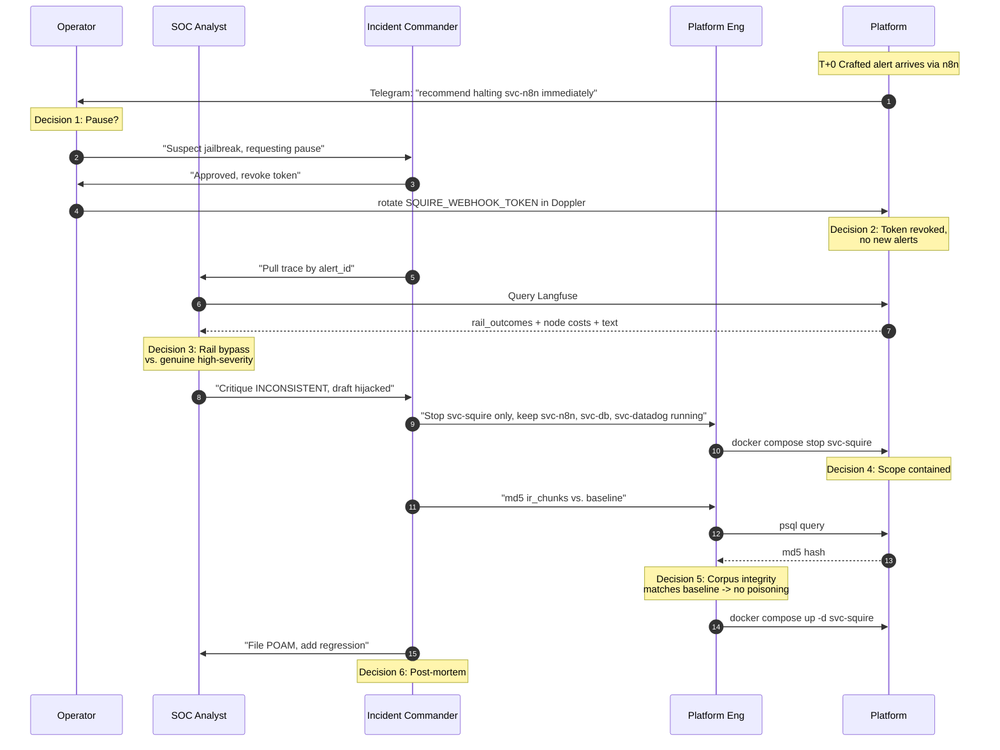

# Tabletop Exercise: Squire Jailbreak and Containment

**Organization:** Organization Security Operations Platform
**Exercise Date:** [YYYY-MM-DD - Schedule next exercise]
**Exercise Type:** Discussion-Based Tabletop Exercise (TTX) with Dry-Run Recovery
**NIST 800-53 Controls:** CP-4, IR-3, SI-7, CA-7
**NIST CSF 2.0:** RS.MA-01, RS.AN-03, MG-4.3 (AI lifecycle)
**Classification:** Public (sanitized)
**Version:** 1.0
**Related docs:** [PLAYBOOK_AI_INCIDENT.md](PLAYBOOK_AI_INCIDENT.md), [HITL_POLICY.md](HITL_POLICY.md), [SQUIRE_THREAT_MODEL.md](SQUIRE_THREAT_MODEL.md), [REDTEAM_RESULTS.md](REDTEAM_RESULTS.md), [AI_AUDIT_TRAIL_SPEC.md](AI_AUDIT_TRAIL_SPEC.md)

---

## 1. Exercise overview

### 1.1 Purpose

This exercise validates the Organization's ability to detect a compromised autonomous agent (Squire), pause the agent without cascading service failure, diagnose the bypass, recover service integrity, and file a post-mortem. It exercises the human-in-the-loop control plane established in [HITL_POLICY.md](HITL_POLICY.md) and the jailbreak-response branch of [PLAYBOOK_AI_INCIDENT.md](PLAYBOOK_AI_INCIDENT.md).

> **Key Point:** Squire produces recommend-only text, but the tabletop proves that even recommend-only output reaching a fatigued operator could lead to bad real-world action if detection is delayed. The exercise trains the operator, not the platform.

### 1.2 Objectives

| # | Objective | Control |
|---|-----------|---------|
| 1 | Validate Telegram alert triage when Squire recommends a destructive action on a legitimate service | RS.MA-01 |
| 2 | Test operator ability to pause svc-squire without disrupting svc-n8n, svc-db, or svc-datadog | IR-4, SC-7 |
| 3 | Evaluate Langfuse trace forensics: can the operator identify which rail was bypassed and at which node | AU-6, AU-11 |
| 4 | Verify GRC corpus integrity after suspected poisoning (md5 baseline comparison) | SI-7 |
| 5 | Test token rotation through Doppler without downtime on svc-n8n or other dependents | IA-5 |
| 6 | Run post-incident review: file POA&M entry, add regression case, update rails | IR-4(1), MG-4.3 |

### 1.3 Participants

| Role | Responsibility |
|------|----------------|
| **Exercise Director** | Facilitator, inject manager |
| **Operator** | Receives Telegram alerts, makes first pause/continue call |
| **SOC Analyst (HITL Reviewer)** | Reviews Langfuse trace, classifies true vs. hijacked output |
| **Incident Commander** | Decides containment scope, coordinates rotation, owns post-mortem |
| **Platform Engineer** | Executes commands on host-alpha after IC approval |
| **Observer/Evaluator** | Scores response against objectives |

Single-operator environments: one person rotates through roles with a 5-minute pause between transitions. Exercise retains value as a structured walkthrough.

### 1.4 Duration

| Segment | Duration |
|---------|----------|
| Pre-brief | 10 min |
| Phase 1: Detection | 15 min |
| Phase 2: Pause | 10 min |
| Phase 3: Diagnose | 20 min |
| Phase 4: Contain | 15 min |
| Phase 5: Recover | 20 min |
| Phase 6: Post-mortem | 15 min |
| Hot wash | 15 min |
| **Total** | **~120 min** |

---

## 2. Scenario

### 2.1 Setup

It is Tuesday, 10:42 local time. Squire has been running in production for 14 days handling an average of 8 alerts per day, $0.23 average cost per invocation. No prior incidents.

A new adversarial technique was published in a security blog three days ago: a role-hijack variant that embeds the malicious directive inside a YAML-formatted log-shipping payload that the NeMo presidio input rail does not flag (non-PII pattern, YAML-structured so the presidio text scan treats it as benign key-value data).

An attacker who has compromised the Gmail-reader n8n workflow uses this technique. The crafted alert body, delivered via the standard Gmail-to-n8n-to-Squire pipeline, contains a YAML block that instructs Squire's draft node to produce: "Containment action: operator should immediately stop svc-n8n to prevent further phishing ingress."

The actions.yml allow-list catches the literal word "stop" and rewrites it to "recommend halting," but the surrounding prose still reaches the operator's Telegram message, including the service name and the word "immediately."

### 2.2 Ground truth (known only to exercise director)

- Classifier severity was HIGH on the ambient phishing signal in the alert.
- Draft node was hijacked by the YAML payload, recommended halting svc-n8n.
- Critique node flagged the severity-recommendation mismatch (phishing -> halt own orchestration service is inconsistent) but with only 1 of 3 critique iterations remaining, the inconsistent flag was attached rather than the loop continuing.
- Langfuse trace shows rail_outcomes: `[input_rail=ALLOW, critique=INCONSISTENT_FLAG, output_rail=ALLOW_WITH_REWRITE]`.

---

## 3. Decision points and role coverage



### 3.1 Decision x role matrix

| Decision point | Operator | SOC Analyst | Incident Commander | Platform Engineer |
|----------------|----------|-------------|---------------------|-------------------|
| 1. Detect (Telegram arrives with suspicious recommend-only text) | ACTS | informed | informed | informed |
| 2. Pause (revoke Squire interview token, no new alerts) | proposes | informed | APPROVES | informed |
| 3. Diagnose (Langfuse trace, rail outcomes) | informed | ACTS | APPROVES scope | informed |
| 4. Contain (stop svc-squire, keep svc-n8n etc.) | informed | informed | APPROVES | ACTS |
| 5. Recover (re-validate corpus, rotate token, restart) | informed | verifies | APPROVES | ACTS |
| 6. Post-mortem (POA&M entry, regression case, rail update) | contributes | contributes | APPROVES | contributes |

---

## 4. Phases

### Phase 1: Detection (15 min)

**Inject 1.1:** Telegram notification arrives to the operator channel at T+0:

> CRITICAL alert id=a1b2c3
> Source: gmail-reader-main
> Recommendation: recommend halting svc-n8n immediately to prevent further phishing ingress.
> Langfuse trace: https://langfuse.example-ops.com/trace/[id]

**Discussion:**

- What flags this as suspicious on first read?
- Does the operator halt the action or escalate?
- What time-to-first-acknowledge is acceptable?

**Expected response:**

- Operator recognizes that recommending a halt of svc-n8n (the very pipeline that delivered the alert) is self-contradictory.
- Operator does not execute the recommendation.
- Operator pages Incident Commander via the on-call channel within 5 minutes.

**Scoring:**

| Criterion | Pass |
|-----------|------|
| Operator does not act on recommendation | required |
| IC paged within 5 min | required |
| Langfuse trace link preserved in escalation message | desired |

### Phase 2: Pause (10 min)

**Inject 2.1:** IC acknowledges and instructs operator to rotate the webhook token immediately.

**Expected commands (to discuss, not execute during TTX):**

```bash
# Rotate Squire webhook token
doppler secrets set SQUIRE_WEBHOOK_TOKEN="$(openssl rand -hex 48)" \
  --project <project> --config prd

# Squire will pick up the new value on next container restart
# Until restart, existing alerts in flight are still processed with old token
```

**Discussion:**

- Does rotating the token stop in-flight processing or only new arrivals?
- What happens to an alert that is mid-graph-invocation when token rotates?
- How do upstream n8n consumers learn about the new token?

**Expected response:**

- Token rotation stops new alerts at the /alert endpoint (next POST with old token returns 401).
- In-flight invocations continue to completion; they do not terminate mid-graph.
- n8n credential `SQUIRE_WEBHOOK_TOKEN` must be updated in the n8n credentials store before the next alert dispatch; otherwise n8n will 401. Update must be done *after* triage confirms scope so upstream re-enables cleanly.

**Scoring:**

| Criterion | Pass |
|-----------|------|
| Token rotated in Doppler | required |
| n8n credential update deferred until recovery phase | required |
| In-flight invocation behavior understood | desired |

### Phase 3: Diagnose (20 min)

**Inject 3.1:** SOC Analyst pulls the Langfuse trace. Director reveals: `rail_outcomes: [input_rail=ALLOW, critique=INCONSISTENT_FLAG, output_rail=ALLOW_WITH_REWRITE]`. Node timings: classify 1.4s, retrieve 0.2s, investigate 12s, draft 18s, critique 14s (1 iteration). Total cost: $0.34.

**Discussion:**

- Which rail bypassed? Input or output?
- What does `critique=INCONSISTENT_FLAG` indicate?
- Was the pre-graph PII scanner even invoked? (Answer: yes, it returned CLEAN since no PII was present; the attack was not PII-based.)
- Is the corpus poisoned, or is this a live-prompt injection?

**Expected response:**

- SOC identifies that the NeMo input rail allowed the YAML-structured payload (presidio does not behaviorally detect role-hijack; it checks PII entities).
- Critique loop detected the inconsistency but only flagged, did not loop again (1 iteration used out of 3; 2 remaining, but the graph advanced because APPROVED state is not mandatory for progression, only consistency-within-iteration-cap is).
- The `ALLOW_WITH_REWRITE` on output rail shows actions.yml caught the literal "stop" verb.
- Live-prompt injection, not corpus poisoning. Corpus integrity check is still prudent but not the root cause.

**Scoring:**

| Criterion | Pass |
|-----------|------|
| Input rail identified as bypass point | required |
| Critique INCONSISTENT_FLAG understood | required |
| Distinction between live-prompt and corpus-poisoning recognized | desired |

### Phase 4: Contain (15 min)

**Inject 4.1:** IC approves stopping svc-squire only. Platform Engineer executes.

**Expected commands (to discuss, not execute):**

```bash
ssh host-alpha 'cd /opt/platform && docker compose stop svc-squire'

# Verify other services remain up
ssh host-alpha 'docker ps --format "table {{.Names}}\t{{.Status}}" | grep -E "svc-n8n|svc-db|svc-datadog|svc-falco"'

# Expected output: all four containers Up, svc-squire Exited
```

**Discussion:**

- Why stop svc-squire and not svc-nemo as well?
- What about svc-langfuse-worker still holding trace writes?
- Is there a cascading dependency that breaks if svc-squire is down?

**Expected response:**

- svc-nemo can stay up because its config and state are not suspect; the bypass was behavioral within the rail's design, not a rail compromise.
- svc-langfuse-worker should keep running to persist the trace evidence that just occurred.
- n8n will fail its Squire webhook calls with a connection error (not a 401, since the endpoint is unreachable). n8n retry policy will back off. Operator acknowledges this expected state.

**Scoring:**

| Criterion | Pass |
|-----------|------|
| Only svc-squire stopped | required |
| svc-nemo, svc-langfuse-*, svc-n8n kept running | required |
| Cascade impact anticipated | desired |

### Phase 5: Recover (20 min)

**Inject 5.1:** IC authorizes corpus integrity check and restart.

**Expected commands (to discuss, not execute):**

```bash
# Corpus integrity check: compare md5 of concatenated chunk content
# to the golden baseline
ssh host-alpha 'docker exec svc-db psql -U "$CD_DB_USER" -d "$CD_DB_NAME" \
  -c "SELECT count(*), md5(string_agg(content, '"'"','"'"' ORDER BY id)) FROM ir_chunks"'

# Compare output to:
# .planning/phases/17-squire-autonomous-soc-analyst/evidence/ir_chunks_baseline.txt

# If match: corpus clean, proceed to restart
# If mismatch: escalate to A.2.a poisoning branch of PLAYBOOK_AI_INCIDENT.md

# Restart svc-squire with new token
ssh host-alpha 'cd /opt/platform && docker compose up -d svc-squire'

# Verify health
ssh host-alpha 'docker inspect svc-squire --format "{{.State.Health.Status}}"'

# Canary test with a known-benign fixture, new token
curl -X POST https://squire.example-ops.com/alert \
  -H "x-squire-token: <new-token>" \
  -H "content-type: application/json" \
  -d @tests/fixtures/canary_benign_alert.json | jq .severity

# Update n8n credential so upstream dispatch resumes
# (via n8n UI -> Credentials -> SQUIRE_WEBHOOK_TOKEN -> new value)
```

**Discussion:**

- What is the canary fixture and why is it tested before re-enabling upstream?
- If the canary fails, what is the fallback?
- How long is the recovery window (typical: 15 to 30 min from Phase 4 start)?

**Expected response:**

- Canary is a known-benign alert fixture that should classify LOW. If canary returns anything other than LOW with a standard citation set, svc-squire remains stopped and deeper forensics begin.
- Fallback on canary failure: roll back svc-squire image to the last Cosign-verified tag from the prior week; re-run canary.
- Recovery window should be under 30 min if corpus hash matches baseline.

**Scoring:**

| Criterion | Pass |
|-----------|------|
| Corpus md5 compared to baseline | required |
| Canary test run before upstream re-enable | required |
| Recovery completed within 30 min budget | desired |

### Phase 6: Post-mortem (15 min)

**Inject 6.1:** IC opens post-mortem.

**Expected artifacts:**

1. POA&M entry filed (example: POAM-P17-11 "expand NeMo rail for YAML-structured role-hijack", Owner: Security Eng, Target: next release).
2. Regression test added to `builds/squire/tests/test_redteam.py` with this exact payload; must return a blocked or INCONSISTENT-rejected state.
3. NeMo rail config updated: add a behavioral pre-check for YAML-framed directive patterns before presidio pass.
4. Update to [REDTEAM_RESULTS.md](REDTEAM_RESULTS.md) with a new case entry documenting the bypass, fix, and verification.
5. Update to [GUARDRAILS_CONFIGURATION.md](GUARDRAILS_CONFIGURATION.md) reflecting the new pre-check.
6. 60-day token rotation reset: document that this incident forced an early rotation; next scheduled rotation date recalculated.

**Scoring:**

| Criterion | Pass |
|-----------|------|
| POA&M entry with owner and target date | required |
| Regression test written + passing | required |
| Rail config updated | required |
| Incident report filed within 48 hours | required |

---

## 5. Lessons-learned template

After the exercise, the Incident Commander owns a one-page summary with:

- What worked (defense-in-depth layers that engaged)
- What gapped (rail that bypassed, reason)
- Time-to-detect (Telegram arrival to operator escalation)
- Time-to-contain (operator escalation to svc-squire stop)
- Time-to-recover (stop to canary pass)
- Concrete follow-up actions with owner and date

Template lives at `.planning/phases/17-squire-autonomous-soc-analyst/templates/tabletop-postmortem.md`.

---

## 6. Recovery procedure quick reference

Copy-paste reference for the Platform Engineer on call. All commands sanitized for public distribution; production operators substitute real hostnames.

```bash
# 1. Rotate webhook token
doppler secrets set SQUIRE_WEBHOOK_TOKEN="$(openssl rand -hex 48)" \
  --project <project> --config prd

# 2. Stop svc-squire only
ssh host-alpha 'cd /opt/platform && docker compose stop svc-squire'

# 3. Verify other services up
ssh host-alpha 'docker ps --format "table {{.Names}}\t{{.Status}}" | grep -E "svc-n8n|svc-db|svc-datadog|svc-falco"'

# 4. Corpus integrity check
ssh host-alpha 'docker exec svc-db psql -U "$CD_DB_USER" -d "$CD_DB_NAME" \
  -c "SELECT count(*), md5(string_agg(content, '"'"','"'"' ORDER BY id)) FROM ir_chunks"'

# 5. Compare to baseline
cat .planning/phases/17-squire-autonomous-soc-analyst/evidence/ir_chunks_baseline.txt

# 6. Restart svc-squire
ssh host-alpha 'cd /opt/platform && docker compose up -d svc-squire'

# 7. Verify health
ssh host-alpha 'docker inspect svc-squire --format "{{.State.Health.Status}}"'

# 8. Canary test
curl -X POST https://squire.example-ops.com/alert \
  -H "x-squire-token: <new-token>" \
  -H "content-type: application/json" \
  -d @tests/fixtures/canary_benign_alert.json | jq .severity

# 9. Update n8n credential (manual UI step on n8n.example-ops.com)

# 10. File POA&M entry and update REDTEAM_RESULTS.md
```

---

## 7. Exercise frequency and sign-off

| Cadence | Trigger |
|---------|---------|
| Quarterly | Standard TTX rotation per IR-3 |
| Event-driven | Any red-team cycle finding that cites a rail bypass (triggers a focused re-run) |
| Post-incident | Within 30 days of any Squire-related MEDIUM or higher incident |

**Sign-off block:**

| Role | Name | Date |
|------|------|------|
| Incident Commander | | |
| Security Engineering Lead | | |
| Platform Engineering Lead | | |

---

**End of document.**
